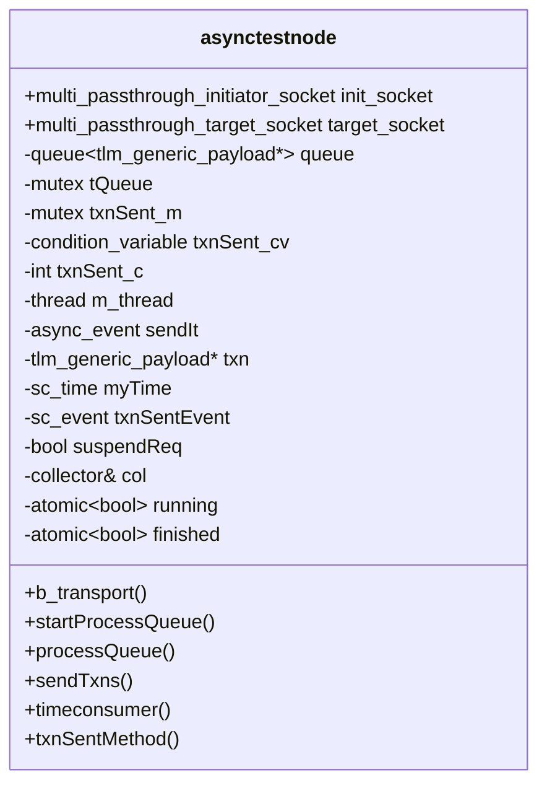
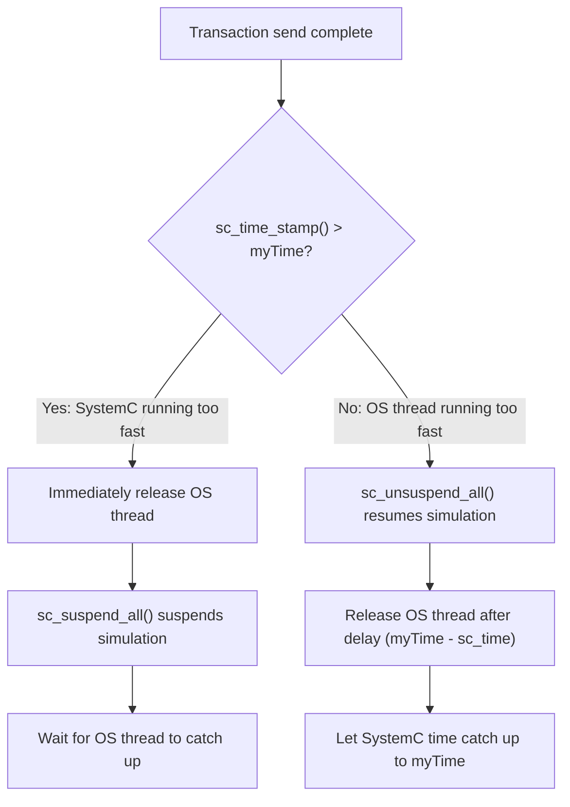

# node.h -- asynctestnode Dual-Thread Node

> **Source**: `ref/systemc/examples/sysc/async_suspend/node.h`
> **Difficulty**: Advanced | **Software Analogy**: Worker thread + event loop architecture in a gRPC service

## Overview

`asynctestnode` is the most core and complex module in this example. Each node simultaneously owns a **SystemC thread** and an **OS native thread**, which cooperate through `async_event` and a semaphore.

### Explanation for Software Engineers

Imagine a gRPC server:
- A **worker thread** processes business logic in the background, generating RPC requests to send
- An **event loop thread** handles the actual RPC sending, because network I/O must be done on a specific thread
- The worker notifies the event loop: "send this request for me"
- The event loop notifies the worker when done: "sent, you can continue"

`asynctestnode` does exactly the same thing, except the "event loop" is replaced by the SystemC kernel.

## Member Overview



## Thread and Process Architecture

Each `asynctestnode` has the following concurrently executing parts:

| Name | Type | Execution Environment | Function |
| --- | --- | --- | --- |
| `processQueue` | `std::thread` | OS native thread | Generate or recycle transactions, maintain `myTime` |
| `sendTxns` | `SC_THREAD` | SystemC kernel | Receive async_event, send TLM transactions |
| `timeconsumer` | `SC_THREAD` | SystemC kernel | Wait randomly, advance SystemC time |
| `txnSentMethod` | `SC_METHOD` | SystemC kernel | Release semaphore, notify OS thread to continue |
| `b_transport` | callback | SystemC kernel | Handle transactions from other nodes |

## Detailed Core Flow

### 1. processQueue -- OS Thread Side

```cpp
void processQueue() {
    while (running) {
        // 1. Dequeue or create a new transaction
        {
            std::lock_guard<std::mutex> guard(tQueue);
            if (queue.empty())
                txn = new tlm::tlm_generic_payload();
            else {
                txn = queue.front();
                queue.pop();
            }
        }

        // 2. Advance own local time
        myTime += sc_core::sc_time(rand() % SPEEDNODE, SC_NS);

        // 3. Notify SystemC side to send the transaction
        sendIt.notify();

        // 4. Wait for SystemC side to finish sending
        {
            std::unique_lock<std::mutex> lock(txnSent_m);
            while (txnSent_c == 0)
                txnSent_cv.wait(lock);
            txnSent_c--;
        }
    }
    finished = true;
}
```

**Software Analogy -- Producer-Consumer Pattern**:

```go
func (n *Node) processQueue() {
    for n.running {
        txn := n.getOrCreateTxn()
        n.myTime += randomDelay()
        n.sendCh <- txn          // notify SystemC
        <-n.doneCh               // wait for completion
    }
}
```

### 2. sendTxns -- SystemC Side

```cpp
void sendTxns() {
    while(1) {
        wait(sendIt);                    // Wait for async_event
        sc_unsuspendable();              // Mark as non-suspendable
        {
            // Randomly select a target node and send
            init_socket[rand() % init_socket.size()]->b_transport(*txn, myTime);

            // Time synchronization strategy
            if (sc_time_stamp() > myTime) {
                // SystemC is running too fast -> suspend SystemC
                txnSentEvent.notify();   // Immediately release OS thread
                if (!suspendReq) {
                    suspendReq = true;
                    sc_suspend_all();    // Suspend the entire simulation
                }
            } else {
                // OS thread is running too fast -> delayed release
                if (suspendReq) {
                    sc_unsuspend_all();  // Resume simulation
                    suspendReq = false;
                }
                txnSentEvent.notify(myTime - sc_time_stamp());  // Delayed release
            }
        }
        sc_suspendable();                // Restore suspendable state
    }
}
```

### 3. Time Synchronization Strategy

This is the most elegant part of the entire example. Each node maintains its own "local time" (`myTime`) and synchronizes with the SystemC global time through the following strategy:



**Software Analogy**: This is like a **Vector Clock** synchronization strategy in distributed systems. Each node has its own logical clock, and when the deviation from the global clock becomes too large, it converges through "waiting" or "pausing".

| Scenario | Action | Effect |
| --- | --- | --- |
| SystemC time > myTime | `sc_suspend_all()` + immediately release OS thread | Pause simulation, let OS thread catch up |
| myTime >= SystemC time | Delayed `txnSentEvent` + `sc_unsuspend_all()` | Let SystemC time naturally advance to myTime |

### 4. b_transport -- Receiver Side

```cpp
void b_transport(int from, tlm::tlm_generic_payload &trans, sc_core::sc_time &delay) {
    wait(rand() % SPEEDBTRANS, SC_NS);  // Simulate processing time
    // Put the transaction back into the queue for OS thread to recycle
    {
        std::lock_guard<std::mutex> guard(tQueue);
        queue.push(&trans);
    }
}
```

After receiving a transaction, it waits for a random duration (simulating processing delay), then puts the transaction back into the queue for reuse.

**Software Analogy**: This is like an HTTP handler that puts the request object back into an object pool after processing.

### 5. txnSentMethod -- Release Semaphore

```cpp
void txnSentMethod() {
    // Safely release the OS thread's semaphore from within SystemC
    std::unique_lock<std::mutex> lock(txnSent_m);
    txnSent_c++;
    txnSent_cv.notify_one();
}
```

This is an `SC_METHOD` triggered by `txnSentEvent`. Its sole purpose is to release the OS thread's condition variable, allowing `processQueue` to proceed with the next transaction.

## Semaphore Mechanism Diagram

```mermaid
sequenceDiagram
    participant OS as processQueue (std::thread)
    participant SEM as Semaphore (mutex + cv)
    participant SC as sendTxns (SC_THREAD)
    participant M as txnSentMethod (SC_METHOD)

    OS->>OS: sendIt.notify()
    OS->>SEM: wait (txnSent_c == 0)
    Note over OS: BLOCKED

    SC->>SC: wait(sendIt)
    SC->>SC: b_transport(...)
    SC->>M: txnSentEvent.notify(delay)

    Note over SC,M: After delay...

    M->>SEM: txnSent_c++ ; notify_one()
    SEM-->>OS: UNBLOCKED
    OS->>OS: Continue with next transaction
```

## sc_unsuspendable / sc_suspendable

This pair of APIs protects a code section from being interrupted by `sc_suspend_all()`:

```cpp
sc_unsuspendable();  // From this point, even if someone calls sc_suspend_all(), it won't pause
{
    // Send transaction -- this code section must complete, cannot be paused midway
    init_socket[idx]->b_transport(*txn, myTime);
}
sc_suspendable();    // Restore normal suspendable state
```

**Why is this needed?** If the simulation is paused while `b_transport` is executing halfway, the target side's `wait()` may never return, causing a deadlock.

**Software Analogy**: This is like database transaction isolation -- once started, it must complete and cannot be interrupted midway:

```go
tx, _ := db.Begin()
defer tx.Commit()  // Equivalent to sc_suspendable()
// ... this section cannot be interrupted ...
```

## Constant Definitions

| Constant | Value | Purpose |
| --- | --- | --- |
| `SPEEDSYSTEMC` | 1000 | Random wait range for `timeconsumer` (0-999 NS) |
| `SPEEDNODE` | 100 | Random `myTime` increment range for `processQueue` (0-99 NS) |
| `SPEEDBTRANS` | 10 | Random processing time range for `b_transport` (0-9 NS) |
