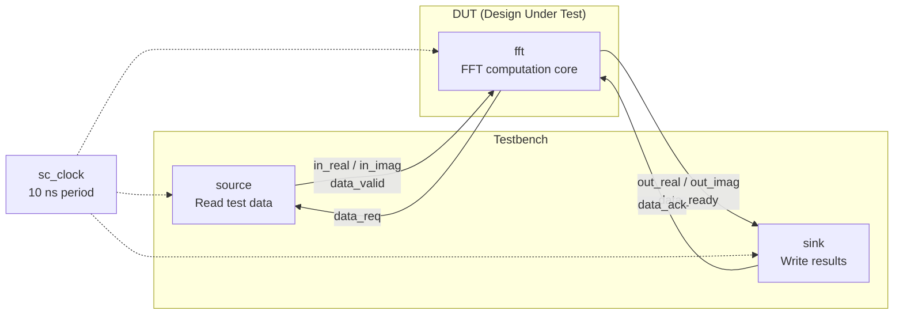
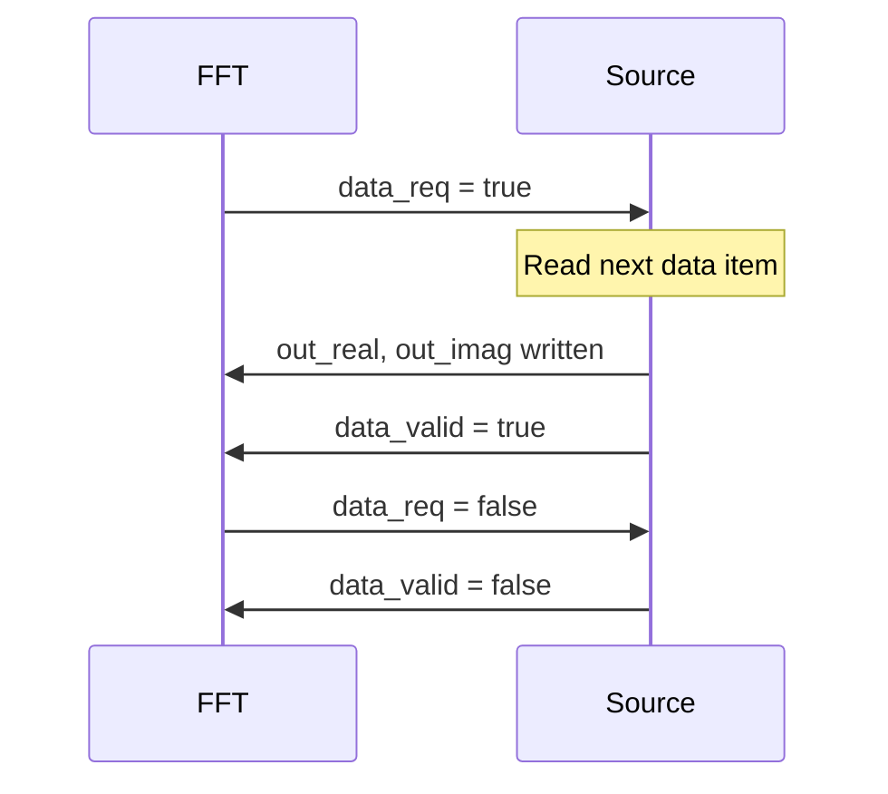

# FFT Example Overview -- Floating-Point and Fixed-Point Implementations

## A Software Engineer's Intuition

Imagine you open a music player on your phone and see the equalizer visualization bouncing along with the music. The core algorithm behind that animation is **FFT (Fast Fourier Transform)**. Its job is to decompose a signal that varies over time (time domain) into its constituent frequency components (frequency domain).

In software terms: FFT is like a `Map` operation that transforms an array of "values at each point in time" into an array of "intensity at each frequency."

## Why Are There Two Versions?

This example contains two subdirectories, both implementing the exact same 16-point FFT algorithm but using different numeric types:

| Comparison | `fft_flpt` (Floating-Point) | `fft_fxpt` (Fixed-Point) |
|---------|---------------------|---------------------|
| Numeric Type | C++ `float` | SystemC `sc_int<16>` |
| Precision | High (IEEE 754 floating-point) | Lower (16-bit fixed-point, 5-bit integer + 10-bit fraction) |
| Hardware Cost | Very expensive (floating-point multipliers are huge) | Cheap (integer multipliers are much smaller) |
| Purpose | Functional verification, algorithm development | Model for actual hardware implementation |

**Software Analogy**: The floating-point version is like using `double` for scientific computation; the fixed-point version is like using integers to simulate decimals in game development (e.g., storing currency in "cents" instead of "dollars": `$12.34` stored as `1234`).

## System Architecture

Both versions share the exact same module architecture; only the data types differ:



The data flow is a simple pipeline:

1. **source** reads 16 complex samples (real + imaginary parts) from a file
2. **fft** performs a 16-point DIF (Decimation-In-Frequency) FFT computation
3. **sink** writes the computation results to an output file

Modules synchronize data transfers using handshake signals (`data_req` / `data_valid` and `data_ready` / `data_ack`).

## File List

### `fft_flpt/` -- Floating-Point Version

| File | Purpose | Description |
|------|---------|-------------|
| `fft.h` | FFT module interface | Declares ports with `float` data type |
| `fft.cpp` | FFT algorithm implementation | Uses C++ `float` for butterfly operations |
| `source.h` | Data source interface | Reads floating-point test data |
| `source.cpp` | Data source implementation | Reads `float` values from `in_real` / `in_imag` files |
| `sink.h` | Result receiver interface | Writes floating-point results |
| `sink.cpp` | Result receiver implementation | Writes `float` results to `out_real` / `out_imag` files |
| `main.cpp` | Top-level wiring | Instantiates modules, creates signals, starts simulation |

### `fft_fxpt/` -- Fixed-Point Version

| File | Purpose | Description |
|------|---------|-------------|
| `fft.h` | FFT module interface | Declares ports with `sc_int<16>` data type |
| `fft.cpp` | FFT algorithm implementation | Uses `sc_int` for butterfly operations, includes bit-level operations |
| `source.h` | Data source interface | Reads integer test data |
| `source.cpp` | Data source implementation | Reads `int` values from file, outputs `sc_int<16>` |
| `sink.h` | Result receiver interface | Writes integer results |
| `sink.cpp` | Result receiver implementation | Converts `sc_int<16>` to `int` before writing |
| `main.cpp` | Top-level wiring | Same structure as floating-point version, signal types changed to `sc_int<16>` |

## Key SystemC Concepts

### SC_CTHREAD -- Synchronous Clocked Thread

All modules in this example use `SC_CTHREAD`, rather than `SC_METHOD` or `SC_THREAD`.

```cpp
SC_CTOR(fft) {
    SC_CTHREAD(entry, CLK.pos());  // Triggered on clock positive edge
}
```

`SC_CTHREAD` is a thread process that only wakes up on clock edges. Its `wait()` always waits for the next clock edge. This is similar to the concept of a "game loop that executes once per tick" in software.

### sc_int / sc_uint -- Fixed-Width Integer Types

In the fixed-point version, all data is represented using `sc_int<16>`. This is a 16-bit signed integer, but in this example it is used to represent a fixed-point number:

- 1 bit for the sign
- 5 bits for the integer part
- 10 bits for the fractional part

For example, `cos(22.5 degrees) = 0.9239` is represented as `942` (i.e., `0.9239 * 1024 ≈ 942`).

### Handshake Synchronization Protocol

Modules do not transfer data directly; instead, they use a request/acknowledge handshake mechanism:



This is like the producer-consumer pattern in software, but using hardware signals instead of queues/semaphores for synchronization.

## Further Reading

- [spec.md](spec.md) -- FFT hardware specification, background knowledge for software engineers
- [fft-flpt.md](fft-flpt.md) -- Floating-point FFT module detailed explanation
- [fft-fxpt.md](fft-fxpt.md) -- Fixed-point FFT module detailed explanation
- [source.md](source.md) -- Data source module
- [sink.md](sink.md) -- Result receiver module
- [main.md](main.md) -- Top-level wiring and simulation startup
