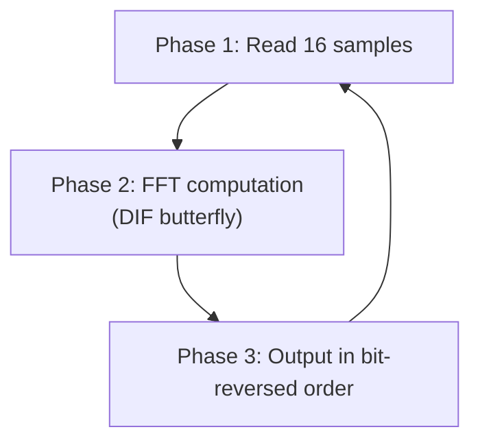
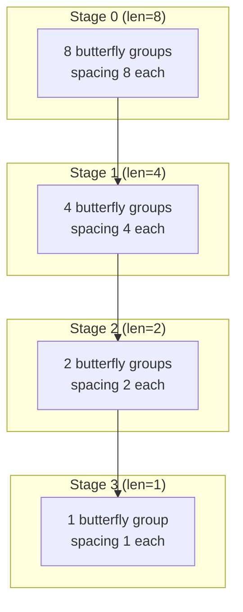

# Floating-Point FFT Module (`fft_flpt/fft.h` + `fft.cpp`)

## A Software Engineer's Intuition

Imagine you have a glass of water mixed with red, blue, and green dyes. The FFT's job is like a "dye separator" that can tell you how much red, blue, and green are in the mixture.

In signal processing terms: the input is a "mixed sound waveform" (time domain), and the output is "how much energy exists at each frequency" (frequency domain).

## Module Interface

```
Source code: fft_flpt/fft.h
```

```cpp
struct fft: sc_module {
    sc_in<float>  in_real;      // Input: real part of complex number
    sc_in<float>  in_imag;      // Input: imaginary part of complex number
    sc_in<bool>   data_valid;   // Signal from source: data is ready
    sc_in<bool>   data_ack;     // Signal from sink: output received
    sc_out<float> out_real;     // Output: real part of FFT result
    sc_out<float> out_imag;     // Output: imaginary part of FFT result
    sc_out<bool>  data_req;     // Request to source: please send next data
    sc_out<bool>  data_ready;   // Notification to sink: output is ready
    sc_in_clk     CLK;          // Clock
};
```

From a software perspective, this interface is a function with 8 parameters: 4 inputs and 4 outputs. The `bool` signals are for flow control (like TCP ACKs).

## Algorithm Flow

The `entry()` function is an infinite loop; each iteration processes 16 complex samples. The flow has three phases:



### Phase 1: Read Samples

```cpp
while (index < 16) {
    data_req.write(true);                    // Tell source: I need data
    do { wait(); } while (data_valid == true); // Wait for source to be ready
    sample[index][0] = in_real.read();       // Read real part
    sample[index][1] = in_imag.read();       // Read imaginary part
    index++;
    data_req.write(false);                   // Tell source: I'm done reading
    wait();
}
```

Software analogy: this is like continuously dequeuing 16 complex data items from a blocking queue.

### Phase 2: FFT Core Computation

This example implements the **DIF (Decimation-In-Frequency)** version of the Radix-2 FFT.

#### Twiddle Factor Computation

First, it computes the "twiddle factors," which are the trigonometric values used in the FFT:

```cpp
theta = 8.0f * atanf(1.0f) / N;  // theta = 2*pi/16 = 22.5 degrees
w_real = cos(theta);              // Real part of W
w_imag = -sin(theta);             // Imaginary part of W
```

Then it uses recursive multiplication to generate all required W values (`W[0]` through `W[6]`), avoiding repeated calls to trigonometric functions. This is like using memoization in software to speed up computation.

#### Butterfly Operations

The core of FFT is the "butterfly" operation. For an N=16 FFT, M=4 stages are needed, each performing a number of butterflies:



The basic operation of each butterfly:

```
Output1 = Input1 + Input2
Output2 = (Input1 - Input2) * W[k]
```

Where `W[k]` is the twiddle factor. In the first iteration (`j=0`), since `W[0] = 1`, no multiplication is needed -- only addition and subtraction.

In software terms: this is a divide-and-conquer algorithm. Each stage splits the problem into smaller subproblems, using butterfly operations to merge results. This is structurally similar to merge sort, except the merge operation is complex multiplication rather than comparison.

#### Butterfly Code (Floating-Point Version)

```cpp
// Part that does not require multiplication (W = 1)
tmp_real = sample[index][0] + sample[index2][0];
tmp_imag = sample[index][1] + sample[index2][1];
sample[index2][0] = sample[index][0] - sample[index2][0];
sample[index2][1] = sample[index][1] - sample[index2][1];
sample[index][0] = tmp_real;
sample[index][1] = tmp_imag;

// Part that requires multiplication (W != 1)
tmp_real2 = sample[index][0] - sample[index2][0];
tmp_imag2 = sample[index][1] - sample[index2][1];
sample[index2][0] = tmp_real2 * W[windex][0] - tmp_imag2 * W[windex][1];
sample[index2][1] = tmp_real2 * W[windex][1] + tmp_imag2 * W[windex][0];
```

Complex multiplication `(a + bi)(c + di) = (ac - bd) + (ad + bc)i` requires 4 real multiplications and 2 additions/subtractions.

### Phase 3: Bit-Reversed Output

The output of a DIF FFT is in bit-reversed order. For example, the result at index 3 (binary `0011`) goes to the position at index 12 (binary `1100`).

```cpp
bits_i = i;
bits_index[3] = bits_i[0];  // Reverse bit order
bits_index[2] = bits_i[1];
bits_index[1] = bits_i[2];
bits_index[0] = bits_i[3];
index = bits_index.to_uint();
```

Here, SystemC's `sc_uint<4>` type is used for bit-level operations, which in pure C++ would require bitwise operations to achieve.

## Data Structure

All FFT data is stored in a local array:

```cpp
float sample[16][2];  // 16 complex samples, [0] = real part, [1] = imaginary part
```

This is an in-place algorithm: input and output share the same memory. In software terms: this is like an in-place sort -- no extra array is needed.

## Key Observations

1. **All computation uses `float`** -- This is standard C++ floating-point arithmetic with nothing hardware-specific.
2. **`wait()` is the only "hardware flavor"** -- Each `wait()` represents waiting for one clock cycle. In the floating-point version, the entire FFT computation (Phase 2) has no `wait()`, meaning it completes "instantaneously" in the simulation.
3. **Handshake protocol** -- Reading and writing use a request/acknowledge pattern, with each data item taking at least 2 clock cycles.
