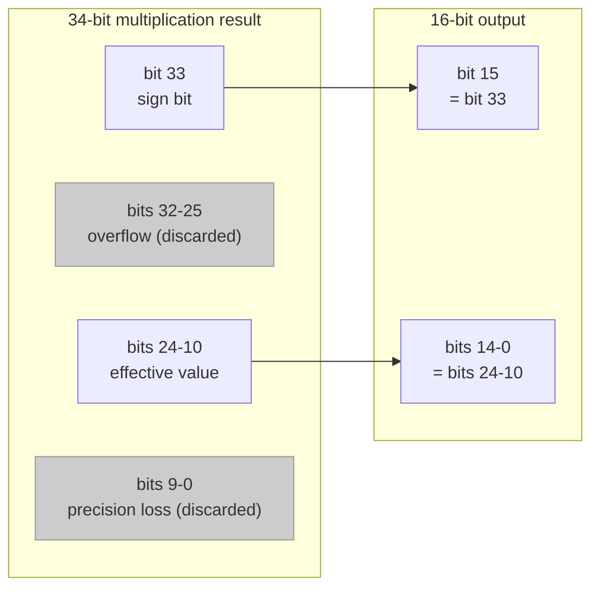

# Fixed-Point FFT Module (`fft_fxpt/fft.h` + `fft.cpp`)

## A Software Engineer's Intuition

This module does exactly the same thing as the floating-point version -- a 16-point FFT. The difference is: **all `float` types have been replaced with fixed-width integers (`sc_int<16>`)**.

Why do this? Because on a real chip, a floating-point multiplier may require tens of thousands of logic gates, while a 16-bit integer multiplier needs only a few thousand. If your WiFi chip has to perform millions of FFTs per second, using floating-point means a chip that is large, expensive, and power-hungry.

**Software Analogy**: This is like changing all coordinates from `double` to `int16_t` in game development, sacrificing some precision for performance. Or like changing currency from `float` to `int` represented in "cents" (`$12.34` becomes `1234`).

## Module Interface Differences

```
Source code: fft_fxpt/fft.h
```

Floating-point version vs fixed-point version:

```cpp
// fft_flpt
sc_in<float>  in_real;
sc_out<float> out_real;

// fft_fxpt
sc_in<sc_int<16> >  in_real;
sc_out<sc_int<16> > out_real;
```

The only change is replacing `float` with `sc_int<16>`. Control signals (`data_valid`, `data_ack`, etc.) remain completely unchanged.

## Fixed-Point Representation

In this example, the 16-bit integer is interpreted in **`<s,5,10>` format**:

```
[15] [14 13 12 11 10] [9 8 7 6 5 4 3 2 1 0]
 ^        ^                    ^
 sign    5-bit integer part   10-bit fractional part
```

This means:
- Actual value = integer value / 1024 (because 2^10 = 1024)
- Representable range: approximately -16.0 to +15.999
- Precision: 1/1024 ≈ 0.001

For example, `cos(22.5 degrees) = 0.9239` is represented in fixed-point as:

```cpp
w_real = 942;  // 942 / 1024 = 0.9199... (close to 0.9239)
w_imag = -389; // -389 / 1024 = -0.3799... (close to -0.3827)
```

## Key Differences from the Floating-Point Version

### Difference 1: Twiddle Factors Become Constants

The floating-point version computes them at runtime using `cos()` and `sin()`; the fixed-point version uses pre-computed integer constants directly:

```cpp
// fft_flpt: runtime computation
w_real = cos(theta);
w_imag = -sin(theta);

// fft_fxpt: pre-computed constants
w_real = 942;   // cos(22.5 deg) * 1024
w_imag = -389;  // -sin(22.5 deg) * 1024
```

This is common in software: replacing runtime floating-point computation with compile-time lookup tables.

### Difference 2: Manual Bit Width Management

Floating-point multiplication yields another `float`, but integer multiplication doubles the bit width. 16-bit x 16-bit = 32-bit:

```cpp
sc_int<16> a, b;
sc_int<32> result = a * b;  // Multiplication result needs 32 bits
```

Addition can also overflow: 16-bit + 16-bit may need 17 bits:

```cpp
sc_int<16> a, b;
sc_int<17> sum = a + b;     // Addition result needs 17 bits
```

The code contains variables of various bit widths:

```cpp
sc_int<16> real[16];    // Original data: 16-bit
sc_int<17> tmp_real1;   // Addition result: 17-bit
sc_int<34> tmp_real3;   // Multiplication result: 34-bit (17 * 16 + 1)
```

### Difference 3: Butterfly Function

The floating-point version computes inline; the fixed-point version extracts a separate `func_butterfly()` function. This is because fixed-point requires precise bit extraction:

```cpp
void func_butterfly(
    const sc_int<16>& w_real, const sc_int<16>& w_imag,
    const sc_int<16>& real1_in, const sc_int<16>& imag1_in,
    const sc_int<16>& real2_in, const sc_int<16>& imag2_in,
    sc_int<16>& real1_out, sc_int<16>& imag1_out,
    sc_int<16>& real2_out, sc_int<16>& imag2_out
);
```

### Difference 4: Bit Extraction (Truncation and Alignment)

This is the most critical difference in the fixed-point version. The multiplication result is 34 bits, but the output needs only 16 bits, so the correct bits must be carefully extracted:

```cpp
// 34-bit multiplication result:
// [33]  [32..25]  [24..10]  [9..0]
//  ^      ^         ^         ^
// sign  overflow  what we   precision
//       bits      want      loss

// Extract sign bit
real2_out[15] = tmp_real3[33];

// Extract middle 15 bits
real2_out.range(14,0) = tmp_real3.range(24,10);
```

In software terms: this is like rounding back to low precision after a high-precision computation. Similar to `(int)((double_result * 1024) / 1024)`.



### Difference 5: Recursive W Value Computation

The floating-point version's W value recursion is straightforward (just multiply `float` values). The fixed-point version needs bit extraction after each multiplication:

```cpp
w_temp1 = w_rec_real * w_real;  // 32-bit result
w_temp5 = w_temp1 - w_temp2;   // 33-bit result

// Truncate back to 16-bit
W_real[w_index][15] = w_temp5[32];              // sign bit
W_real[w_index].range(14,0) = w_temp5.range(24,10); // value bits
```

Each truncation introduces a small error, and these errors accumulate. This is the core challenge of fixed-point arithmetic.

## Code Structure Comparison Table

| Feature | Floating-Point Version | Fixed-Point Version |
|---------|----------------------|---------------------|
| Data array | `float sample[16][2]` | `sc_int<16> real[16]`, `sc_int<16> imag[16]` |
| W value computation | `cos()` / `sin()` | Pre-computed constants `942` / `-389` |
| Multiplication | `float * float` -> `float` | `sc_int<16> * sc_int<16>` -> `sc_int<32>` |
| Butterfly | Inline computation | Separate function `func_butterfly()` |
| Precision management | Automatic (IEEE 754) | Manual bit extraction with `range()` |
| Bit reversal | `sc_uint<4>` bit operations | Same |

## Key Observations

1. **The algorithm logic is exactly the same** -- Both versions have an identical DIF FFT algorithm structure; only the numeric representation differs.
2. **Fixed-point requires "manual floating-point"** -- Software engineers normally do not worry about the bit width of multiplication results, but hardware designers must precisely control every bit.
3. **Precision vs cost trade-off** -- Truncating bits means discarding precision. Choosing which bits to keep (`range(24,10)`) is a core hardware design decision.
4. **Bit operations with `sc_int<N>`** -- Methods like `range()` and `[]` allow C++ code to express bit slicing operations common in hardware, which in pure C++ would require shifts and masks.
