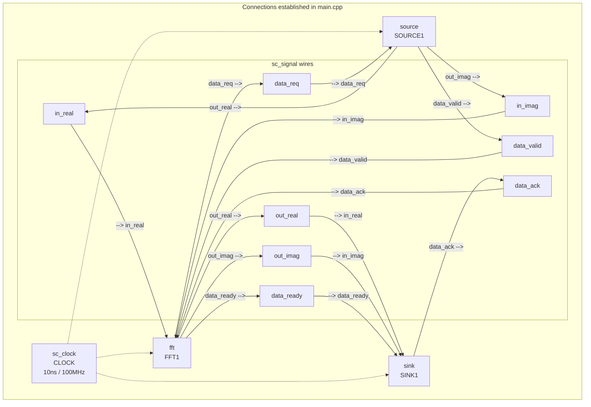

# Main -- Top-Level Wiring and Simulation Startup

## A Software Engineer's Intuition

The role of `main.cpp` is like an **application entry point** combined with a **dependency injection container**. It is responsible for:

1. Creating all components (module instantiation)
2. Connecting the interfaces between components (signal binding)
3. Starting the entire system (beginning the simulation)

In software framework terms: this is like a dependency injection container (like Python's inject library) or Angular's Module -- defining the wiring between components.

## Comparison of the Two Versions

```
Source code: fft_flpt/main.cpp
Source code: fft_fxpt/main.cpp
```

Both versions have an identical structure; the only difference is the signal types:

```cpp
// fft_flpt
sc_signal<float> in_real;
sc_signal<float> out_real;

// fft_fxpt
sc_signal<sc_int<16>> in_real;
sc_signal<sc_int<16>> out_real;
```

## Code Structure Walkthrough

### Step 1: Declare Signals

```cpp
sc_signal<float> in_real;       // Real part data from source -> fft
sc_signal<float> in_imag;       // Imaginary part data from source -> fft
sc_signal<bool>  data_valid;    // Handshake from source -> fft
sc_signal<bool>  data_ack;      // Handshake from sink -> fft
sc_signal<float> out_real;      // Real part result from fft -> sink
sc_signal<float> out_imag;      // Imaginary part result from fft -> sink
sc_signal<bool>  data_req;      // Handshake from fft -> source
sc_signal<bool>  data_ready;    // Handshake from fft -> sink
```

`sc_signal` is like a shared variable in software, but with one key difference: a written value is not visible to readers until the next delta cycle. This models the behavior of wires in hardware.

### Step 2: Create Clock

```cpp
sc_clock clock("CLOCK", 10, SC_NS, 0.5, 0.0, SC_NS);
```

Parameter meanings:
- `"CLOCK"` -- Name (for debugging)
- `10, SC_NS` -- 10 nanosecond period (100 MHz)
- `0.5` -- 50% duty cycle (5 ns high and 5 ns low)
- `0.0, SC_NS` -- Zero start offset

In software terms: this is a timer that triggers every 10 ns. All `SC_CTHREAD` processes execute to the rhythm of this timer.

### Step 3: Instantiate Modules and Connect

```cpp
fft FFT1("FFTPROCESS");
FFT1.in_real(in_real);      // Bind port to signal
FFT1.in_imag(in_imag);
FFT1.data_valid(data_valid);
// ... remaining port bindings ...
FFT1.CLK(clock);
```

This **port binding** syntax is SystemC's form of dependency injection. Each module declares what ports it needs, and `main` is responsible for injecting the actual signals.

### Step 4: Start Simulation

```cpp
sc_start();  // Start simulation, runs until sc_stop() is called
return 0;
```

`sc_start()` with no arguments means "run indefinitely until someone calls `sc_stop()`." In this example, the `source` module calls `sc_stop()` after finishing reading the input file.

## Complete Wiring Diagram



## `sc_main` vs `main`

SystemC uses `sc_main` instead of the standard C++ `main`. This is because the SystemC library needs to perform some initialization (creating the simulation kernel) before user code runs. The actual `main` function is provided by the SystemC library, which then calls the user-defined `sc_main`.

```cpp
int sc_main(int, char*[])  // Note: parameter names are omitted
```

## Key Observations

1. **No logic at all** -- `main.cpp` is purely wiring with no computation logic. This is a typical pattern in hardware design: the top level only handles connections, and all functionality resides in submodules.
2. **Signals are shared** -- Notice that the `in_real` signal is connected to both `SOURCE1.out_real` and `FFT1.in_real`. A single signal can have one writer and multiple readers (just like a wire).
3. **All modules share the same clock** -- This is a characteristic of synchronous design. Real systems may have multiple clock domains, but this example uses only one.
4. **Simulation termination is controlled by the testbench** -- `sc_start()` does not specify a time; it relies on `source`'s `sc_stop()` to end the simulation. This is a common pattern.
