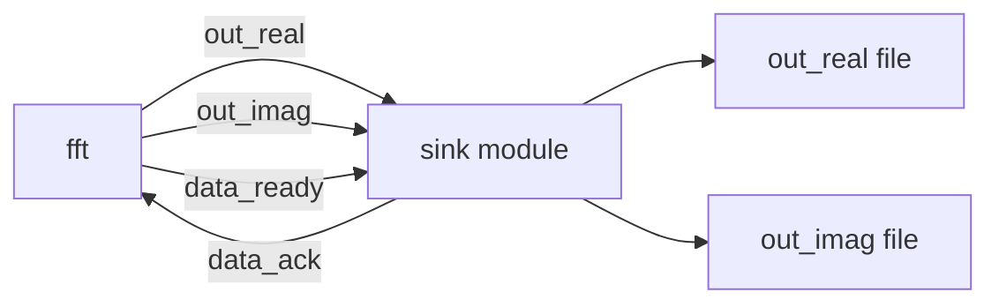
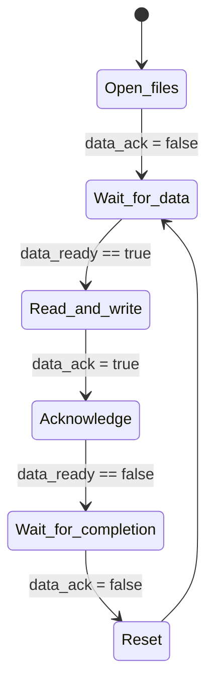

# Sink Module -- Result Receiver and Verification

## A Software Engineer's Intuition

The `sink` module is a **file writer** or **data consumer**. It receives computation results from the FFT module and writes them to output files. These can then be compared against golden reference files to verify correctness.

In software terms: this is a consumer thread that consumes data from a blocking queue and writes to a file, paired with an offline `diff` for assertion.

## Comparison of the Two Versions

```
Source code: fft_flpt/sink.h, fft_flpt/sink.cpp
Source code: fft_fxpt/sink.h, fft_fxpt/sink.cpp
```

### Interface Differences

| Port | Floating-Point Version | Fixed-Point Version |
|------|----------------------|---------------------|
| `in_real` | `sc_in<float>` | `sc_in<sc_int<16>>` |
| `in_imag` | `sc_in<float>` | `sc_in<sc_int<16>>` |
| `data_ready` | `sc_in<bool>` | `sc_in<bool>` (same) |
| `data_ack` | `sc_out<bool>` | `sc_out<bool>` (same) |

### Output Format Differences

```cpp
// fft_flpt: writes floating-point (scientific notation)
fprintf(fp_real, "%e  \n", in_real.read());

// fft_fxpt: converts to int before writing
sc_int<16> tmp = in_real.read();
int tmp_out = tmp.to_int();
fprintf(fp_real, "%d  \n", tmp_out);
```

The fixed-point version needs an additional `to_int()` conversion because `sc_int<16>` cannot be printed directly with `%d`.

## Module Structure



## Operation Flow



Core code (floating-point version as example):

```cpp
void sink::entry() {
    fp_real = fopen("out_real", "w");
    fp_imag = fopen("out_imag", "w");
    data_ack.write(false);

    while(true) {
        // 1. Wait for FFT output to be ready
        do { wait(); } while (!(data_ready == true));

        // 2. Read results and write to file
        fprintf(fp_real, "%e  \n", in_real.read());
        fprintf(fp_imag, "%e  \n", in_imag.read());

        // 3. Notify FFT: I have received the data
        data_ack.write(true);

        // 4. Wait for FFT to deassert data_ready
        do { wait(); } while (!(data_ready == false));

        // 5. Reset acknowledge
        data_ack.write(false);
    }
}
```

## Destructor and Resource Management

The `sink` module has a noteworthy design -- it closes files in its destructor:

```cpp
~sink() {
    fclose(fp_real);
    fclose(fp_imag);
}
```

The `source` module does not do this. In SystemC, module destructors are called when the simulation ends. This ensures the output file contents are fully written (flushed).

In software terms: this is like the RAII pattern -- using a destructor to ensure resources are properly released.

## Verification Mechanism

This example uses offline comparison for verification. Each version comes with golden reference files:

```
out_real.1.golden  out_real.2.golden  out_real.3.golden  out_real.4.golden
out_imag.1.golden  out_imag.2.golden  out_imag.3.golden  out_imag.4.golden
```

Verification flow:

1. Run the simulation; `sink` produces `out_real` and `out_imag`
2. Use `diff` to compare outputs against golden references
3. If they match exactly, the FFT implementation is correct

This is the same concept as snapshot testing in software: first generate a known-correct output as a baseline, then compare against that baseline after every change.

## Key Observations

1. **Sink performs no verification logic** -- It only writes files. Verification is done externally using `diff` after the simulation. More advanced testbenches might perform comparison directly inside the sink.
2. **Handshake is symmetric** -- The source-to-FFT and FFT-to-sink handshake protocols are mirror images: `data_req`/`data_valid` corresponds to `data_ready`/`data_ack`.
3. **Infinite loop** -- The `while(true)` loop in `sink` never terminates on its own. Simulation termination is triggered by `source` calling `sc_stop()`.
