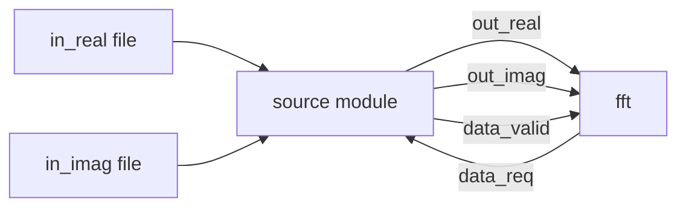
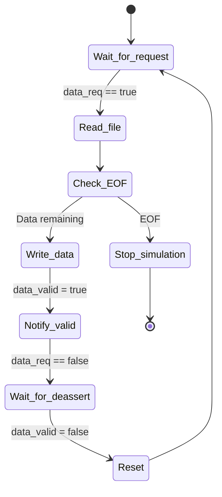

# Source Module -- Test Data Generator

## A Software Engineer's Intuition

The `source` module's role is like a **file reader** or **data producer**. It reads pre-prepared test data from files, then sends the data one item at a time to the FFT module via a handshake protocol.

In software terms: this is a producer thread that reads data from a file and pushes it to a blocking queue.

## Comparison of the Two Versions

### Common Structure

Both versions of `source` share an identical structure:

```
Source code: fft_flpt/source.h, fft_flpt/source.cpp
Source code: fft_fxpt/source.h, fft_fxpt/source.cpp
```



### Interface Differences

| Port | Floating-Point Version | Fixed-Point Version |
|------|----------------------|---------------------|
| `out_real` | `sc_out<float>` | `sc_out<sc_int<16>>` |
| `out_imag` | `sc_out<float>` | `sc_out<sc_int<16>>` |
| `data_req` | `sc_in<bool>` | `sc_in<bool>` (same) |
| `data_valid` | `sc_out<bool>` | `sc_out<bool>` (same) |

### File Reading Differences

```cpp
// fft_flpt: reads floating-point numbers
float tmp_val;
fscanf(fp_real, "%f \n", &tmp_val);

// fft_fxpt: reads integers
int tmp_val;
fscanf(fp_real, "%d", &tmp_val);
```

The floating-point version's input files contain decimals like `1.5`, while the fixed-point version's input files contain integers like `1536` (i.e., `1.5 * 1024`).

## Operation Flow

The `entry()` function logic is very straightforward:



Core code (floating-point version as example):

```cpp
void source::entry() {
    fp_real = fopen("in_real", "r");
    fp_imag = fopen("in_imag", "r");
    data_valid.write(false);

    while(true) {
        // 1. Wait for FFT module to issue a request
        do { wait(); } while (!(data_req == true));

        // 2. Read one data item from file
        if (fscanf(fp_real, "%f \n", &tmp_val) == EOF) {
            sc_stop();  // File exhausted, end simulation
            break;
        }
        out_real.write(tmp_val);
        // ... similarly read the imaginary part ...

        // 3. Notify FFT: data is ready
        data_valid.write(true);

        // 4. Wait for FFT to receive data (deassert request)
        do { wait(); } while (!(data_req == false));

        // 5. Reset data_valid
        data_valid.write(false);
        wait();
    }
}
```

## Handshake Timing

Each data transfer requires at least 3 clock cycles:

```
Clock:      |  1  |  2  |  3  |  4  |  5  |
data_req:   __/‾‾‾‾‾‾‾‾‾‾‾\_______________
data_valid: __________/‾‾‾‾‾‾‾‾‾\__________
out_real:   ----------<VALID>---------------
out_imag:   ----------<VALID>---------------
```

1. **Cycle 1-2**: FFT asserts `data_req`; source detects it, reads the file, and outputs data
2. **Cycle 2-3**: source asserts `data_valid`; FFT detects it and reads the data
3. **Cycle 3-4**: FFT deasserts `data_req`; source detects it and deasserts `data_valid`

## Test Data Files

Each version has multiple sets of test data:

| File | Purpose |
|------|---------|
| `in_real` / `in_imag` | Input for the first test vector |
| `in_real.1` ~ `in_real.4` | Additional test vectors (must be switched manually) |
| `in_imag.1` ~ `in_imag.4` | Corresponding imaginary parts |

The filenames `"in_real"` and `"in_imag"` are hardcoded in the source code.

## Key Observations

1. **`sc_stop()` ends the simulation** -- When the input file is exhausted, `source` calls `sc_stop()` to terminate the entire simulation. This is a common pattern in SystemC: letting the testbench control when the simulation ends.
2. **Blocking I/O** -- `do { wait(); } while (condition)` is the blocking wait pattern in SystemC, equivalent to `while(condition) { sleep(tick); }` in software.
3. **No resource management** -- `fopen` is not paired with `fclose` in the destructor (unlike `sink`). This is not a major issue in simulation, but would need attention in real software.
