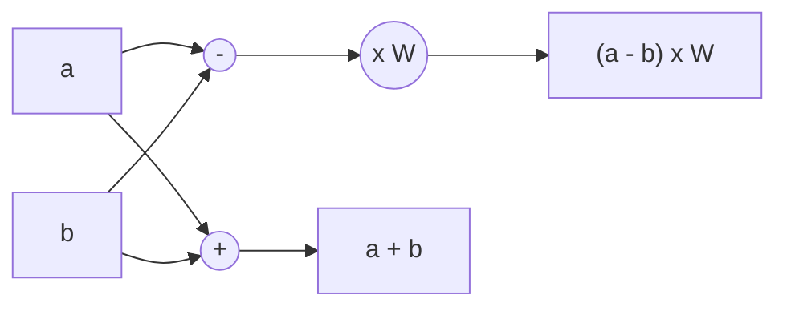
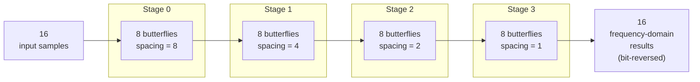
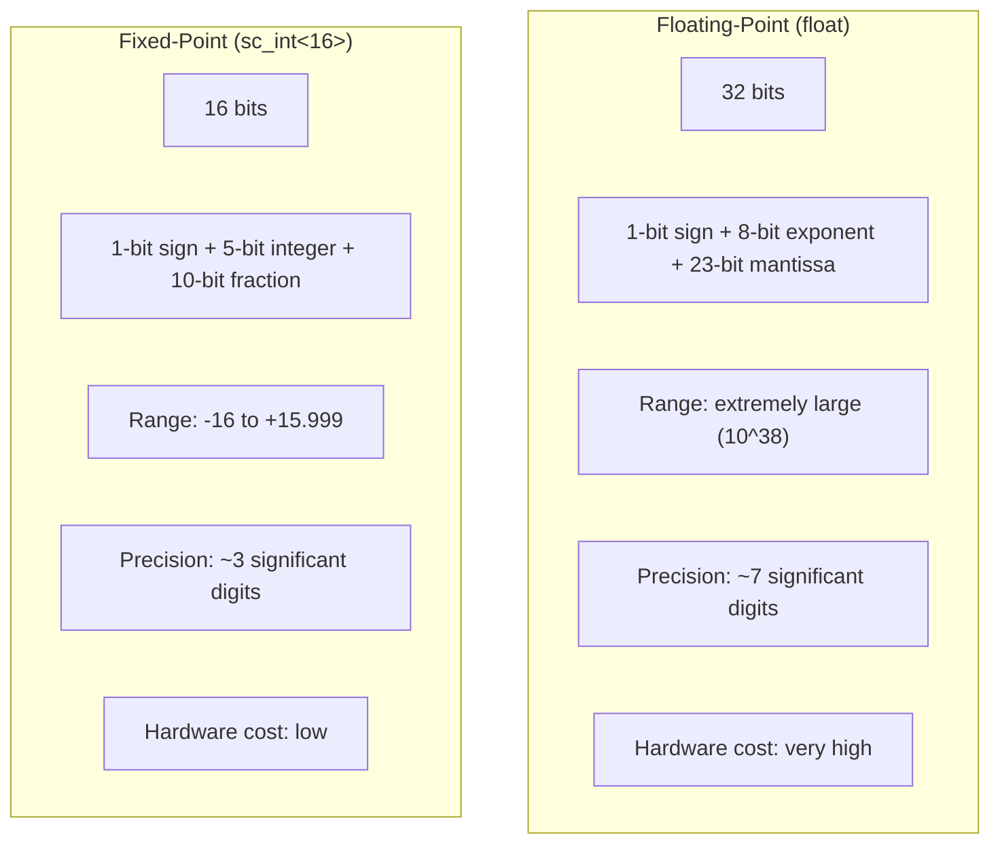
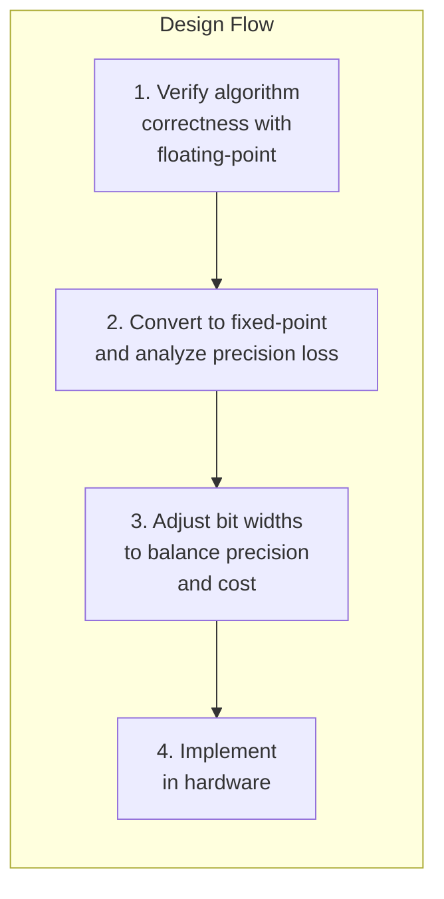
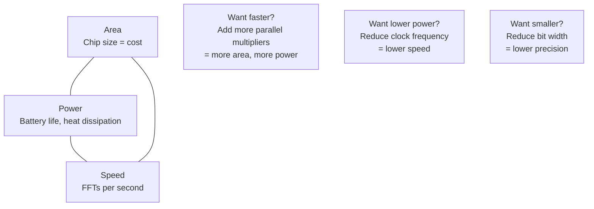

# FFT Hardware Specification -- Background Knowledge for Software Engineers

## What Is FFT?

**FFT (Fast Fourier Transform)** is a mathematical algorithm that converts a "signal varying over time" into "constituent frequency components."

### An Everyday Example

Imagine you are in a room hearing three sounds simultaneously: a deep engine rumble, a mid-range human voice, and a high-pitched bird call. Your ears can "distinguish" these three sounds. FFT does exactly the same thing -- it decomposes a mixed signal into its individual frequency components.

```
Time domain (the mixed sound you hear)     Frequency domain (components extracted by FFT)

  Amplitude                                  Energy
   ^  ~~~                                    ^
   | ~   ~~  ~                               |  |
   |~  ~~  ~~  ~~~                           |  |     |
   |    ~    ~~    ~                          |  |     |  |
   +-----------> Time                        +-----------> Frequency
                                               Low   Mid   High
```

### Analogies Familiar to Software Engineers

| Concept | Software Analogy |
|---------|-----------------|
| Time-domain signal | A `float[]` array, indexed by time |
| Frequency-domain signal | A `float[]` array, indexed by frequency |
| FFT computation | A `transform(input[]) -> output[]` function |
| Complex number | A `struct { float real, imag; }` |
| N-point FFT | A transform of array length N (N=16 in this example) |

## Real-World Applications

FFT is everywhere:

| Application | How FFT Is Used |
|------------|----------------|
| **WiFi / 5G (OFDM)** | Separates multiple subcarriers from radio waves. The WiFi chip in your phone performs millions of FFTs per second |
| **Audio Processing** | Spectrum visualization in music players, noise cancellation, speech recognition |
| **Radar** | Analyzes target speed and distance from echo signals |
| **Medical Imaging** | MRI scanners use FFT to reconstruct images of the body's interior |
| **Image Compression** | JPEG uses a similar frequency-domain transform to compress images |

## FFT Algorithm Principles

### Butterfly Operation

The core operation of FFT is called a **butterfly**, because its data flow diagram resembles butterfly wings:



Each butterfly takes two inputs and produces two outputs:
- Output 1 = Input 1 + Input 2
- Output 2 = (Input 1 - Input 2) x W

Where W is the "twiddle factor," a complex constant.

### Complete Structure of a 16-Point FFT

A 16-point FFT requires 4 stages (since log2(16) = 4), each stage containing 8 butterflies:



Total computation:
- Additions/subtractions: N x log2(N) = 16 x 4 = 64
- Complex multiplications: approximately N/2 x log2(N) = 32 (fewer when excluding the W=1 cases)

Compared to computing DFT directly, which requires N^2 = 256 multiplications, FFT is 8x faster. The difference is even more dramatic for larger N (100x faster at N=1024).

## Why Two Implementations?

### Floating-Point vs Fixed-Point



### What Is Fixed-Point?

**Fixed-point means using integers to simulate decimals.** This is the easiest explanation for software engineers.

Imagine you are writing code for an embedded system that does not support floating-point (or more practically: you are using integers to handle currency):

```
Actual amount: $12.34
Integer storage: 1234 (cents)
Conversion: actual value = integer value / 100
```

The fixed-point numbers in the FFT example use the same concept, just with a different "decimal point position":

```
Actual value: 0.9239 (cos 22.5 degrees)
Integer storage: 942
Conversion: actual value = integer value / 1024 (because the fractional part has 10 bits)
Verification: 942 / 1024 = 0.9199 ≈ 0.9239
```

### Why Not Use Floating-Point for Everything?

In the software world, `float` and `int` operations have similar speeds (modern CPUs all have FPUs). But in the hardware world, the difference is enormous:

| Comparison | 16-bit Integer Multiplier | 32-bit Floating-Point Multiplier |
|------------|--------------------------|----------------------------------|
| Logic gate count | ~2,000 | ~20,000 |
| Chip area | Small | 10x larger |
| Power consumption | Low | High |
| Latency | Fast | Slower (requires exponent alignment and other extra steps) |

An FFT module may need multiple multipliers running in parallel. If each one uses floating-point, the chip becomes impractically large.

### The Precision vs Cost Trade-off



This is why this example has two versions:
1. **`fft_flpt`** -- Uses floating-point as the golden reference (correct answer)
2. **`fft_fxpt`** -- Uses fixed-point to model actual hardware, verifying whether precision is sufficient

## Fixed-Point Arithmetic Pitfalls

### Overflow

Adding two 16-bit values can produce a 17-bit result:

```
Maximum positive value:  0111_1111_1111_1111 (32767)
                       + 0111_1111_1111_1111 (32767)
                       = 1111_1111_1111_1110 (65534, requires 17 bits)
```

If stored in only 16 bits, the result overflows and becomes negative. This is why the code uses wider types:

```cpp
sc_int<17> tmp_real1 = real1_in + real2_in;  // 17 bits to prevent overflow
```

### Truncation Error

After multiplication, the result must be truncated from 34 bits back to 16 bits. The discarded bits represent precision loss:

```
34-bit multiplication result:
[sign] [overflow bits | 15 bits kept | 10 bits discarded]
                        ^               ^
                    what we keep     precision loss
```

Each truncation loses roughly 10 bits of precision (i.e., an error of 1/1024). After multiple butterfly operations, the errors accumulate.

### Error Accumulation

A 4-stage FFT has truncation error at each stage. The final result may differ from the floating-point version by a few percent. The hardware designer's job is to ensure this error stays within the acceptable range for the application.

## The Area / Power / Speed Triangle Trade-off

In hardware design, these three metrics are always in conflict:



The "floating-point vs fixed-point" choice demonstrated in this example is the most typical case of the area/power trade-off.

## Specifications for This Example

| Parameter | Value |
|-----------|-------|
| FFT Size | 16-point (N=16) |
| Algorithm | Radix-2 DIF (Decimation-In-Frequency) |
| Data Format (floating-point) | IEEE 754 `float` (32-bit) |
| Data Format (fixed-point) | `sc_int<16>`, format `<s,5,10>` |
| Butterfly stages | 4 (= log2(16)) |
| Butterflies per stage | 8 (= N/2) |
| Output order | Bit-reversed |
| I/O Protocol | Request/Acknowledge handshake |
| Clock | 10 ns period (100 MHz) |
