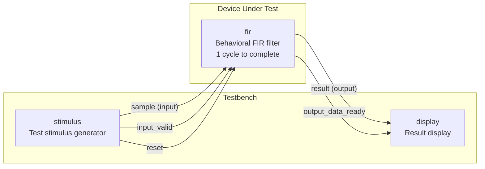
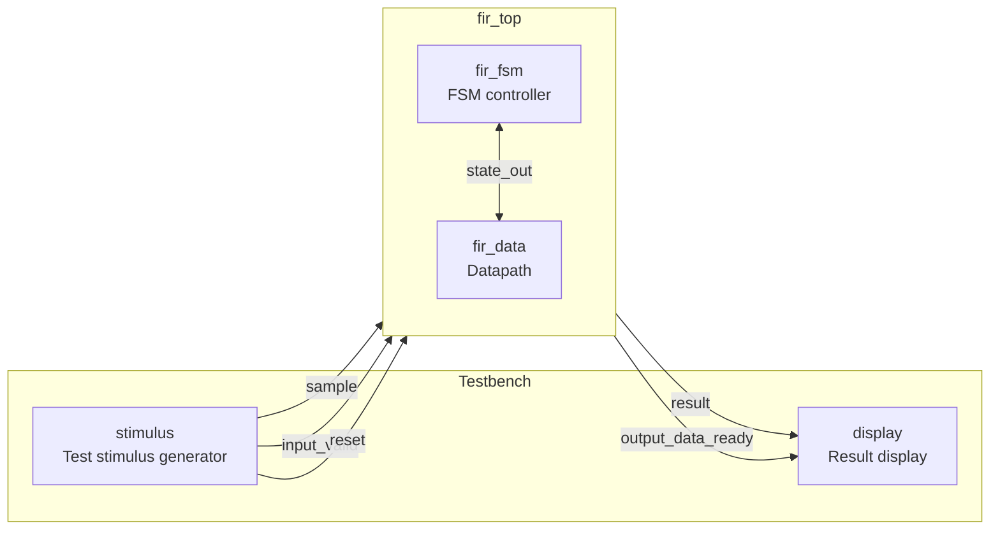
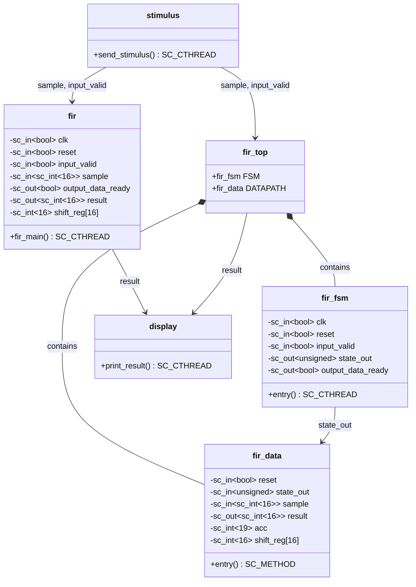

# FIR Filter Example -- Behavioral and RTL Dual Implementation

> **Reading difficulty**: Intermediate | **Prerequisites**: SC_MODULE basics, SC_CTHREAD concepts
> **Source code location**: `examples/sysc/fir/`

---

## Overview

This example implements a **16-tap FIR (Finite Impulse Response) filter** and provides two implementations at different abstraction levels:

| Implementation | Corresponding files | Software analogy |
|---------|---------|---------|
| **Behavioral** | `fir.h`, `fir.cpp` | Like calling a function directly, computing everything at once |
| **RTL (Register Transfer Level)** | `fir_fsm.h/.cpp`, `fir_data.h/.cpp`, `fir_top.h` | Like splitting a function into a state machine + data processor, completing in multiple steps |

### Software Engineer's Intuition

A FIR filter is essentially a **sliding window weighted average**.

Imagine you are doing a moving average for stock analysis:
- You have the stock prices of the last 16 days (shift register)
- Each day has a different weight (coefficients)
- Add up all "price x weight" products, and that is today's filtered result

The only difference: FIR weights (coefficients) are carefully designed to filter out specific frequency components of a signal.

---

## Data Flow Diagram

### Behavioral Version -- Single module, completes in one clock cycle

### RTL Version -- FSM + Datapath, completes in four clock cycles

---

## Module Class Diagram

---

## File List

| File | Purpose | Documentation link |
|------|------|---------|
| `fir_const.h` | 16 filter coefficient definitions | [fir-const.md](fir-const.md) |
| `fir.h` / `fir.cpp` | Behavioral FIR implementation | [fir.md](fir.md) |
| `fir_fsm.h` / `fir_fsm.cpp` | RTL FSM controller | [fir-fsm.md](fir-fsm.md) |
| `fir_data.h` / `fir_data.cpp` | RTL datapath | [fir-data.md](fir-data.md) |
| `fir_top.h` | RTL top-level module (combines FSM + Datapath) | [fir-top.md](fir-top.md) |
| `stimulus.h` / `stimulus.cpp` | Test stimulus generator | [stimulus.md](stimulus.md) |
| `display.h` / `display.cpp` | Result output display | [display.md](display.md) |
| `main.cpp` | Behavioral testbench | [main.md](main.md) |
| `main_rtl.cpp` | RTL testbench | [main.md](main.md) |

---

## Core Concepts

### Same Algorithm, Two Abstraction Levels

This is the most important concept in this example: **Behavioral and RTL perform exactly the same computation**; the difference lies in "how it is realized in hardware."

| Aspect | Behavioral | RTL |
|------|-----------|-----|
| **Abstraction level** | High (describes "what to do") | Low (describes "how to do it") |
| **Clock cycles** | 1 cycle to complete all 16 taps | 4 cycles to complete (4 taps per cycle) |
| **Software analogy** | Calling `calculate()` directly | Using a state machine to compute step by step |
| **Hardware resources** | Requires 16 multipliers (parallel) | Can use only 4 multipliers (time-shared) |
| **Modeling construct** | `SC_CTHREAD` | `SC_CTHREAD` (FSM) + `SC_METHOD` (Datapath) |

### Key SystemC Concepts

1. **SC_CTHREAD (Clocked Thread)**: A thread synchronized to the clock, suitable for describing stateful sequential logic
2. **Behavioral Modeling**: Describes functionality like writing a normal program, without worrying about timing details
3. **RTL Modeling**: Splits the design into "control" (FSM) and "computation" (Datapath), precisely describing behavior at each clock cycle
4. **FSM + Datapath decomposition**: A classic hardware design architecture pattern, similar to MVC separation in software

---

## Recommended Reading Order

1. [spec.md](spec.md) -- First understand what a FIR filter is
2. [fir-const.md](fir-const.md) -- Understand the filter coefficients
3. [fir.md](fir.md) -- Read the Behavioral implementation (simpler)
4. [fir-fsm.md](fir-fsm.md) -- Then read the RTL controller
5. [fir-data.md](fir-data.md) -- Then read the RTL datapath
6. [fir-top.md](fir-top.md) -- See how the two are combined
7. [stimulus.md](stimulus.md) + [display.md](display.md) -- Test environment
8. [main.md](main.md) -- Complete testbench
