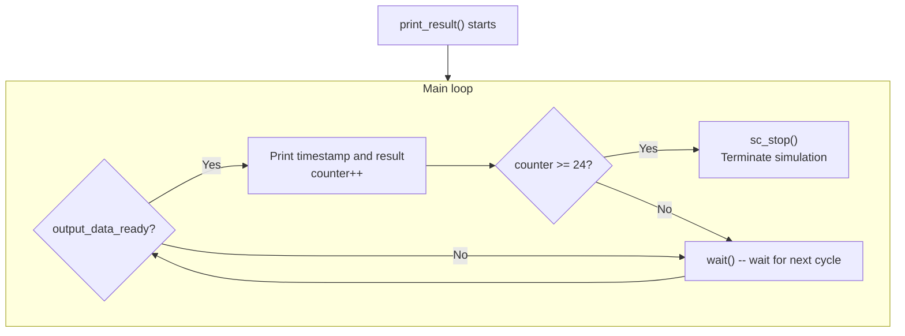

# Result Display Module

> **Files**: `display.h`, `display.cpp`
> **Difficulty**: Beginner | **Key concepts**: sc_stop(), simulation termination control

---

## Overview

The `display` module is a **monitor** that observes the FIR filter output and prints results to the terminal. After collecting enough results, it calls `sc_stop()` to terminate the entire simulation.

---

## Module Interface

| Port | Direction | Type | Description |
|------|------|------|------|
| `clk` | in | `bool` | Clock |
| `output_data_ready` | in | `bool` | Output ready flag from the FIR |
| `result` | in | `sc_int<16>` | Computation result from the FIR |

---

## Execution Flow



---

## What sc_stop() Does

`sc_stop()` is a global function provided by the SystemC kernel to **terminate the entire simulation**.

```cpp
if (counter >= 24) {
    sc_stop();  // graceful shutdown
}
```

### Software Analogy

| SystemC | Software |
|---------|------|
| `sc_stop()` | `process.exit()` or `done()` in a test framework |
| Simulation keeps running | Event loop keeps running |
| All modules stop simultaneously | All Python coroutines (asyncio) / threads end simultaneously |

### Why 24 Results?

24 is an arbitrarily chosen number, sufficient to verify that the filter behaves correctly. In real hardware verification, there would be more rigorous pass/fail logic (e.g., comparing against a golden reference).

---

## Output Format

Whenever `output_data_ready` is true, display prints a message like:

```
at time [TIMESTAMP] the FIR ipnut is SAMPLE and the output is RESULT
```

Where `TIMESTAMP` is the SystemC simulation time (`sc_time_stamp()`), letting you know at which point in time each result was produced.

---

## Design Observations

### Monitor Pattern

`display` is a typical **monitor** module:

- Only reads signals, never writes to any signal
- Does not affect the DUT (Device Under Test) behavior
- Can be added or removed at any time without affecting functional correctness

This is like a **logger** or **observer** in software -- passively observing system state without interfering with system operation.

### Using SC_CTHREAD

display uses `SC_CTHREAD` to synchronize with the clock, ensuring it checks `output_data_ready` at each clock edge. This is the standard approach for observing synchronous signals.
