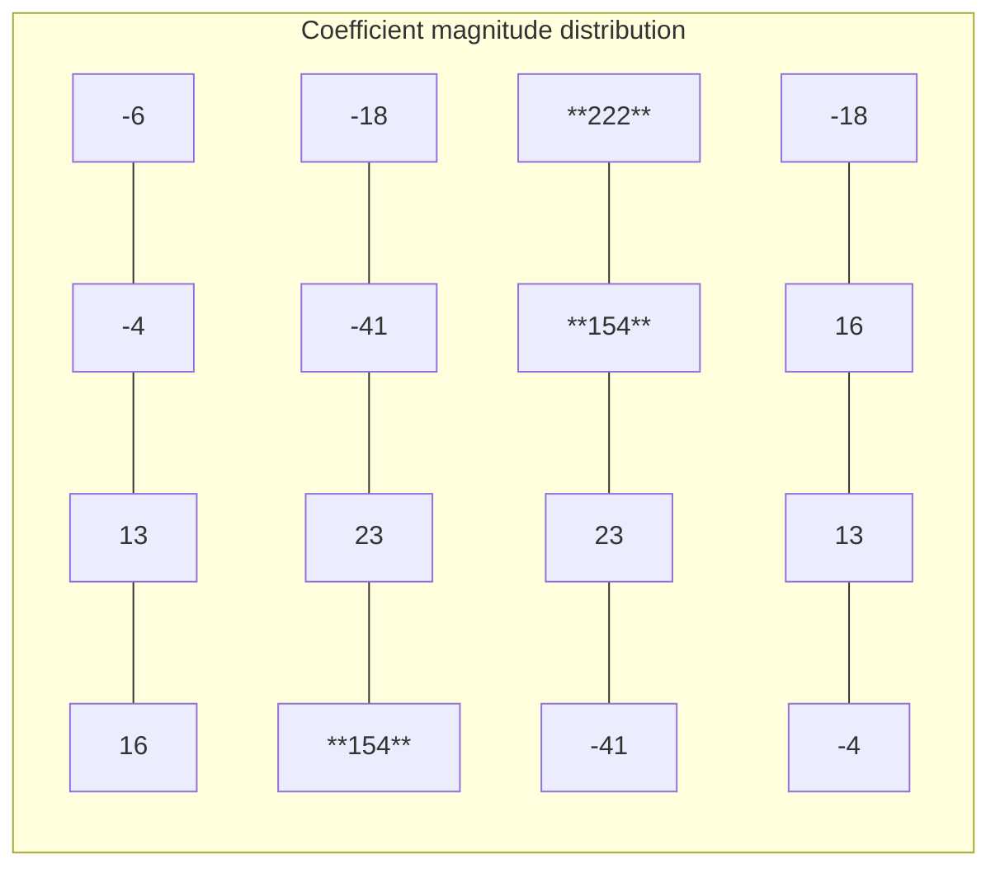

# Filter Coefficients

> **File**: `fir_const.h`
> **Difficulty**: Beginner | **Key concepts**: FIR coefficients, symmetry, low-pass filtering

---

## Overview

`fir_const.h` defines the 16 FIR filter tap coefficients:

```
-6, -4, 13, 16, -18, -41, 23, 154, 222, 154, 23, -41, -18, 16, 13, -4
```

These numbers determine the filter characteristics -- which frequencies it preserves and which it removes.

---

## Coefficient Symmetry

Observe these 16 coefficients and you will notice they are nearly **symmetric**:

```
Position:  0    1   2   3    4    5   6    7    8    9   10   11   12  13  14  15
Coeff:    -6   -4  13  16  -18  -41  23  154  222  154   23  -41  -18  16  13  -4
           ^                                                                  ^
           |__________________ nearly symmetric ______________________________|
```

More precisely, `coeff[i] == coeff[15-i]` (except the first -6 and the last -4 differ slightly).

### Why Symmetry?

Symmetric coefficients have a **linear phase** property. In everyday terms:

> Linear phase means the filter **does not distort the shape of the signal** when filtering -- it only changes the amplitude.

**Software analogy**: Imagine using a blur filter in Photoshop. A symmetric blur kernel blurs the image uniformly; an asymmetric kernel would shift the image in one direction. Linear phase ensures "no shift."

---

## What Do These Numbers Represent?

### Understanding from a "Weighted Average" Perspective

Each coefficient is a "weight." Positions with larger values have a greater influence on the final result:



- **Center positions** (tap 7, 8, 9) have the largest weights (154, 222, 154): the most recent data matters most
- **Endpoints** have very small or negative weights: older data has less influence; negative values "correct" edge effects
- **Negative coefficients**: their presence allows the filter to more precisely "cut off" at specific frequencies

### Low-pass Filter

This set of coefficients forms a **low-pass filter**:

- **Preserves**: Low-frequency signals (slowly changing parts)
- **Removes**: High-frequency signals (rapidly changing parts, noise)

**Everyday analogies**:

| Application | Low-pass filter effect |
|------|------------|
| Audio processing | Removes high-frequency noise, preserves voice |
| Image processing | Blur filter (removes detail/noise) |
| Stock analysis | Moving average line (removes daily fluctuations, shows trend) |
| Temperature sensing | Smoothed readings (removes instantaneous spikes) |

---

## How the Coefficients Are Defined

In `fir_const.h`, the coefficients are defined as a `const sc_int<16>` array, where each coefficient is a 16-bit signed integer.

Why integers instead of floating point? In hardware, integer operations are **much faster and require much less circuit area** than floating-point operations. These integer coefficients are obtained by "quantizing" the ideal floating-point coefficients.

---

## Why 16 Taps?

The number of taps (also called the "order") determines the filter's "precision":

- **More taps** = More precise frequency separation, but requires more computation and hardware resources
- **Fewer taps** = Coarser, but faster and more resource-efficient

16 taps is a common teaching example size -- sufficient to demonstrate FIR concepts without being overly complex.
