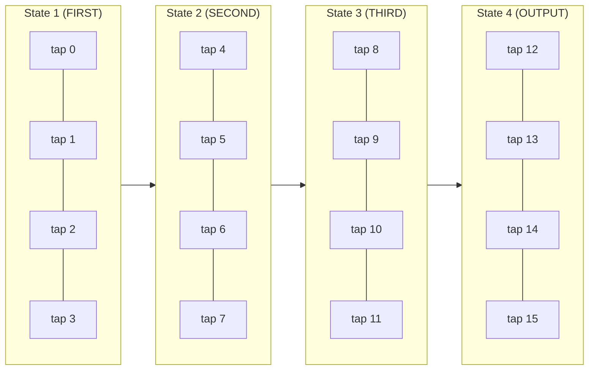
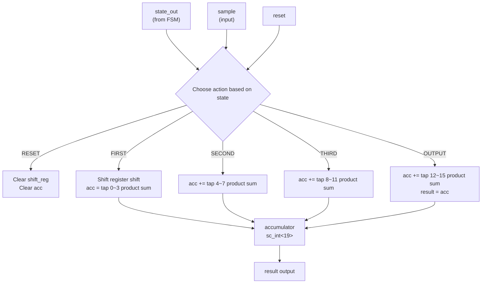

# RTL Datapath

> **Files**: `fir_data.h`, `fir_data.cpp`
> **Difficulty**: Intermediate | **Key concepts**: SC_METHOD, accumulator, time-shared computation

---

## Overview

`fir_data` is the **Datapath** of the RTL version of the FIR filter. It handles the actual mathematical operations: shift register manipulation and convolution computation. It does not decide "when to do it" (that is the FSM's job) -- it only decides "how to do it."

---

## Core Concept: Time-Shared Computation

The Behavioral version computes all 16 taps in a single cycle. The RTL version splits the 16 taps into **4 groups of 4**, completing them across 4 clock cycles:



In each cycle, the products of 4 taps are accumulated into the same accumulator. After 4 cycles, the accumulator holds the complete convolution result.

---

## Module Interface

| Port | Direction | Type | Description |
|------|------|------|------|
| `reset` | in | `bool` | Reset signal |
| `state_out` | in | `unsigned` | State number from the FSM |
| `sample` | in | `sc_int<16>` | Input sample |
| `result` | out | `sc_int<16>` | Computation result |

---

## Computation Details for Each State

### State 1 (FIRST) -- Shift + tap 0~3

```
1. Execute shift register (shift in the new sample)
2. acc  = shift_reg[0] * coeff[0]
3. acc += shift_reg[1] * coeff[1]
4. acc += shift_reg[2] * coeff[2]
5. acc += shift_reg[3] * coeff[3]
```

### State 2 (SECOND) -- tap 4~7

```
acc += shift_reg[4] * coeff[4]
acc += shift_reg[5] * coeff[5]
acc += shift_reg[6] * coeff[6]
acc += shift_reg[7] * coeff[7]
```

### State 3 (THIRD) -- tap 8~11

```
acc += shift_reg[8]  * coeff[8]
acc += shift_reg[9]  * coeff[9]
acc += shift_reg[10] * coeff[10]
acc += shift_reg[11] * coeff[11]
```

### State 4 (OUTPUT) -- tap 12~15 + output

```
acc += shift_reg[12] * coeff[12]
acc += shift_reg[13] * coeff[13]
acc += shift_reg[14] * coeff[14]
acc += shift_reg[15] * coeff[15]
result = acc   // Output the final result
```

---

## Why Is the Accumulator `sc_int<19>`?

This is a good bit-width design question.

### Calculating the Maximum Possible Value

- Input sample: `sc_int<16>`, max value = 2^15 - 1 = 32767
- Coefficients: max value = 222 (the largest coefficient)
- Maximum single-tap product: 32767 * 222 = 7,274,274
- Maximum sum of 16 taps: theoretically must consider the sum of absolute values of all coefficients

Sum of absolute coefficient values = |-6| + |-4| + 13 + 16 + |-18| + |-41| + 23 + 154 + 222 + 154 + 23 + |-41| + |-18| + 16 + 13 + |-4| = 766

Maximum possible accumulated value = 32767 * 766 = 25,099,522

How many bits are needed to represent this value?

- 2^24 = 16,777,216
- 2^25 = 33,554,432

So theoretically 25 bits are needed (including sign bit). But `sc_int<19>` is used here because:

1. **Actual inputs will not reach maximum**: The test stimulus uses small incrementing values
2. **19 bits is sufficient for the actual operating range**: No overflow occurs in this specific test scenario
3. **This is a teaching example**: A real product would do more rigorous bit-width analysis

### Software Analogy

This is like choosing `int16_t` vs `int32_t` vs `int64_t` -- in hardware, every single bit corresponds to actual circuit area, so bit-width selection matters far more than in software.

---

## SC_METHOD vs SC_CTHREAD

This is one of the most important SystemC concepts in this file.

### fir_data Uses SC_METHOD

```cpp
SC_METHOD(entry);
sensitive << reset << state_out << sample;
```

### fir_fsm Uses SC_CTHREAD

```cpp
SC_CTHREAD(entry, clk.pos());
reset_signal_is(reset, true);
```

### Comparison

| Property | SC_METHOD | SC_CTHREAD |
|------|-----------|------------|
| **Trigger** | Any sensitive signal change | Only at clock edge |
| **Execution mode** | Runs from start to finish each time | Can pause with `wait()` |
| **Has `wait()`** | Cannot use | Can use |
| **Hardware equivalent** | Combinational logic | Sequential logic |
| **Software analogy** | Pure function | Stateful coroutine |

### Why Does the Datapath Use SC_METHOD?

The Datapath is **combinational logic**: given inputs (state, sample, shift register contents), it immediately produces output. No need to wait for a clock -- when the input changes, the output follows immediately.

This is like a pure function:

```python
# SC_METHOD is equivalent to:
def datapath(state, sample, shift_reg, coefficients):
    # Decide what computation to do based on state
    # Return result immediately, no waiting
    if state == RESET:
        return reset_values()
    elif state == FIRST:
        return compute_taps_0_3(sample, shift_reg, coefficients)
    # ...
```

### Why Does the FSM Use SC_CTHREAD?

The FSM is **sequential logic**: state can only change at a clock edge. Without clock synchronization, the state could undergo multiple transitions during unstable moments.

---

## Data Flow Diagram


