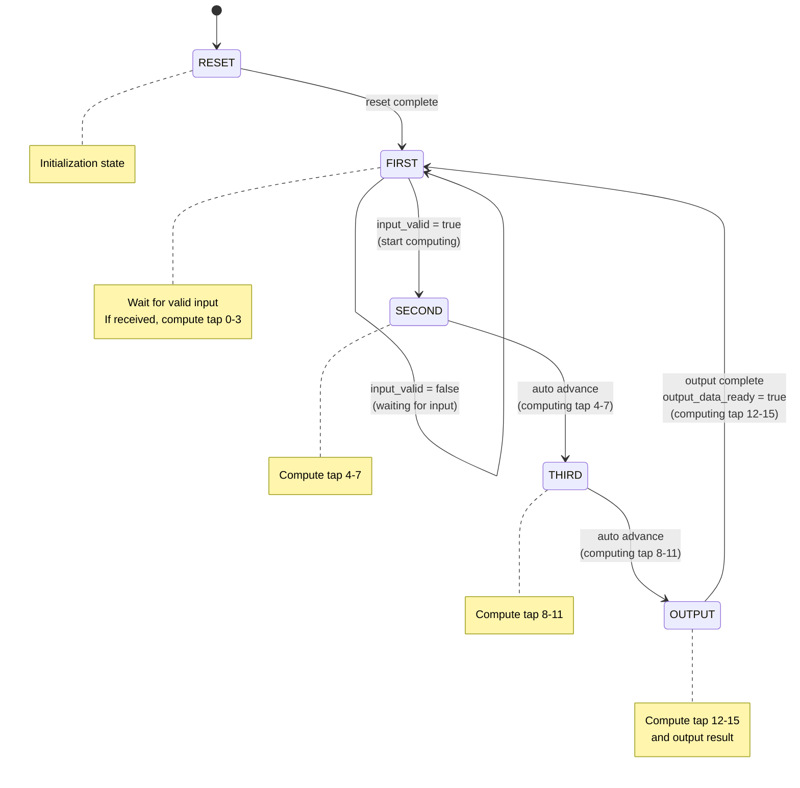
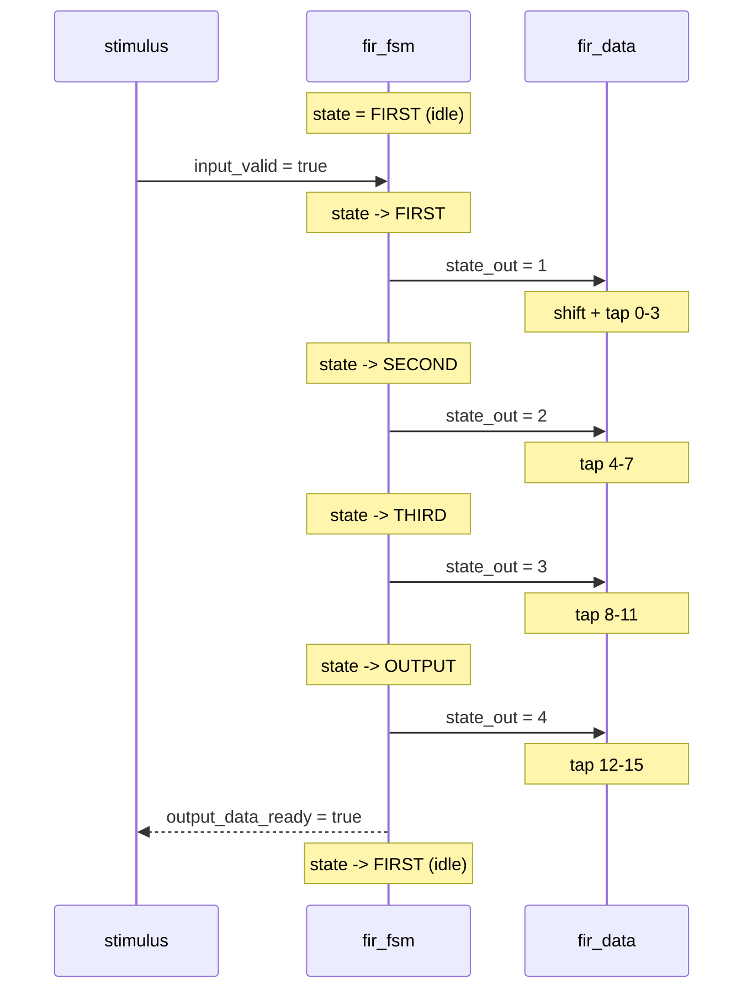

# RTL FSM Controller

> **Files**: `fir_fsm.h`, `fir_fsm.cpp`
> **Difficulty**: Intermediate | **Key concepts**: Finite State Machine (FSM), SC_CTHREAD, control and data separation

---

## Overview

`fir_fsm` is the **Controller** of the RTL version of the FIR filter. It is a Finite State Machine that tells the datapath "what to do now."

It does not perform any computation itself -- it only manages the flow, like a commander deciding when to start and when to finish.

---

## Software Analogy: State Machine Pattern

If you have used the state machine pattern, `fir_fsm` is like a **state machine pattern (like Python enum + match)**:

```python
# Conceptually equivalent state machine pattern (Python enum + match)
from enum import Enum

class State(Enum):
    RESET = 0
    FIRST = 1
    SECOND = 2
    THIRD = 3
    OUTPUT = 4

def fir_next_state(state: State, input_valid: bool) -> State:
    match state:
        case State.RESET:
            return State.FIRST
        case State.FIRST:
            if input_valid:
                return State.SECOND  # start processing
            return State.FIRST       # keep waiting
        case State.SECOND:
            return State.THIRD
        case State.THIRD:
            return State.OUTPUT
        case State.OUTPUT:
            return State.FIRST       # done, go back to waiting
```

Each state corresponds to a "step," advancing one step per clock cycle.

---

## State Diagram



---

## State Description

| State | Code | Action | Datapath operation |
|------|------|--------|-------------|
| **RESET** | 0 | Initialization | Clear all registers |
| **FIRST** | 1 | Wait for `input_valid`, start when received | Shift register + compute tap 0-3 |
| **SECOND** | 2 | Auto advance | Accumulate tap 4-7 |
| **THIRD** | 3 | Auto advance | Accumulate tap 8-11 |
| **OUTPUT** | 4 | Set `output_data_ready = true` | Accumulate tap 12-15, output result |

---

## Timing Diagram



---

## Module Interface

| Port | Direction | Type | Description |
|------|------|------|------|
| `clk` | in | `bool` | Clock |
| `reset` | in | `bool` | Reset |
| `input_valid` | in | `bool` | Input valid flag |
| `state_out` | out | `unsigned` | Current state number (for the datapath) |
| `output_data_ready` | out | `bool` | Output ready flag |

---

## Why Separate FSM and Datapath?

This is a very classic architecture pattern in hardware design called **FSM + Datapath decomposition**.

### Software Analogy

| Hardware concept | Software concept |
|---------|---------|
| FSM (controller) | Controller / State machine / state machine pattern (like Python enum + match) |
| Datapath | Model / Service / Business logic |
| FSM + Datapath | C + M in MVC architecture |

### Benefits of Separation

1. **Separation of Concerns**
   - FSM only manages "when to do what"
   - Datapath only manages "how to compute"
   - Both can be tested and modified independently

2. **Composability**
   - The same datapath can be paired with different FSMs (e.g., changing the computation schedule)
   - The same FSM can control different datapaths (e.g., swapping in a different filter)

3. **Synthesis-friendly**
   - EDA tools optimize this structure most effectively
   - Timing analysis is easier

---

## SC_CTHREAD Usage in the FSM

```cpp
SC_CTHREAD(entry, clk.pos());  // Triggered on each clock rising edge
reset_signal_is(reset, true);   // Triggers reset when reset is high
```

The FSM uses `SC_CTHREAD` because:

- State transitions must be synchronized with the clock (at most one transition per clock edge)
- Reset support is needed (initialize to a known state)
- The `while(true) { ... wait(); }` loop pattern intuitively describes state transitions

This uses the same mechanism (`SC_CTHREAD`) as the behavioral model's `fir.cpp`, but the behavior is entirely different: behavioral completes all computation between one `wait()`, while the FSM only performs one state transition per `wait()`.
