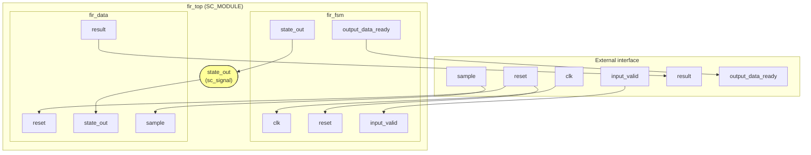
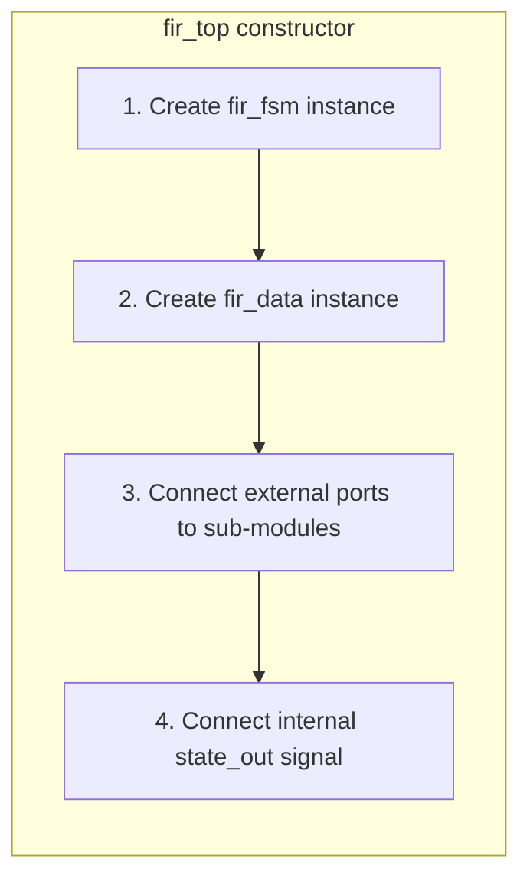

# RTL Top-Level Module

> **File**: `fir_top.h`
> **Difficulty**: Beginner | **Key concepts**: Module composition, internal signal connections

---

## Overview

`fir_top` is the **top-level module** of the RTL version of the FIR filter. It does not perform any computation itself -- it only connects `fir_fsm` (controller) and `fir_data` (datapath) together.

Software analogy: this is like a **facade class** that wraps two internal components into a unified interface.

---

## Internal Connection Diagram

The yellow `state_out` is an **internal signal** not visible externally. It is the sole communication channel between the FSM and the Datapath.

---

## External Interface

The external interface of `fir_top` is exactly the same as the behavioral version `fir`:

| Port | Direction | Type | Description |
|------|------|------|------|
| `clk` | in | `bool` | Clock |
| `reset` | in | `bool` | Reset |
| `input_valid` | in | `bool` | Input valid |
| `sample` | in | `sc_int<16>` | Input sample |
| `output_data_ready` | out | `bool` | Output ready |
| `result` | out | `sc_int<16>` | Computation result |

This means the **testbench can swap the behavioral version for the RTL version without any modifications** (only the output timing will differ).

---

## Internal Signal

`fir_top` has only one internal signal:

| Signal | Type | Connection |
|------|------|------|
| `state_out` | `sc_signal<unsigned>` | FSM output -> Datapath input |

This signal carries the FSM state number (0~4), telling the Datapath which computation to perform.

---

## Module Instantiation

In the `fir_top` constructor, two sub-modules are created and their ports are connected:

### Port Connection Logic

- **clk** -> Connected only to `fir_fsm` (because `fir_data` uses SC_METHOD and does not need clk)
- **reset** -> Connected to both `fir_fsm` and `fir_data` (both need reset)
- **input_valid** -> Connected only to `fir_fsm` (only the controller needs to know the input state)
- **sample** -> Connected only to `fir_data` (only the datapath needs the actual values)
- **state_out** -> Internal signal, from `fir_fsm` output to `fir_data` input
- **result** -> From `fir_data` output to external
- **output_data_ready** -> From `fir_fsm` output to external

---

## Design Observations

### Interface Consistency

`fir_top` and `fir` (behavioral) have the same external interface. This is an important design principle:

> Implementations at different abstraction levels should have the same interface, making substitution and verification easy.

This is like **interface / protocol** in software: regardless of the internal implementation, the external API remains consistent.

### Minimal Internal Communication

The FSM and Datapath communicate through only a single `state_out` signal. This minimal interface keeps the two modules highly decoupled, allowing each to be independently modified and tested.
