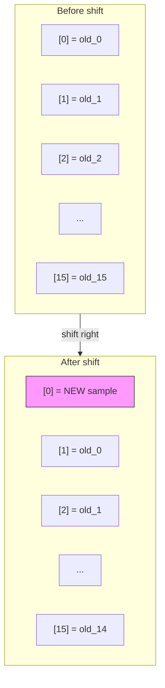
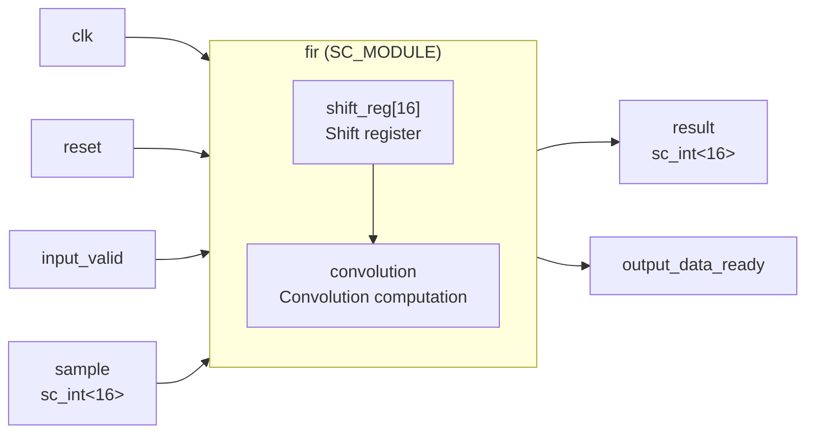
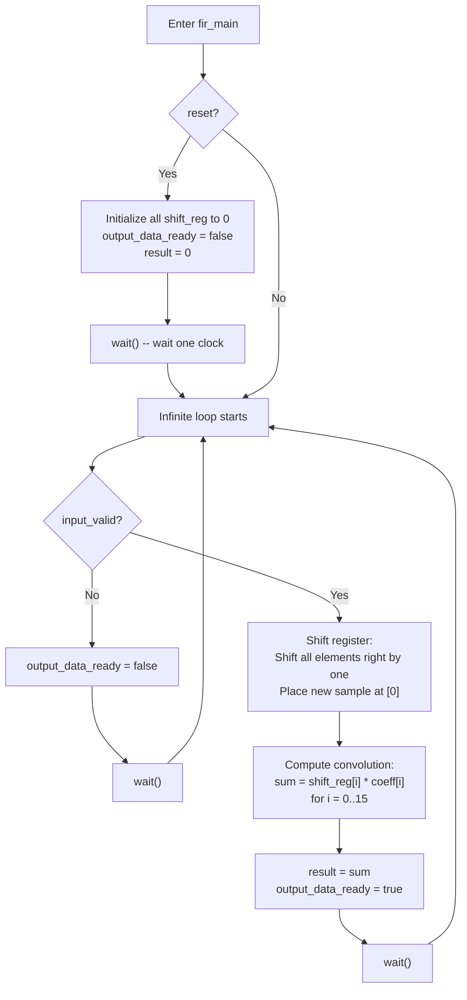

# Behavioral FIR Filter Implementation

> **Files**: `fir.h`, `fir.cpp`
> **Difficulty**: Beginner | **Key concepts**: SC_CTHREAD, shift register, convolution

---

## Overview

The `fir` module is the **Behavioral** implementation of the FIR filter. It completes the entire 16-tap convolution in a single clock cycle, as simple as calling a function.

---

## Software Analogy: Weighted Sliding Window

Imagine you have an array of length 16 (shift register). Each time new data arrives:

```
Step 1: Shift all elements one position to the right (the oldest data is discarded)
Step 2: Place the new data at position [0]
Step 3: Multiply each element by its corresponding weight and sum them all up
```

This is exactly what a FIR filter does. Expressed in Python:

```python
def fir_filter(new_sample, shift_reg, coefficients):
    # Step 1 & 2: shift and insert
    shift_reg = [new_sample] + shift_reg[:-1]

    # Step 3: dot product (convolution)
    result = sum(s * c for s, c in zip(shift_reg, coefficients))

    return result, shift_reg
```

---

## Shift Register Operation Diagram

Each time a new sample arrives, the shift register changes as follows:



Note: `old_15` (the oldest data) is discarded -- this is the concept of a "sliding window."

---

## Convolution Operation

After shifting, compute the weighted sum of all taps:

```
result = shift_reg[0] * coeff[0]
       + shift_reg[1] * coeff[1]
       + shift_reg[2] * coeff[2]
       + ...
       + shift_reg[15] * coeff[15]
```

This is mathematically a **convolution** or **dot product**.

---

## Module Interface



### Port Description

| Port | Direction | Type | Description |
|------|------|------|------|
| `clk` | in | `bool` | Clock signal |
| `reset` | in | `bool` | Reset signal |
| `input_valid` | in | `bool` | Input data valid flag |
| `sample` | in | `sc_int<16>` | 16-bit signed input sample |
| `output_data_ready` | out | `bool` | Output data ready flag |
| `result` | out | `sc_int<16>` | 16-bit signed output result |

---

## Execution Flow



---

## Key Design Observations

### Why Use SC_CTHREAD?

`SC_CTHREAD` is a "clocked thread" with two important properties:

1. **Synchronized with clock**: Each call to `wait()` waits for one clock edge
2. **Reset support**: A reset signal can be specified with `reset_signal_is()`

This is well-suited for describing behavior that "does one thing per clock cycle."

### Behavioral Characteristic: Everything in One Cycle

In the Behavioral model, the entire 16-tap convolution completes within **one clock cycle**. From a software perspective, this is natural (just a for loop), but in real hardware it means:

- **16 multipliers** working simultaneously (parallel computation)
- An adder tree to sum 16 products
- Large circuit area, but fast

In contrast, the RTL version (see [fir-fsm.md](fir-fsm.md) and [fir-data.md](fir-data.md)) splits the computation into 4 cycles, computing only 4 taps per cycle, sharing multipliers to save area but at 4x slower speed.

### Analogy Summary

| Concept | Behavioral FIR | Software analogy |
|------|---------------|---------|
| Shift register | Fixed-size array | `collections.deque(maxlen=16)` |
| Convolution | For loop doing dot product | `numpy.dot(a, b)` |
| Completes in one cycle | One function call | Synchronous function `calculate()` |
| `wait()` | Wait for next clock | `await next_tick()` |
