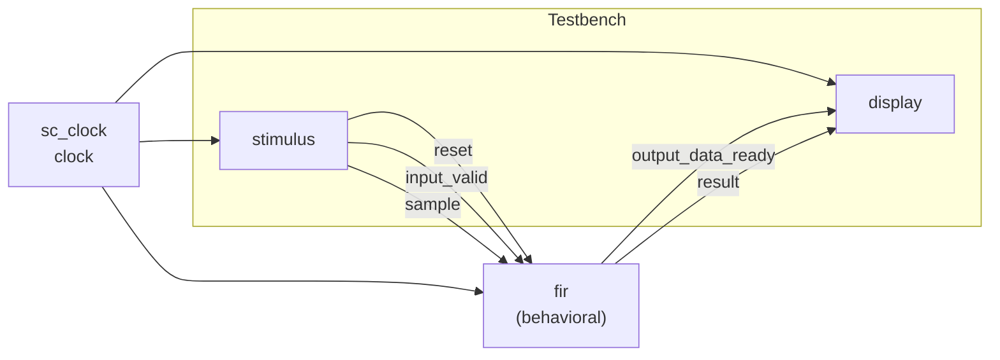
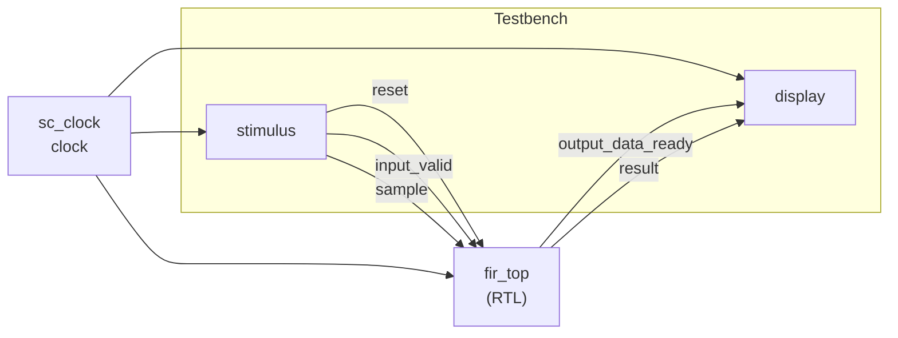
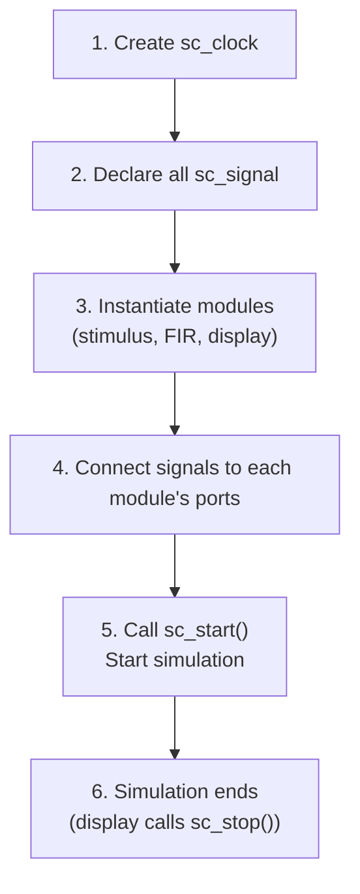

# Testbench

> **Files**: `main.cpp` (Behavioral), `main_rtl.cpp` (RTL)
> **Difficulty**: Beginner | **Key concepts**: sc_clock, sc_signal, module interconnection

---

## Overview

This example has two `main` files that create complete testbenches for the Behavioral and RTL versions respectively. The structure of the two is nearly identical -- the only difference is the FIR filter module in the middle.

---

## Testbench Architecture Comparison

### main.cpp -- Behavioral Version



### main_rtl.cpp -- RTL Version



---

## Differences Between the Two

| Item | `main.cpp` | `main_rtl.cpp` |
|------|-----------|---------------|
| DUT module | `fir` | `fir_top` |
| DUT internals | Single SC_CTHREAD | FSM + Datapath |
| Processing latency | 1 clock cycle | 4 clock cycles |
| stimulus / display | Identical | Identical |
| Signal declarations | Identical | Identical |

Key point: **Because `fir` and `fir_top` have the same external interface**, the rest of the testbench requires no modifications at all. Only the DUT (Device Under Test) instantiation needs to change.

---

## Testbench Construction Steps

Both main files follow the same steps:



### Signal Declarations

All modules are connected through `sc_signal`:

| Signal | Type | Connection |
|--------|------|------|
| `clock` | `sc_clock` | All modules' `clk` |
| `reset` | `sc_signal<bool>` | stimulus -> FIR |
| `input_valid` | `sc_signal<bool>` | stimulus -> FIR |
| `sample` | `sc_signal<sc_int<16>>` | stimulus -> FIR |
| `output_data_ready` | `sc_signal<bool>` | FIR -> display |
| `result` | `sc_signal<sc_int<16>>` | FIR -> display |

---

## sc_clock

`sc_clock` is a clock generator provided by SystemC that automatically produces a periodic square wave signal.

```cpp
sc_clock clock("clock", 100, SC_NS);  // 100ns period
```

- Period = 100 ns
- First half-period high, second half-period low
- Runs automatically, no manual control needed

### Software Analogy

`sc_clock` is like JavaScript's `setInterval()`, but more precise:

```javascript
// Conceptual equivalent
setInterval(() => {
    clock = !clock;  // toggle
    notifyAll();     // wake up all modules
}, 50);  // half period
```

---

## sc_start() and Simulation Lifecycle

```cpp
sc_start();  // run until sc_stop() is called
```

`sc_start()` launches the SystemC simulation engine (scheduler), which:

1. Drives the clock to produce square waves
2. Wakes relevant SC_CTHREAD and SC_METHOD processes at each clock edge
3. Processes all signal updates
4. Repeats the above steps until `sc_stop()` is called

### Software Analogy

```python
# sc_start() is equivalent to
async def sc_start():
    while not stopped:
        clock.toggle()
        await run_all_triggered_processes()
        update_all_signals()
```

---

## Design Observations

### Benefits of Interface Consistency

This example perfectly demonstrates why "same interface" is so important:

1. The designer can first write a behavioral model to quickly validate the algorithm
2. Then write an RTL model for hardware implementation
3. Use the exact same testbench to verify that both behave consistently

This is like using an interface for dependency injection in software -- you can easily swap implementations without affecting the test code.
