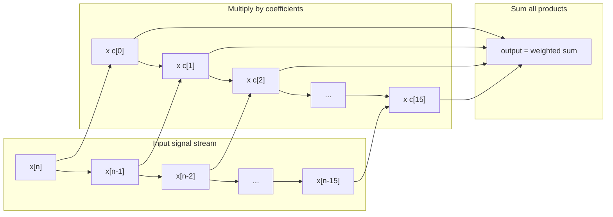
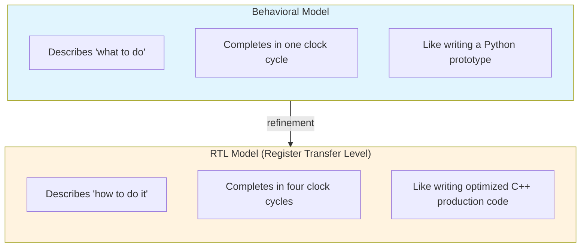
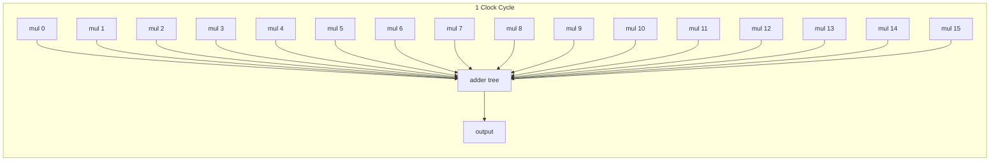
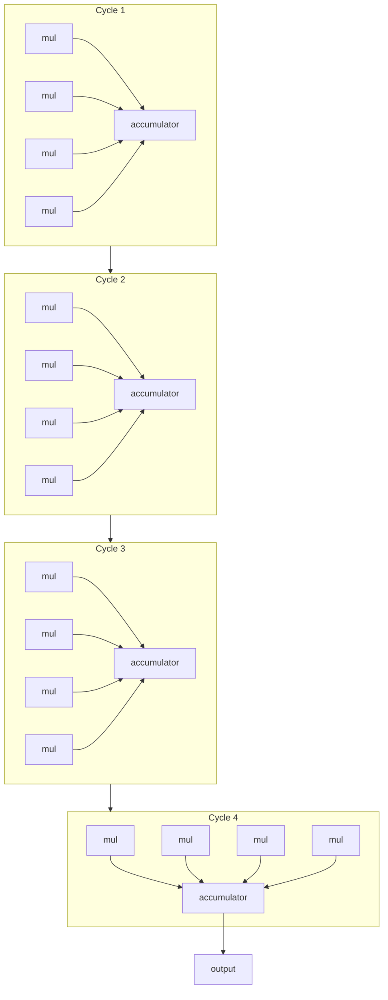
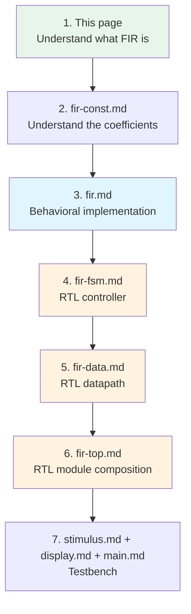

# FIR Filter Hardware Specification -- Software Engineer's Guide

> **Difficulty**: Beginner | **Purpose**: Understand the principles of FIR filters and hardware design methodology

---

## What Is a FIR Filter?

### One-Sentence Explanation

A FIR filter is a **noise filter for signals**, just like a blur filter for images -- it "blurs away" unwanted high-frequency noise while preserving the low-frequency signal you care about.

### Everyday Analogies

| Scenario | Original signal | Noise | FIR effect |
|------|---------|------|-----------|
| Phone call | Human voice | Background wind noise | Preserves only the voice |
| Thermometer | Actual temperature | Sensor fluctuations | Smooth temperature readings |
| Stock market | Long-term trend | Daily fluctuations | Moving average line |
| Photo | Subject outline | Noise pixels | Denoised clear image |

### Mathematical Essence

A FIR is a **weighted moving average**:

```
output[n] = coeff[0] * input[n]
          + coeff[1] * input[n-1]
          + coeff[2] * input[n-2]
          + ...
          + coeff[15] * input[n-15]
```



---

## Why Do Hardware Systems Need FIR Filters?

FIR filters are the most fundamental building blocks in Digital Signal Processing (DSP). Almost all hardware that processes real-world signals uses them:

| Application area | Actual products | Role of FIR |
|---------|---------|-----------|
| **Audio** | DAC chips, Bluetooth headphones | Remove quantization noise, equalizer (EQ) |
| **Communications** | WiFi baseband chips | Signal shaping, channel equalization |
| **Radar** | Automotive radar, weather radar | Noise removal, target detection |
| **Image processing** | Camera ISP, medical imaging | Denoising, edge enhancement |
| **Instruments** | Oscilloscopes, spectrum analyzers | Measurement signal preprocessing |

The advantage of hardware FIR: **real-time processing**. Software can take its time, but audio and communications need filtering done in microseconds (or even nanoseconds).

---

## Behavioral vs RTL: Design Methodology

### Two Abstraction Levels

The core teaching goal of this example is to demonstrate **the same algorithm implemented at different abstraction levels**.



### Software Analogy

| Phase | Hardware design | Software development |
|------|---------|---------|
| Requirements confirmation | Algorithm specification | PRD / User Story |
| Rapid prototyping | **Behavioral model** | Python prototype |
| Functional verification | Behavioral simulation | Unit test |
| Detailed design | **RTL model** | Optimized C++ implementation |
| Hardware verification | RTL simulation + waveform analysis | Integration test + profiling |
| Production | ASIC / FPGA synthesis | Build & deploy |

### Behavioral = Quickly Validate Ideas

```
Advantages:
- Written like a normal program, fast
- Easy to understand and modify
- Focuses on algorithm correctness

Disadvantages:
- Does not reflect real hardware timing
- Cannot be directly synthesized into circuits
- Ignores resource constraints
```

### RTL = Precisely Describe Hardware Behavior

```
Advantages:
- Precise down to each clock cycle
- Can be directly synthesized into FPGA / ASIC
- Reflects actual resource usage

Disadvantages:
- More complex to write
- Must consider timing, area, and power
- Harder to debug
```

---

## Resource Tradeoff: Speed vs Area

This is one of the most fundamental tradeoffs in hardware design.

### Behavioral Version: 1 cycle, 16 multipliers



- **Requires 16 multipliers** (parallel computation)
- Produces one result per cycle
- Large area, fast speed
- **Throughput**: 1 sample / cycle

### RTL Version: 4 cycles, 4 multipliers



- **Only 4 multipliers needed** (time-shared)
- Takes 4 cycles to produce one result
- 4x smaller area, 4x slower
- **Throughput**: 1 sample / 4 cycles

### Comparison Table

| Aspect | Behavioral (1-cycle) | RTL (4-cycle) |
|------|---------------------|---------------|
| Number of multipliers | 16 | 4 |
| Number of adders | 15 (adder tree) | 4 + 1 accumulator |
| Latency | 1 cycle | 4 cycles |
| Throughput | 1 sample/cycle | 1 sample/4 cycles |
| Area | Large | Small (approx. 1/4) |
| Power consumption | High | Low |
| Use case | High-speed requirements | Area-constrained |

### Software Analogy

This is like choosing an algorithm's **time-space tradeoff**:

- **Behavioral** = Use more memory (multipliers) to gain faster speed
- **RTL** = Use less memory (multipliers) but require more time

---

## Real-World Applications

### Audio DAC (Digital-to-Analog Converter)

When your phone plays music, the audio DAC internally contains a FIR filter. Its job is to filter out frequency components above the human hearing range (above 20kHz) when converting digital audio (44.1kHz sampling) to an analog signal.

### WiFi Baseband Processing

WiFi chip baseband processors use multiple FIR filters for:
- Matched filtering
- Channel equalization
- Pulse shaping

These FIR filters typically have 32 to 256 taps and must complete computation within each OFDM symbol (3.2 microseconds).

### Image Processing

The 2D FIR filter in a camera ISP (Image Signal Processor) is the convolution kernel you are familiar with:

```
Blur kernel     = [1 1 1]    Edge detection = [-1 -1 -1]
                  [1 1 1]                     [-1  8 -1]
                  [1 1 1]                     [-1 -1 -1]
```

The 1D FIR in this example is a simplified version of 2D convolution. Once you understand 1D FIR, 2D convolution is just adding another loop.

---

## Learning Roadmap for This Example



- Green = Background knowledge
- Blue = Behavioral (simpler)
- Orange = RTL (more advanced)
