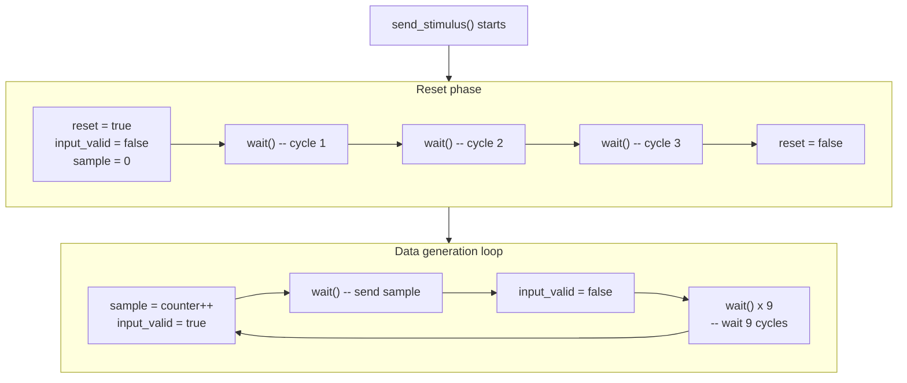

# Test Stimulus Generator

> **Files**: `stimulus.h`, `stimulus.cpp`
> **Difficulty**: Beginner | **Key concepts**: Test stimulus, reset sequence, SC_CTHREAD

---

## Overview

The `stimulus` module generates test input data and feeds it into the FIR filter. It simulates a "data source," such as an ADC (Analog-to-Digital Converter) converting an analog signal into digital samples.

---

## Module Interface

| Port | Direction | Type | Description |
|------|------|------|------|
| `clk` | in | `bool` | Clock |
| `reset` | out | `bool` | Sends the reset signal |
| `input_valid` | out | `bool` | Input valid flag |
| `sample` | out | `sc_int<16>` | Output sample value |

Note: `reset` is an **output** -- stimulus is the source that generates the reset signal.

---

## Execution Flow



---

## Reset Sequence

The FIR filter must be properly initialized before it begins operating. The stimulus sends a reset signal lasting **3 clock cycles**:

```
Clock:        1    2    3    4    5    ...
reset:        H    H    H    L    L    ...
input_valid:  L    L    L    L    ...
```

- `H` = high (true), `L` = low (false)

3 cycles of reset ensure all registers are cleared to zero. This is standard practice in hardware testing -- always wait a few more cycles than you think you need.

---

## Input Data Pattern

After reset ends, stimulus generates incrementing integers as samples:

```
sample:       0    1    2    3    4    ...
input_valid:  H    L    L... H    L    L...
              |<- 10 cycles ->|<- 10 cycles ->|
```

Each sample is spaced **10 clock cycles** apart. Why?

1. **The RTL version needs 4 cycles** to process one sample (4 states)
2. A 10-cycle interval ensures the RTL version has enough time to complete computation
3. The extra idle time also makes waveform observation easier

### Software Analogy

This is like a producer generating messages at a fixed rate:

```python
async def stimulus():
    # Reset phase
    await reset(duration=3)

    # Data generation
    counter = 0
    while True:
        send(sample=counter, valid=True)
        await tick()
        send(valid=False)
        for _ in range(9):
            await tick()  # cooldown
        counter += 1
```

---

## Design Observations

### Why Does Stimulus Control Reset?

In hardware testing, the testbench is responsible for generating all control signals, including clock and reset. As part of the testbench, `stimulus` naturally takes charge of generating the reset signal.

### Why Does input_valid Stay High for Only One Cycle?

This is a common hardware communication protocol (handshaking protocol):

1. The producer sets `data` and pulls `valid` high for one cycle
2. The consumer reads `data` when it sees `valid = true`
3. On the next cycle, `valid` returns to false

This ensures each piece of data is processed exactly once.
