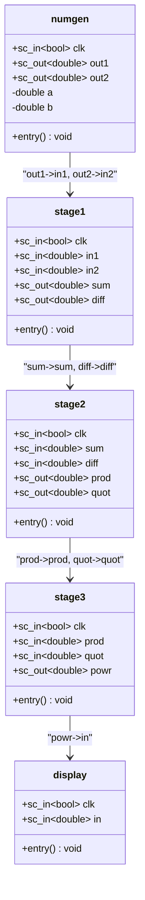

# pipe -- Three-Stage Arithmetic Pipeline Example

> **Difficulty**: Beginner | **Software Analogy**: Unix pipe (`cmd1 | cmd2 | cmd3`), ETL data processing pipeline | **Source**: `ref/systemc/examples/sysc/pipe/`

## Overview

The `pipe` example demonstrates a **3-stage arithmetic pipeline**. A number generator produces two `double` values each clock, passes them through three computation stages, and a display module prints the final result.

If you have written Unix shell scripts, this is:

```bash
numgen | stage1_add_sub | stage2_mul_div | stage3_pow | display
```

If you have done ETL (Extract-Transform-Load), this is:

```
Data Source -> Transform A -> Transform B -> Transform C -> Output
```

Each stage module does one thing, passing results to the next stage via `sc_signal`. It is like a factory **assembly line**: each workstation performs one processing step, and the product moves forward along the conveyor belt.

## Data Flow Diagram

```mermaid
flowchart LR
    subgraph numgen["numgen (Data Generator)"]
        direction TB
        A1["a: 134.56, 133.06, ..."]
        A2["b: 98.24, 95.44, ..."]
    end

    subgraph stage1["stage1 (Add/Subtract)"]
        direction TB
        S1["sum = a + b"]
        S2["diff = a - b"]
    end

    subgraph stage2["stage2 (Multiply/Divide)"]
        direction TB
        S3["prod = sum * diff"]
        S4["quot = sum / diff"]
    end

    subgraph stage3["stage3 (Power)"]
        direction TB
        S5["powr = prod ^ quot"]
    end

    subgraph display["display (Output)"]
        direction TB
        S6["printf result"]
    end

    numgen -->|"in1, in2"| stage1
    stage1 -->|"sum, diff"| stage2
    stage2 -->|"prod, quot"| stage3
    stage3 -->|"powr"| display
```



## Class Diagram



## File List

| File | Description | Documentation |
|---|---|---|
| `numgen.h` / `numgen.cpp` | Number generator, outputs two decrementing `double` values each clock | [numgen.md](numgen.md) |
| `stage1.h` / `stage1.cpp` | First stage: computes sum and diff | [stage1.md](stage1.md) |
| `stage2.h` / `stage2.cpp` | Second stage: computes product and quotient (with division-by-zero guard) | [stage2.md](stage2.md) |
| `stage3.h` / `stage3.cpp` | Third stage: computes power (with negative value guard) | [stage3.md](stage3.md) |
| `display.h` / `display.cpp` | Result display module | [display.md](display.md) |
| `main.cpp` | Top-level connections, clock generation, simulation control | [main.md](main.md) |

## Core Concepts

### SC_METHOD vs SC_THREAD

All modules in this example use **SC_METHOD**, one of the two main process types in SystemC:

| Property | SC_METHOD | SC_THREAD |
|---|---|---|
| **Software Analogy** | callback function | coroutine / Python coroutine (asyncio) |
| **Execution** | Runs from start to finish each time it is triggered | Can pause midway with `wait()` |
| **State Preservation** | Via member variables | Via local variables + `wait()` |
| **Performance** | Faster (no context switch) | Slower (requires saving the stack) |
| **Use Case** | Combinational logic, simple sequential logic | Complex control flows |

SC_METHOD is like a Python callback function: each time an event triggers, your function is called, and it must return immediately without blocking.

### sc_signal Connections

Modules are connected via `sc_signal<double>`, similar to pipes in Unix. Each signal can only be written once within the same delta cycle, and readers see the new value in the **next** delta cycle.

### Positional vs Named Port Binding

`main.cpp` demonstrates two connection styles:

```cpp
// Positional binding -- like positional arguments in a function call
stage1_inst("Stage1", clk, in1, in2, sum, diff);

// Named binding -- like Python keyword arguments
stage2_inst.clk(clk);
stage2_inst.sum(sum);
```

### Why Use a Pipeline? The Throughput vs Latency Tradeoff

**Without a pipeline**: one piece of data must complete all stages before the next one starts. Latency = 3 clocks, throughput = one result every 3 clocks.

**With a pipeline**: each stage processes different data simultaneously. Latency = 3 clocks (the first result still takes 3 stages to complete), but throughput = one result every 1 clock.

This is the same as HTTP request pipelining: you can send the next request without waiting for the previous response, improving overall throughput by 3x while single-request latency stays the same.

## Further Reading

- [Pipeline Concepts](spec.md) -- Principles of hardware pipelines and software analogies
- [main.cpp Walkthrough](main.md) -- Module connections and clock generation
