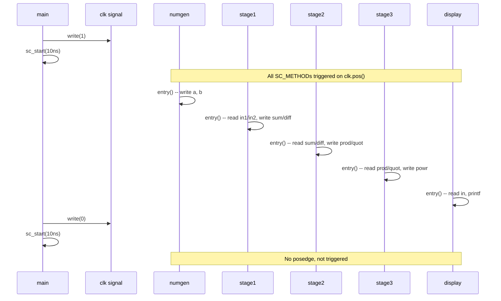

# main.cpp -- Top-Level Connections and Simulation Control

> **File**: `main.cpp` | **Role**: Top-level module, testbench

## Software Analogy

The role of `main.cpp` is like:

- **Docker Compose**: defines all services (modules) and specifies the connections (networks) between them
- **Python dependency injection**: creates all components (modules), injects dependencies (port binding)
- **Makefile**: defines all components and their dependencies

```yaml
# Docker Compose analogy
services:
  numgen:
    output: [signal_in1, signal_in2]
  stage1:
    input: [signal_in1, signal_in2]
    output: [signal_sum, signal_diff]
  stage2:
    input: [signal_sum, signal_diff]
    output: [signal_prod, signal_quot]
  # ...
```

## Program Structure

### sc_main -- SystemC Entry Point

```cpp
int sc_main(int argc, char* argv[]) {
    // 1. Declare signals (wires)
    // 2. Create module instances
    // 3. Bind ports to signals
    // 4. Generate clock and run simulation
}
```

`sc_main` is the entry point of SystemC, replacing the standard C++ `main()`. The SystemC runtime calls `sc_main` after initialization is complete.

This is like `unittest.main()` or `pytest.main()` -- the framework provides its own entry point where you set up the test environment.

### Signal Declaration

```cpp
sc_signal<bool>   clk;     // clock signal
sc_signal<double> in1;     // numgen -> stage1
sc_signal<double> in2;     // numgen -> stage1
sc_signal<double> sum;     // stage1 -> stage2
sc_signal<double> diff;    // stage1 -> stage2
sc_signal<double> prod;    // stage2 -> stage3
sc_signal<double> quot;    // stage2 -> stage3
sc_signal<double> powr;    // stage3 -> display
```

Each `sc_signal` is like a **wire** connecting two modules. In software, this is similar to a message queue or shared variable (but with synchronization guarantees).

### Module Instantiation

```cpp
numgen  numgen_inst("numgen", clk, in1, in2);          // positional binding
stage1  stage1_inst("Stage1", clk, in1, in2, sum, diff); // positional binding
```

## Key Concepts

### Positional vs Named Port Binding

This example demonstrates two port binding styles in SystemC:

#### Positional Binding

```cpp
// Signals are bound in the order ports are declared in the SC_MODULE
stage1 stage1_inst("Stage1", clk, in1, in2, sum, diff);
//                           ^    ^    ^    ^    ^
//                           |    |    |    |    +-- 5th port: diff
//                           |    |    |    +------- 4th port: sum
//                           |    |    +------------ 3rd port: in2
//                           |    +----------------- 2nd port: in1
//                           +---------------------- 1st port: clk
```

Like calling a function with positional arguments: `f(1, 2, 3)`

**Pros**: shorter code.
**Cons**: wrong order means wrong wiring, and the compiler will not report an error (all types are `double`), leading to mysterious bugs that only appear in simulation results.

#### Named Binding

```cpp
stage2 stage2_inst("Stage2");
stage2_inst.clk(clk);
stage2_inst.sum(sum);
stage2_inst.diff(diff);
stage2_inst.prod(prod);
stage2_inst.quot(quot);
```

Like Python keyword arguments: `f(x=1, y=2, z=3)`

**Pros**: clear and explicit, no risk of wrong order.
**Cons**: more verbose code.

**Practical advice**: in large projects, **always use named binding**. A few extra lines of code buy you a significant reduction in wiring errors.

### Manual Clock Generation

```cpp
for (int i = 0; i < 50; i++) {
    clk.write(1);              // clock goes high
    sc_start(10, SC_NS);       // simulate 10 ns
    clk.write(0);              // clock goes low
    sc_start(10, SC_NS);       // simulate 10 ns
}
```

This code manually generates a **20 ns period** (50 MHz) clock for 50 cycles.

#### Why Generate the Clock Manually Instead of Using sc_clock?

SystemC provides the `sc_clock` class for automatic clock generation:

```cpp
sc_clock clk("clk", 20, SC_NS);  // automatically generate a 20 ns period clock
```

The advantages of manual clock generation are:

1. **Full control**: you can stop at any point, change the frequency, or insert irregular clock patterns
2. **Teaching purposes**: helps learners understand that a clock is simply a signal toggling between 0 and 1
3. **Easier debugging**: you can add conditional breakpoints or logging inside the loop

In real projects, most people use `sc_clock` because it is cleaner and less error-prone.

### What sc_start Does

`sc_start(10, SC_NS)` tells the SystemC simulation engine to **advance 10 nanoseconds of simulation time**. During this time:

1. All triggered processes are executed
2. Signal values are updated
3. Delta cycles are processed

This is similar to a game engine's `tick()` or an event loop's `processEvents()`:

```python
# Python analogy
for i in range(50):
    clock = 1
    event_loop.run_for(10)  # process all pending events
    clock = 0
    event_loop.run_for(10)
```

## Complete Simulation Flow


