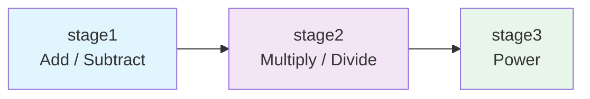

# Pipeline Concepts

> **Target Audience**: Software engineers without a hardware background

## What Is a Pipeline?

A pipeline is an architecture that **breaks complex work into multiple stages, allowing each stage to process different data simultaneously**.

### Car Factory Analogy

Imagine a car assembly line:

| Workstation | Task | Duration |
|---|---|---|
| Station 1 | Weld the chassis | 1 hour |
| Station 2 | Install the engine | 1 hour |
| Station 3 | Paint | 1 hour |

**Without a pipeline** (one worker does everything):
- Completing one car takes 3 hours
- One car every 3 hours
- Throughput: 0.33 cars/hour

**With a pipeline** (three workstations running simultaneously):
- Completing the **first** car still takes 3 hours (latency unchanged)
- After that, one car every hour (three stations process different cars simultaneously)
- Throughput: 1 car/hour (3x improvement)

## Why Does Hardware Need Pipelines?

In hardware, the motivation for pipelining is the same as in a factory: **increasing throughput without a faster clock**.

Suppose you have a computation that takes 30 ns to complete:

- **Without a pipeline**: clock period must be at least 30 ns (33 MHz), one result per clock
- **Split into a 3-stage pipeline**: 10 ns per stage, clock period 10 ns (100 MHz), one result per clock once the pipeline is full

Throughput improves by 3x, but each piece of data still takes 30 ns from entry to exit (3 stages x 10 ns).

## Pipeline Timing Diagram

Using the three-stage pipeline in this example, observe how three data items flow through the pipeline:

```mermaid
gantt
    title Three-Stage Pipeline Timing -- Three Data Items (D1, D2, D3)
    dateFormat X
    axisFormat %s

    section D1 (First)
    stage1 (Add/Sub)    : d1s1, 0, 1
    stage2 (Mul/Div)    : d1s2, 1, 2
    stage3 (Power)      : d1s3, 2, 3

    section D2 (Second)
    Waiting              : d2w, 0, 1
    stage1 (Add/Sub)    : d2s1, 1, 2
    stage2 (Mul/Div)    : d2s2, 2, 3

    section D3 (Third)
    Waiting              : d3w, 0, 2
    stage1 (Add/Sub)    : d3s1, 2, 3
```



- **Clock 1**: D1 is in stage1; D2 and D3 have not entered yet
- **Clock 2**: D1 enters stage2, D2 enters stage1 (two stages working simultaneously)
- **Clock 3**: D1 enters stage3, D2 enters stage2, D3 enters stage1 (all three stages busy)

Starting from Clock 3, the pipeline is **fully utilized**, producing one result every clock.

## Pipeline Costs and Risks

### 1. Increased Latency

Although throughput improves, the **latency** of a single data item may actually increase, because registers are needed between stages to store intermediate results, and these registers introduce small delays.

Software analogy: HTTP/2 multiplexing increases throughput, but each request incurs additional framing overhead.

### 2. Pipeline Hazards

In real hardware (especially CPUs), pipelines encounter three kinds of hazards:

#### Data Hazard

The next stage needs data that has not been computed yet.

```
Instruction 1: x = a + b        // stage1 is computing
Instruction 2: y = x * 2        // stage2 needs x, but x is not ready yet
```

Software analogy: race condition -- one thread writes while another reads, and the result depends on execution order.

#### Control Hazard

A conditional branch is encountered, and it is unclear which data to process next.

```
if (condition) {
    // take path A
} else {
    // take path B
}
// The pipeline has already prefetched data for path A, but if path B is taken, it must be discarded and restarted
```

Software analogy: branch prediction failure -- speculatively executing a path, then having to rollback if the guess was wrong.

#### Structural Hazard

Two stages need the same hardware resource at the same time.

Software analogy: resource contention -- two threads need the same lock simultaneously.

> Note: This example (`pipe`) is a pure arithmetic pipeline with no branches or feedback, so **none of these hazards exist**. This is an intentional simplification for teaching purposes.

## Pipeline Applications in Software

### CPU Instruction Pipeline

The core of a modern CPU is a pipeline:

| Stage | Task |
|---|---|
| Fetch | Read instruction from memory |
| Decode | Decode instruction, determine operation type |
| Execute | Perform computation |
| Memory | Read/write memory |
| Write Back | Write result back to register |

This is why a CPU's "IPC (Instructions Per Clock)" can approach 1, even though each instruction requires 5 steps.

### GPU Shader Pipeline

The GPU rendering pipeline is also a classic pipeline architecture:

```
Vertex Shader -> Geometry Shader -> Rasterization -> Fragment Shader -> Output
```

Each stage processes different stages of different triangles, with millions of triangles flowing through the pipeline simultaneously.

### Software Pipelines

| Application | Pipeline Stages |
|---|---|
| Unix pipe | `grep \| sort \| uniq \| head` |
| ETL | Extract -> Transform -> Load |
| CI/CD | Build -> Test -> Deploy |
| HTTP | Request -> Auth -> Route -> Handler -> Response |
| Middleware | Logging -> Auth -> CORS -> Business Logic |
| Compiler | Lexer -> Parser -> Optimizer -> Code Generator |

### Network Packet Processing

Network devices (routers, firewalls) process each packet through a pipelined flow:

```
Receive -> Parse Header -> Route Lookup -> Apply Rules -> Forward
```

High-speed routers process billions of packets per second, relying on deep pipelining.

## The Pipeline in This Example

Returning to the `pipe` example, its three-stage pipeline is:



Each stage is an SC_METHOD, triggered on the positive edge of the clock. Data is passed through `sc_signal`, and the delta cycle delay of signals naturally creates the effect of pipeline registers.

This is not a "practical" computation pipeline, but a teaching example that shows you:

1. How to decompose modules
2. How ports and signals connect
3. How a clock drives all stages to operate synchronously
4. How data flows through stages like an assembly line
