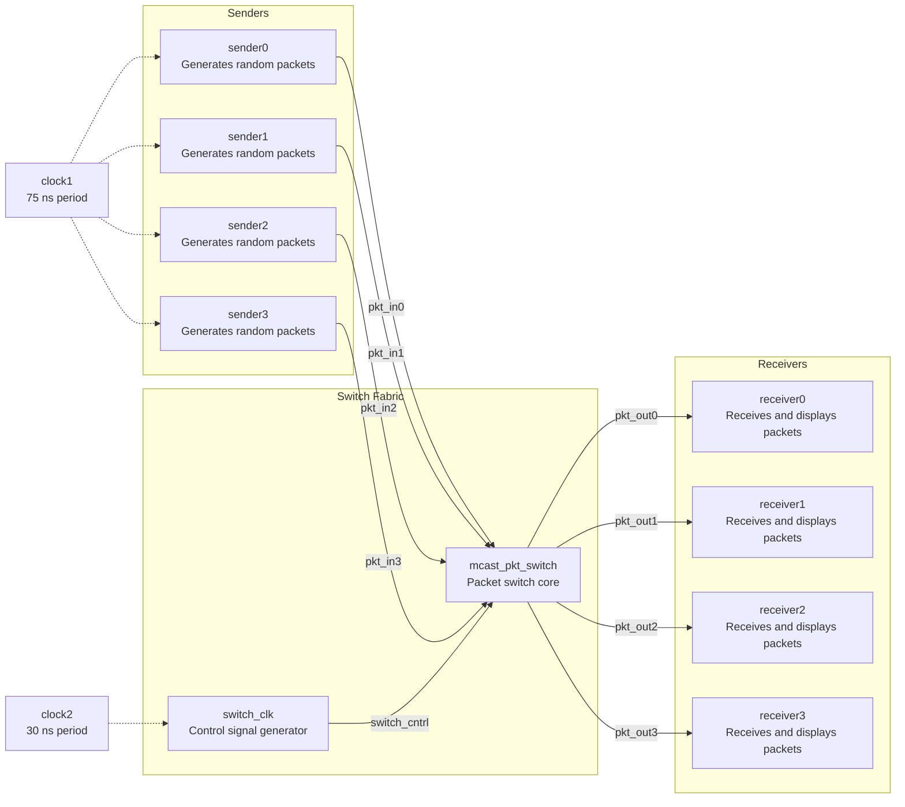
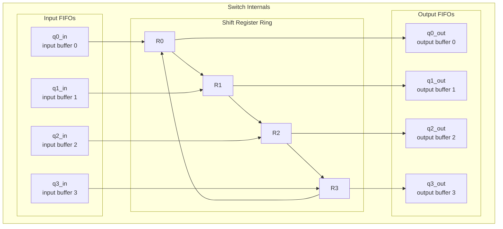

# Packet Switch Example Overview -- 4x4 Multicast Packet Switch

## Software Engineer's Intuition

Imagine you are designing a **message routing system** (similar to a RabbitMQ exchange with multiple queues). You have 4 producers continuously sending messages, and each message can be sent to 1 to 4 consumers simultaneously. In the middle, a router is responsible for:

1. Receiving messages from all producers and buffering them in an input buffer
2. Distributing messages to the corresponding output buffer based on destination tags
3. Sending messages from the output buffer to consumers

This is exactly what this example does -- it implements a **4x4 multicast packet switch** in hardware style.

**Software Analogy**: This is like a **network router** or **Ethernet switch**. Each port has an input/output buffer, and the switching fabric in the middle routes packets from the source port to the destination port. Similar to RabbitMQ's fanout exchange, a single packet can be routed to multiple destinations simultaneously (multicast).

## System Architecture

## Switch Internal Architecture -- Helix Ring

The switch internally uses a **helix ring** structure to route packets. The core of this structure is a circular shift register composed of 4 shift registers (R0-R3):

**How It Works** (in software terms):

1. **Enqueue**: Packets from senders enter the corresponding input FIFO (like messages entering a queue)
2. **Load into Ring**: If the shift register is empty, a packet is taken from the input FIFO and loaded in
3. **Rotate**: Every switch clock cycle, the contents of the 4 registers rotate one position (R0->R1->R2->R3->R0)
4. **Match Output**: If the packet in R0 is destined for port 0, a copy is placed into output FIFO 0; R1 for port 1, and so on
5. **Multicast Handling**: A packet stays in the ring rotating until all destination bits are cleared, meaning all destinations have been served
6. **Dequeue**: The output FIFO delivers packets to receivers

## File List

| File | Purpose | Documentation |
|------|---------|---------------|
| [`pkt.h`](pkt.md) | Packet data structure | Defines the `pkt` struct containing data, sender id, and destination bits |
| [`fifo.h`](fifo.md) / `fifo.cpp` | FIFO queue | 4-slot deep packet buffer used for input/output buffering |
| [`switch_reg.h`](switch.md) | Shift register structure | Data structure for each position in the ring register |
| [`switch.h`](switch.md) / `switch.cpp` | Packet switch core | Main routing logic: input buffering, ring rotation, output matching |
| [`switch_clk.h`](switch.md) / `switch_clk.cpp` | Switch clock control | Generates switch control signals (triggers rotation every other clock) |
| [`sender.h`](sender.md) / `sender.cpp` | Packet sender | Randomly generates packets and writes them to the switch input port |
| [`receiver.h`](receiver.md) / `receiver.cpp` | Packet receiver | Reads packets from the switch output port and prints them |
| [`main.cpp`](main.md) | Top-level testbench | Instantiates all modules, connects signals, and starts the simulation |

## Key Concepts Demonstrated

| SystemC Concept | Usage in This Example | Software Analogy |
|----------------|----------------------|-----------------|
| `SC_CTHREAD` | Sender uses a clocked thread, triggered on the clock positive edge | Timer-driven scheduled worker thread |
| `SC_METHOD` | Receiver and switch_clk use methods, event-driven | Event callback / listener |
| `SC_THREAD` | Switch uses a thread, can `wait()` for events | Long-running Python coroutine (asyncio) |
| `sc_signal<pkt>` | Custom struct used as a signal type | Typed message channel |
| Multiple clock domains | Sender uses 75ns clock, switch uses 30ns clock | Event loops running at different frequencies |
| `dont_initialize()` | Receiver skips execution at startup (ignores initial values) | Lazy initialization |
| FIFO buffering | Input/output each has a 4-slot FIFO | Bounded blocking queue |
| Multicast routing | A single packet can be sent to multiple destinations | Pub/sub fanout pattern |
