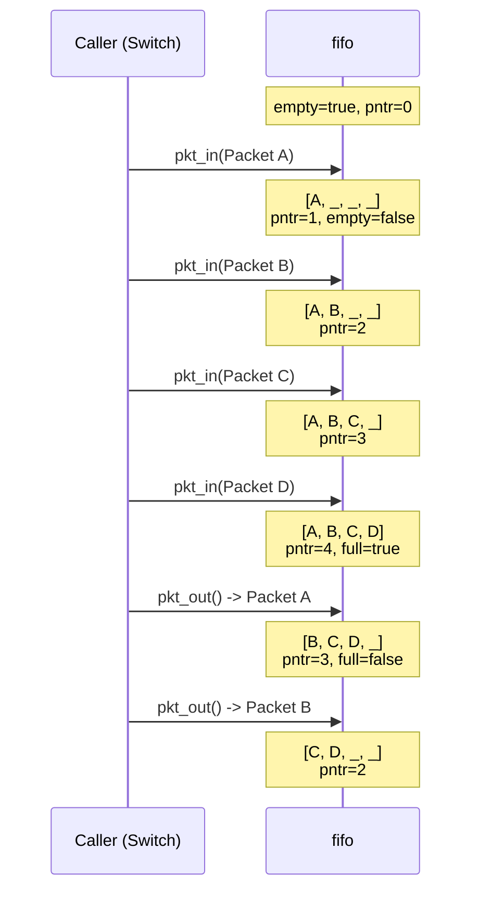

# FIFO -- Packet Buffer Queue

## Software Analogy

A FIFO is a **fixed-size queue** (bounded queue) with a capacity of 4. Its behavior is almost identical to Python's `queue.Queue(maxsize=4)`:

- If there is space, put it in; if full, reject (the caller decides whether to drop or block)
- Items are taken out in first-in-first-out order

The difference is that this FIFO is a hardware-style implementation -- no mutex, no condition variable, state is managed through `full` / `empty` flags.

## Data Structure

```
struct fifo {
    pkt regs[4];       -- 4-slot packet array (underlying storage)
    bool full;         -- Whether it is full
    bool empty;        -- Whether it is empty
    sc_uint<3> pntr;   -- Write pointer (points to the next empty slot)
};
```

### Memory Layout Diagram

```
State when pntr = 2:
+--------+--------+--------+--------+
| regs[0]| regs[1]| regs[2]| regs[3]|
| Pkt A  | Pkt B  | (empty)| (empty)|
+--------+--------+--------+--------+
                    ^
                    pntr (next write position)

full = false, empty = false
Currently holds 2 packets
```

## Methods

### `pkt_in()` -- Write a Packet

```cpp
void fifo::pkt_in(const pkt& data_pkt) {
    regs[pntr++] = data_pkt;    // Write at pntr position, then increment pntr
    empty = false;                // After writing, it is definitely not empty
    if (pntr == 4) full = true;  // pntr reaching 4 means all 4 slots are full
}
```

**Software Analogy**: `list.append(item)` then check `if len(list) == capacity: full = True`.

Note: The caller (switch) must check `full` before calling `pkt_in()`. There is no overflow protection here.

### `pkt_out()` -- Read a Packet

```cpp
pkt fifo::pkt_out() {
    pkt temp;
    temp = regs[0];              // Read the front packet
    if (--pntr == 0) empty = true;  // Decrement pntr; if it reaches zero, it is empty
    else {
        regs[0] = regs[1];      // Shift all elements forward by one
        regs[1] = regs[2];
        regs[2] = regs[3];
        full = false;            // After removal, it is definitely not full
    }
    return temp;
}
```

**Software Analogy**: `list.pop(0)` -- take out the first element, remaining elements shift forward.

### Operation Illustration



## Performance Observations

This FIFO implementation uses a "shift all elements" approach to maintain FIFO order, which is an O(n) operation. In software, we would use a circular buffer (ring buffer) to achieve O(1). However, in hardware, a shift register is a very natural and efficient structure -- all elements can move simultaneously in a single clock cycle.

| Comparison | Software FIFO (Ring Buffer) | Hardware FIFO (Shift Register) |
|-----------|---------------------------|-------------------------------|
| Enqueue | O(1) | O(1) |
| Dequeue | O(1) (move pointer) | O(1) (all registers shift simultaneously) |
| Space | Needs extra head/tail pointers | Only needs one write pointer |
| Implementation | Modular arithmetic | Parallel wire connections |

## Role in the Switch

The switch module uses a total of 8 FIFOs:

- `q0_in` .. `q3_in`: One per input port, buffering packets from senders
- `q0_out` .. `q3_out`: One per output port, buffering packets to be sent to receivers

When an input FIFO is full and a new packet arrives, the packet is dropped. This is the source of "dropped packets" in the switch statistics. Increasing the FIFO depth can reduce the drop rate but increases hardware area and latency.
