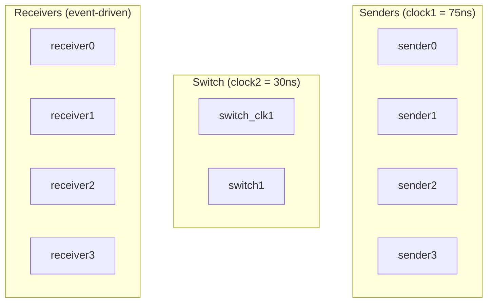
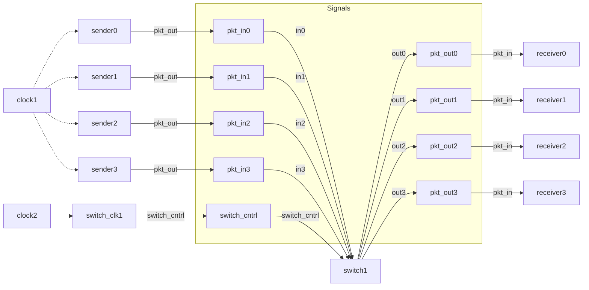

# Main -- Top-Level Testbench

## Software Analogy

`main.cpp` is like an **application bootstrap file (composition root)**. Its job is to:

1. Create all components (acting as a dependency injection container)
2. Wire up the connections between components
3. Set initial parameters
4. Start the system

Similar to dependency injection (like Python's inject library) configuration, or Docker Compose's `docker-compose.yml` -- defining what services exist and how they are connected.

## System Composition

### Signal Declarations

```cpp
sc_signal<pkt> pkt_in0, pkt_in1, pkt_in2, pkt_in3;    // sender -> switch
sc_signal<pkt> pkt_out0, pkt_out1, pkt_out2, pkt_out3; // switch -> receiver
sc_signal<sc_int<4>> id0, id1, id2, id3;                // ID signals
sc_signal<bool> switch_cntrl;                            // switch control signal
```

**Software Analogy**: Signals are **communication channels** between components. `pkt_in0` is like a pipe connecting sender0 and the switch.

### Clocks

```cpp
sc_clock clock1("CLOCK1", 75, SC_NS, 0.5, 0.0, SC_NS);  // sender clock
sc_clock clock2("CLOCK2", 30, SC_NS, 0.5, 10.0, SC_NS);  // switch control clock
```

| Clock | Period | Driven Modules | Software Analogy |
|-------|--------|---------------|-----------------|
| `clock1` | 75 ns | 4 senders | Timer that fires every 75ns |
| `clock2` | 30 ns | switch_clk | Timer that fires every 30ns |

The switch control clock is faster than the sender clock (30ns vs 75ns), ensuring the switch has enough processing speed to handle packets from all 4 senders.

### Module Instantiation

The system has a total of 10 module instances:



### Connection Methods

The example demonstrates two port binding styles:

#### Method 1: By Name

```cpp
sender0.pkt_out(pkt_in0);
sender0.source_id(id0);
sender0.CLK(clock1);
```

Explicitly specifies which signal each port connects to. Similar to Python's keyword argument: `func(pkt_out=pkt_in0, source_id=id0)`.

#### Method 2: By Position

```cpp
sender1(pkt_in1, id1, clock1);
```

Connects in the order ports are declared. Similar to Python's positional argument: `func(pkt_in1, id1, clock1)`.

Both methods produce the same result. By name is more readable; by position is more concise.

### ID Initialization

```cpp
sc_start(0, SC_NS);    // Run for 0 time first to complete elaboration
id0.write(0);
id1.write(1);
id2.write(2);
id3.write(3);
sc_start();             // Start the actual simulation
```

`sc_start(0, SC_NS)` is a SystemC idiom: first run a "zero-time" simulation to let all modules complete initialization (elaboration phase), then set the ID values.

**Why not set the IDs at declaration time?** Because `sc_signal` cannot be written to before the elaboration phase completes. You must wait until `sc_start()` is called before operating on signals.

## Complete Wiring Diagram



## Simulation Behavior

1. `sc_start(0, SC_NS)` -- Complete elaboration, all modules are constructed
2. Write ID signals (0, 1, 2, 3)
3. `sc_start()` -- Start indefinite simulation
4. Senders continuously generate packets driven by clock1
5. Switch processes routing driven by clock2 / switch_cntrl
6. Receivers print information upon receiving packets
7. Switch calls `sc_stop()` to end the simulation after 500 cycles
