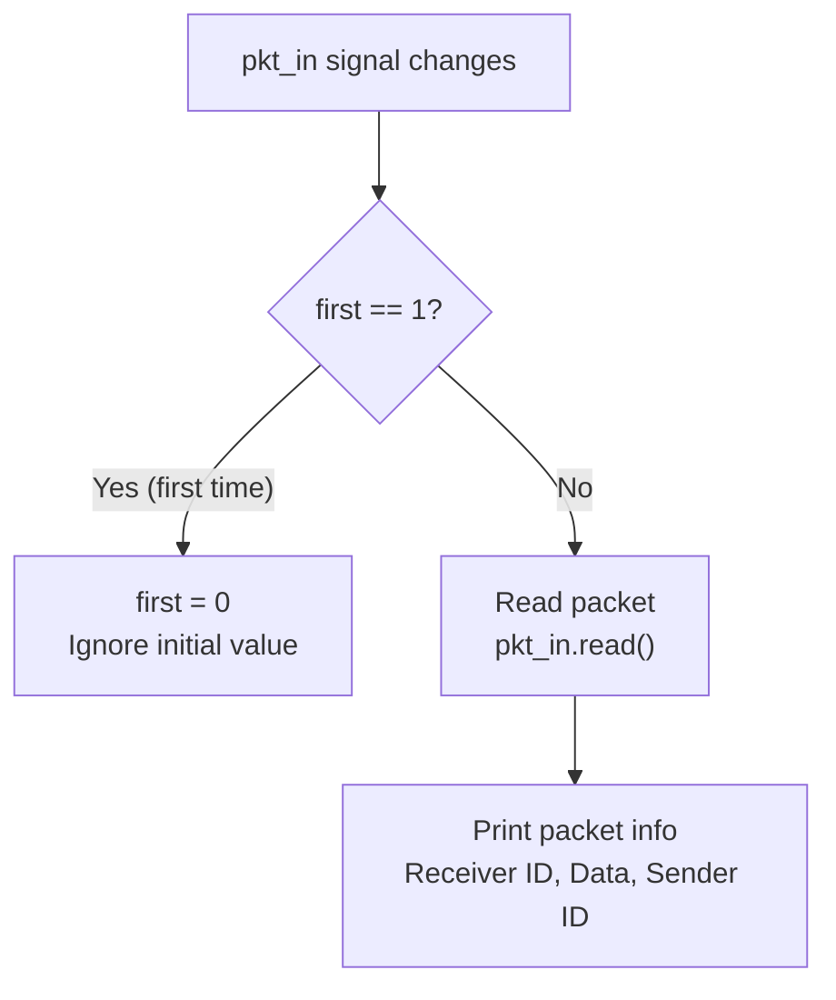

# Receiver -- Packet Receiver

## Software Analogy

A receiver is like an **event listener**. It does not actively poll; instead, it is "automatically called when a new packet arrives." Similar to JavaScript's `element.addEventListener('message', callback)` -- you register a callback, and the framework calls it when the event occurs.

## Interface

```
sc_in<pkt>           pkt_in    -- Packet input port (from switch output)
sc_in<sc_int<4>>     sink_id   -- This receiver's identifier (0-3)
```

The module uses `SC_METHOD`, sensitive to changes on `pkt_in`.

## Behavior



### Ignoring the First Trigger

```cpp
int first;
SC_CTOR(receiver) {
    SC_METHOD(entry);
    dont_initialize();
    sensitive << pkt_in;
    first = 1;
}
```

The receiver uses a `first` flag to skip the first call. This is because `sc_signal` has an initial value at simulation start that triggers an event. This initial value is not a real packet and needs to be ignored.

**Software Analogy**: Like RxJS's `observable.pipe(skip(1))` -- skip the first event (caused by initialization).

### Output Format

The receiver prints information for each received packet:

```
                                  ..........................
                                  New Packet Received
                                  Receiver ID: 1
                                  Packet Value: 42
                                  Sender ID: 3
                                  ..........................
```

Note that the ID is printed with 1 added (`sink_id.read() + 1`), so the displayed ID is 1-4 instead of 0-3.

## Important SystemC Concepts

### `SC_METHOD` vs `SC_CTHREAD`

| Feature | `SC_METHOD` (used by Receiver) | `SC_CTHREAD` (used by Sender) |
|---------|-------------------------------|------------------------------|
| Execution model | Runs the entire function on each trigger | Has its own call stack, can be suspended |
| Can use `wait()`? | No | Yes |
| Trigger condition | Any signal change | Clock edge only |
| Memory usage | Less (no stack) | More (has stack) |
| Software Analogy | Event callback | Coroutine / async function |

Using `SC_METHOD` for the receiver is reasonable because its logic is simple: receive a packet, print info, done. No `wait()` is needed and no state needs to be maintained (except for the `first` flag).

### `dont_initialize()`

```cpp
dont_initialize();
```

By default, SystemC calls all `SC_METHOD`s once at the start of simulation (even without an event trigger). `dont_initialize()` tells the simulator "don't call me at startup, wait for an actual event."

**Software Analogy**: Like setting up a lazy listener that only activates when the first real event arrives, rather than firing at registration time.
