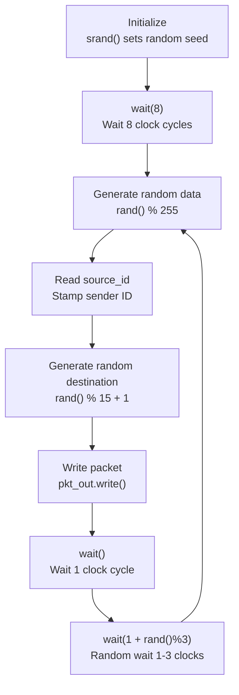

# Sender -- Packet Sender

## Software Analogy

A sender is like a **message producer**, periodically generating random data and sending it out. Similar to a worker thread that continuously calls `queue.push(randomMessage())`, but randomly sleeps for 1-3 ticks after each send.

## Interface

```
sc_out<pkt>           pkt_out     -- Packet output port
sc_in<sc_int<4>>      source_id   -- This sender's identifier (0-3)
sc_in_clk             CLK         -- Input clock (75 ns period)
```

The module uses `SC_CTHREAD`, triggered on the clock positive edge.

**`SC_CTHREAD` vs `SC_THREAD`**: `SC_CTHREAD` (clocked thread) only wakes up on the specified clock edge, like a scheduled task driven by a timer. In contrast, `SC_THREAD` can wait for arbitrary events.

## Behavior Flow



### Packet Generation Logic

1. **Data**: `rand() % 255` generates a random 8-bit value from 0-254
2. **ID**: Read from the `source_id` port, set by `main.cpp` at simulation start (0, 1, 2, 3)
3. **Destination**: `rand() % 15 + 1` generates a value from 1-15, corresponding to combinations of 4 dest bits

### Destination Encoding

The destination is a 4-bit bitmask, where each bit represents a receiver:

| dest value | dest3 | dest2 | dest1 | dest0 | Destination |
|-----------|-------|-------|-------|-------|-------------|
| 1 | 0 | 0 | 0 | 1 | Send to receiver 0 only |
| 5 | 0 | 1 | 0 | 1 | Send to receiver 0 and 2 |
| 15 | 1 | 1 | 1 | 1 | Broadcast to all receivers |

Because `dest` ranges from 1-15 (excluding 0), every packet is sent to at least one destination.

**Software Analogy**: This is like a **topic bitmask** in a pub/sub system. Each bit represents a consumer subscribed to a certain topic, and a single message can be sent to multiple topics simultaneously.

### Sending Rhythm

- Initial wait of 8 clock cycles (to let the system stabilize)
- Wait 1 clock cycle after each send (to let the signal propagate)
- Then randomly wait 1-3 clock cycles (to simulate uneven traffic)

With a 75ns clock, a packet is sent on average every 225ns. Combined across 4 senders, the switch receives approximately one packet every 56ns.

## Important SystemC Concepts

### `SC_CTHREAD` and `wait()`

```cpp
SC_CTHREAD(entry, CLK.pos());
```

`SC_CTHREAD` stands for clocked thread. The `entry()` function is "woken up" once on every clock positive edge. Inside, `wait()` means "pause until the next clock positive edge," and `wait(n)` means "pause for n clock positive edges."

**Software Analogy**: Like Python's `async def` with `await asyncio.sleep()`. `wait()` yields control and resumes at the next clock tick.
