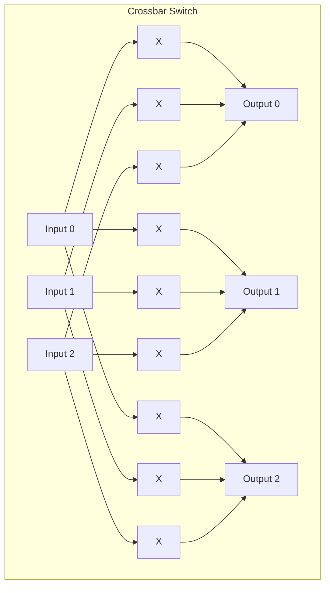
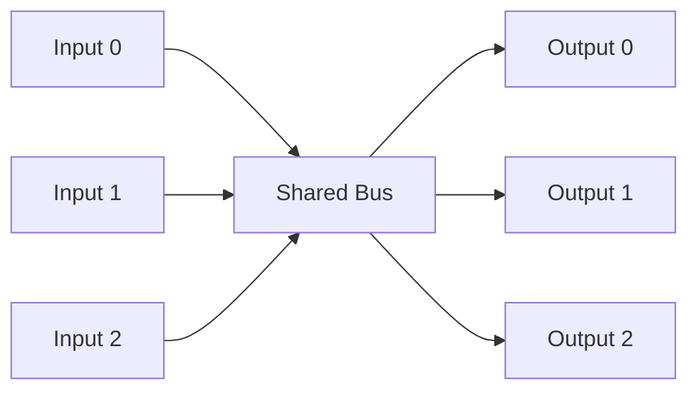
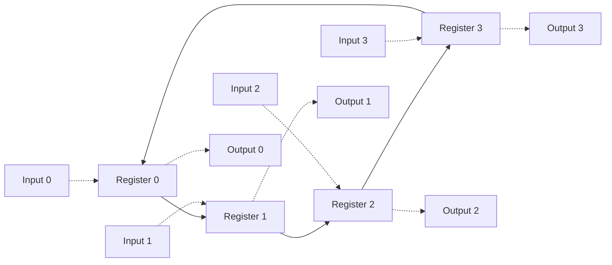
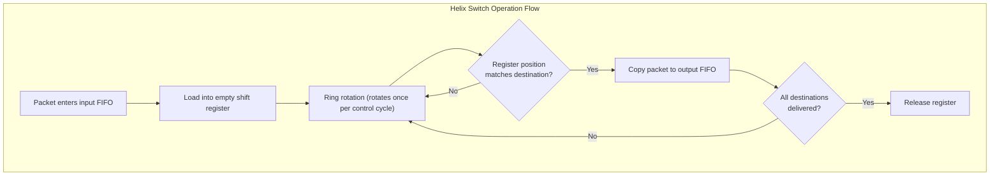
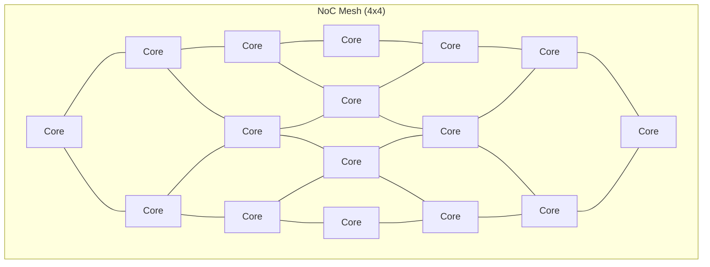

# Hardware Specification -- Packet Switch

> This article is written for software engineers, explaining the hardware background of a packet switch.

## What Is a Packet Switch?

A packet switch is a hardware device that forwards data packets from one input port to one or more output ports.

**Everyday Examples**:
- The **Ethernet switch** under your desk is a packet switch
- The **WiFi router** in your home also contains a packet switch internally
- **Top-of-Rack switches** in data centers handle all server traffic within a rack

**Software Analogy**:

| Hardware Concept | Software Analogy |
|-----------------|-----------------|
| Packet switch | Load balancer (e.g., Nginx, HAProxy) |
| Input port | Incoming TCP connection |
| Output port | Backend server |
| Routing table | Nginx `upstream` configuration |
| Multicast | Pub/sub fanout (e.g., RabbitMQ exchange) |
| Buffer overflow (drop) | HTTP 503 Service Unavailable |

## Why Do We Need Hardware Switches?

Software routers (e.g., Linux's iptables) can do the same thing, but hardware switches have an overwhelming performance advantage:

| Comparison | Software Routing | Hardware Switch |
|-----------|-----------------|-----------------|
| Latency | Microsecond to millisecond range | Nanosecond range (hundreds of times faster) |
| Throughput | Gbps range | Tens of Tbps range |
| CPU usage | High (software runs for every packet) | Zero (dedicated circuits handle it) |
| Power consumption | High | Low (fixed power) |
| Flexibility | High (can change the program anytime) | Low (circuits are fixed) |

**Key Difference**: Hardware switches can achieve **wire-speed routing** -- the processing speed matches the incoming packet rate, creating no bottleneck. Software cannot achieve this because every packet requires CPU intervention.

## Switch Architecture Comparison

### Crossbar

- **Principle**: Every input has a direct path to every output. Like an NxN switch matrix.
- **Pros**: Non-blocking (any input to any output without interference), low latency
- **Cons**: Hardware cost is O(N^2), cost explodes as port count increases
- **Software Analogy**: Full mesh topology, with a direct connection between every pair of services

### Shared Bus

- **Principle**: All ports share a single data channel; only one port can transmit at a time
- **Pros**: Low hardware cost (O(N))
- **Cons**: Bandwidth bottleneck (all traffic competes for one path), requires arbitration
- **Software Analogy**: A single message queue where all producers write to the same queue

### Ring -- The Architecture Used in This Example

- **Principle**: Packets rotate around the ring, checking at each output port whether they match. If they match, a copy is sent out.
- **Pros**: Moderate hardware cost (O(N)), naturally supports multicast (a packet can reach all destinations in one full rotation)
- **Cons**: Higher latency (up to N cycles to reach the destination)
- **Software Analogy**: Token ring network, or Kafka's partition rebalance -- messages are passed around among a group of consumers in turn

### Architecture Comparison Summary

| Architecture | Hardware Cost | Latency | Bandwidth | Multicast | Software Analogy |
|-------------|--------------|---------|-----------|-----------|-----------------|
| Crossbar | O(N^2) | 1 cycle | Highest | Requires extra logic | Full mesh |
| Shared Bus | O(N) | Variable | Lowest | Easy (broadcast) | Single queue |
| Ring | O(N) | 1~N cycles | Medium | Naturally supported | Token ring |

## The Helix Packet Switch in This Example

This example implements a **Helix packet switch**, a variant of the ring architecture:

**The Cleverness of Helix**:

1. **Self-routing**: No centralized routing table needed. Packets carry their own destination information, and the register position determines which output it can write to.
2. **Pipelined**: Multiple packets can flow through the ring simultaneously without waiting for the previous one to finish.
3. **Non-blocking multicast**: Packets stay in the ring rotating until all destinations are served, without blocking other packets.

## Real-World Applications

### Ethernet Switch

The Ethernet switch under your desk is the most common packet switch. It typically has 4, 8, 24, or 48 ports. Enterprise-grade switches use crossbar or more complex multi-stage architectures.

### Network-on-Chip (NoC)

Modern multi-core processors (e.g., AMD EPYC, Intel Xeon) have dozens of CPU cores internally, and they communicate through a NoC -- a packet-switching network inside the chip. Common NoC topologies include ring (Intel's early multi-core designs) and mesh (AMD's chiplet architecture).

### PCIe Switch

PCIe switches that connect high-speed devices like GPUs, NVMe SSDs, and network cards are also a type of packet switch. They allow multiple devices to share PCIe lanes.

### Similar Concepts in Software

If you are writing distributed systems, you may already be familiar with these concepts:

| Hardware | Software |
|----------|----------|
| Packet switch | Service mesh sidecar (Envoy) |
| Input FIFO | Request queue |
| Output FIFO | Response buffer |
| Multicast | gRPC server streaming / Kafka topic fanout |
| Packet drop (FIFO full) | Circuit breaker / backpressure / HTTP 429 |
| Wire-speed routing | Kernel bypass networking (DPDK, io_uring) |

## Why Simulate with SystemC?

The typical flow for designing a packet switch is:

1. **Algorithm exploration** (SystemC / C++ model) -- the stage this example is at
2. **RTL design** (Verilog / VHDL)
3. **Verification** (using the SystemC model as a golden reference)
4. **Synthesis** (converting to actual logic gate circuits)
5. **Manufacturing** (sent to the foundry)

SystemC allows hardware designers to quickly verify switch behavior in C++: packet drop rates under different buffer sizes, different routing strategies, and different traffic patterns. This is much faster than writing RTL directly and is also easier to debug.
