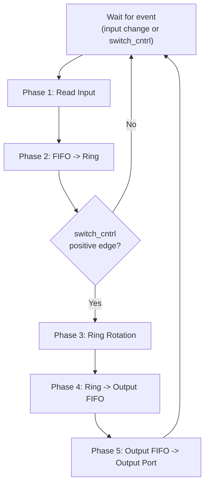
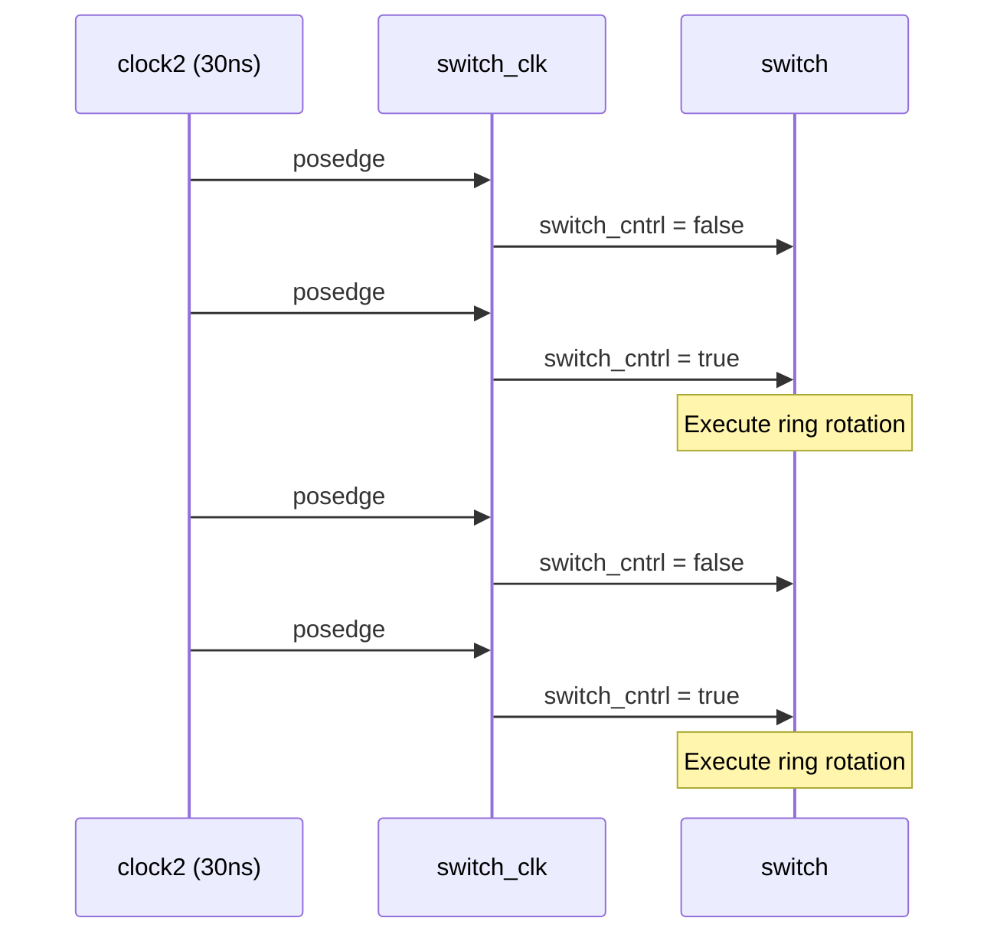

# Switch Fabric -- Packet Switch Core

## Software Analogy

Imagine you are writing a **message router** with 4 input queues and 4 output queues. Your routing logic is:

1. Take a message from the input queue
2. Check the "destination" tag on the message
3. Put the message into the corresponding output queue
4. If it is multicast, the same message needs to go into multiple output queues

This switch module does exactly that, but it uses a clever "rotating ring" mechanism for routing.

## Files Involved

- `switch.h` / `switch.cpp` -- Main switching logic (`mcast_pkt_switch` module)
- `switch_reg.h` -- Data structure for the ring register (`switch_reg`)
- `switch_clk.h` / `switch_clk.cpp` -- Control signal generator (`switch_clk` module)

## mcast_pkt_switch Module

### Interface

```
sc_in<bool>   switch_cntrl   -- Control signal (triggers ring rotation)
sc_in<pkt>    in0..in3       -- 4 input ports (from senders)
sc_out<pkt>   out0..out3     -- 4 output ports (to receivers)
```

The module uses `SC_THREAD`, sensitive to all input ports and the positive edge of `switch_cntrl`.

**Software Analogy**: This is like an event loop that `select()`s on multiple sockets simultaneously, waking up whenever any input has new data or a control signal is received.

### Internal Structure

The switch maintains the following internal data structures:

| Data Structure | Type | Count | Purpose |
|---------------|------|-------|---------|
| `q0_in` .. `q3_in` | `fifo` | 4 | Input FIFO, one per port |
| `q0_out` .. `q3_out` | `fifo` | 4 | Output FIFO, one per port |
| `R0` .. `R3` | `switch_reg` | 4 | Shift registers forming the ring |
| `pkt_count` | `int` | 1 | Total packets received |
| `drop_count` | `int` | 1 | Packets dropped due to full FIFO |

### Operation Flow

Each simulation cycle, the switch executes the following steps:



#### Phase 1: Read Input

```cpp
if (in0.event()) {
    pkt_count++;
    if (q0_in.full == true) drop_count++;  // FIFO full, drop packet
    else q0_in.pkt_in(in0.read());         // Store in input FIFO
}
```

**Software Analogy**: Like `if (poll(fd, POLLIN))` checking each socket for new data. If the buffer is full, drop; otherwise enqueue.

#### Phase 2: FIFO to Ring

```cpp
if ((!q0_in.empty) && R0.free) {
    R0.val  = q0_in.pkt_out();  // Take packet from FIFO
    R0.free = false;             // Mark register as occupied
}
```

A new packet is loaded from the FIFO only when the register is empty (`free == true`).

#### Phase 3: Ring Rotation

```cpp
temp = R0;
R0 = R1;
R1 = R2;
R2 = R3;
R3 = temp;
```

The values of the 4 registers "rotate forward by one position." This is like a **circular buffer rotation**. After rotation:
- The packet originally in R0 is now in R3
- The packet originally in R1 is now in R0
- And so on

**Why rotate?** Because each register can only write to its corresponding output FIFO (R0 writes to q0_out, R1 writes to q1_out...). Through rotation, a packet passes through all 4 positions in at most 4 rotations, allowing it to be sent to all destinations.

#### Phase 4: Ring to Output FIFO

```cpp
if ((!R0.free) && (R0.val.dest0) && (!q0_out.full)) {
    q0_out.pkt_in(R0.val);       // Copy packet to output FIFO
    R0.val.dest0 = false;         // Clear the delivered destination bit
    if (!(R0.val.dest0|R0.val.dest1|R0.val.dest2|R0.val.dest3))
        R0.free = true;           // All destinations delivered, release register
}
```

**Key multicast mechanism**: The packet's `dest0`..`dest3` bits act like a checklist. Each time a destination is reached, it gets checked off (bit cleared). Once all are checked off, the register can be used by a new packet.

**Software Analogy**: This is like `reference counting`. Each destination is a reference; delivering to one decrements the count. When the count reaches zero, the resource is released.

#### Phase 5: Output

```cpp
if (!q0_out.empty) out0.write(q0_out.pkt_out());
```

Takes a packet from the output FIFO and writes it to the output port, sending it to the receiver.

### Simulation Termination

The switch calls `sc_stop()` to end the simulation after 500 cycles (`SIM_NUM = 500`) and prints statistics: packets received, packets dropped, and drop percentage.

## switch_reg Structure

```cpp
struct switch_reg {
    pkt val;     // Stored packet
    bool free;   // Whether it is available (true = empty)
};
```

A very simple data structure, like an `Optional<Packet>` -- either it has a value or it is empty.

## switch_clk Module

### Interface

```
sc_out<bool>  switch_cntrl   -- Control signal output
sc_in_clk     CLK            -- Input clock (30 ns period)
```

### Behavior

On every clock positive edge, `switch_cntrl` toggles between `true` and `false`. The effect is that the switch's ring rotation **executes only every other clock** (rotation is triggered only when `switch_cntrl` is `true` and there is an event).

**Software Analogy**: This is like a **rate limiter** or **tick divider**. Using a 30ns clock to produce a 60ns rotation period, ensuring the switch has enough time to process routing.


