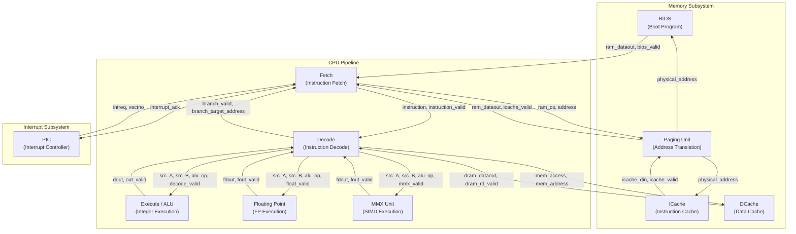

# RISC CPU -- SystemC Example Overview

## Software Analogy

If you have ever written an interpreter -- such as a JVM, V8 engine, or Python bytecode VM -- you already have the foundation to understand this example. This RISC CPU simulator is essentially an **instruction interpreter with a cache layer**:

| CPU Concept | Software Analogy |
|-------------|------------------|
| Fetch Stage | Read the next line of a script (`readline()`) |
| Decode Stage | Parse/tokenize a command string (`parse()`, `tokenize()`) |
| Execute Stage | Perform computation (`eval()`) |
| Instruction Cache | In-memory code cache (like Redis caching SQL queries) |
| Data Cache | In-memory data cache (like Memcached) |
| BIOS | Boot loader / initialization script (like `bootstrap.js`) |
| Paging Unit | Virtual memory mapping (like memory-mapped files) |
| PIC Interrupt Controller | Event loop / signal handler (like Python asyncio event loop) |
| FPU Floating Point Unit | Dedicated math library (like `math.h`) |
| MMX Unit | SIMD vectorized operations (like numpy vector operations) |

## Architecture Diagram

## Data Flow Overview

1. **Boot**: The BIOS module loads the first 5 instructions from `bios.img` for the Fetch unit to read.
2. **Fetch**: The Fetch unit translates logical addresses to physical addresses through the Paging module and reads instructions from ICache.
3. **Decode**: The Decode unit parses the instruction format -- opcode, register numbers, immediate values -- and reads the register file.
4. **Execute**: Depending on the instruction type, computation is dispatched to the ALU (integer), FPU (floating point), or MMX (SIMD) unit.
5. **Memory**: Load/Store instructions access data memory through DCache.
6. **Writeback**: Execution results are written back to the register file in the Decode module.
7. **Interrupt Handling**: The PIC receives external interrupt requests and notifies Fetch to jump to the interrupt vector address.

## File List

| File Name | Description | Role |
|-----------|-------------|------|
| `main.cpp` | Top-level module wiring and simulation startup | Top-level |
| `fetch.h` / `fetch.cpp` | Instruction Fetch Unit | Pipeline Stage 1 |
| `decode.h` / `decode.cpp` | Instruction Decode Unit | Pipeline Stage 2 |
| `exec.h` / `exec.cpp` | Integer ALU | Pipeline Stage 3 |
| `floating.h` / `floating.cpp` | Floating Point Unit (FPU) | Pipeline Stage 3 |
| `mmxu.h` / `mmxu.cpp` | MMX/SIMD Execution Unit | Pipeline Stage 3 |
| `icache.h` / `icache.cpp` | Instruction Cache | Memory Subsystem |
| `dcache.h` / `dcache.cpp` | Data Cache | Memory Subsystem |
| `paging.h` / `paging.cpp` | Paging / Address Translation Unit | Memory Subsystem |
| `bios.h` / `bios.cpp` | BIOS Boot Program | Memory Subsystem |
| `pic.h` / `pic.cpp` | Programmable Interrupt Controller (PIC) | Interrupt Subsystem |
| `directive.h` | Debug output toggles | Configuration |

## Key Concepts

### Pipeline Execution

CPU instruction execution is divided into multiple stages, with each stage processing a different instruction simultaneously, like a factory assembly line. In software, this is analogous to a multi-stage producer-consumer architecture where each stage is an independent thread.

### Memory Hierarchy

Instructions and data each have their own cache (Harvard Architecture). Access speed from fast to slow: Registers > L1 Cache (ICache/DCache) > Main Memory. Software analogy: local variables > Redis > Database.

### Interrupt Handling

The PIC module is like a Python asyncio event loop: when an external event occurs, it does not directly interrupt the executing code but sets a flag, letting the Fetch unit check and jump to the interrupt handler at the appropriate time.

## Suggested Reading Order

1. **[spec.md](spec.md)** -- First understand the RISC CPU hardware specification background
2. **[main.md](main.md)** -- See the overall wiring and how modules connect
3. **[fetch.md](fetch.md)** -- Pipeline Stage 1
4. **[decode.md](decode.md)** -- Pipeline Stage 2 (the most complex module)
5. **[exec.md](exec.md)** -- Pipeline Stage 3: integer operations
6. **[floating.md](floating.md)** -- Floating point operations
7. **[mmxu.md](mmxu.md)** -- SIMD operations
8. **[cache.md](cache.md)** -- Instruction cache and data cache
9. **[bios.md](bios.md)** -- Boot process
10. **[paging.md](paging.md)** -- Address translation
11. **[pic.md](pic.md)** -- Interrupt mechanism
