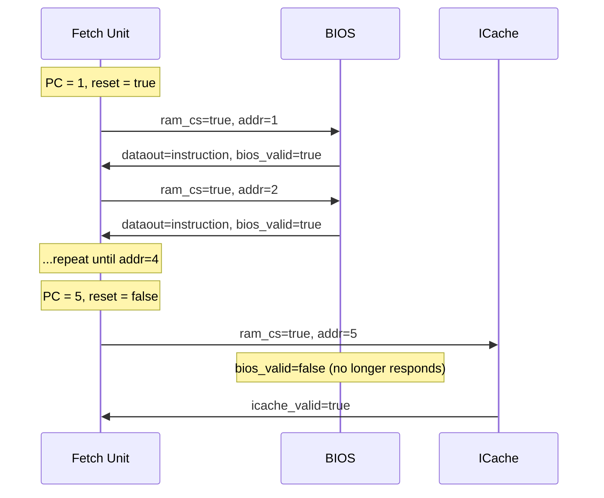

# BIOS -- Basic Input/Output System

## Software Analogy

The BIOS is the CPU's **bootloader** or initialization script. Think of it as:

- A web application's `bootstrap.js` / `main()` -- initializing the environment before the main program logic runs
- An operating system's GRUB bootloader -- loading the kernel into memory and then handing over control
- A Docker container's entrypoint script -- setting up the environment and then executing the main program

In this CPU, the BIOS provides the first 5 instructions. Once booting is complete (PC >= 5), control is handed to ICache, and the BIOS no longer participates.

## Source Files

- `bios.h` -- Module declaration
- `bios.cpp` -- Behavioral implementation

## Module Interface

| Direction | Signal Name | Type | Description |
|-----------|-------------|------|-------------|
| Input | `datain` | `sc_in<unsigned>` | Write data |
| Input | `cs` | `sc_in<bool>` | Chip Select |
| Input | `we` | `sc_in<bool>` | Write Enable |
| Input | `addr` | `sc_in<unsigned>` | Address |
| Output | `dataout` | `sc_out<unsigned>` | Instruction data |
| Output | `bios_valid` | `sc_out<bool>` | Data valid |
| Output | `stall_fetch` | `sc_out<bool>` | Stall Fetch |

## Internal Structure

```cpp
unsigned *imemory;      // BIOS program memory (4000 entries)
unsigned *itagmemory;   // Tag memory (unused)
int wait_cycles;        // Access latency
```

During initialization, code is loaded from `bios.img`; uninitialized locations are filled with `0xFFFFFFFF`.

## Behavioral Logic

```
while true:
    wait for cs == true
    address = addr

    if address < BOOT_LENGTH (5):   # Only handle boot phase
        if write:
            imemory[address] = datain
        else:
            wait wait_cycles
            dataout = imemory[address]
            bios_valid = true
            wait one cycle then clear bios_valid
    else:
        bios_valid = false    # Boot finished, no response
```

## Boot Sequence



### BOOT_LENGTH = 5

The first 5 instructions are provided by the BIOS. `bios.img` typically contains system initialization code, such as setting initial register values, loading the process ID, etc. When the Fetch PC reaches 5, `reset` is deasserted and the system switches to ICache for instruction supply.

## Comparison with ICache

| Feature | BIOS | ICache |
|---------|------|--------|
| Address range served | 0 ~ 4 | 5 ~ 499 |
| Initialization source | `bios.img` | `icache.img` |
| Role | Boot loading | Normal execution |
| When active | reset = true | reset = false |
| Software analogy | bootloader | Code cache |

## Shared Signals

BIOS and the Paging/ICache path share the `ram_dataout` signal (using `SC_MANY_WRITERS` policy), since both never write simultaneously -- BIOS is only active during boot, and ICache is only active after boot.

## SystemC Key Points

- In `main.cpp`, BIOS uses named binding rather than positional binding, resulting in clearer syntax.
- `init_param(delay_cycles)` sets the memory latency -- this is a pattern for passing parameters via function calls, since SystemC constructor parameters are limited.
