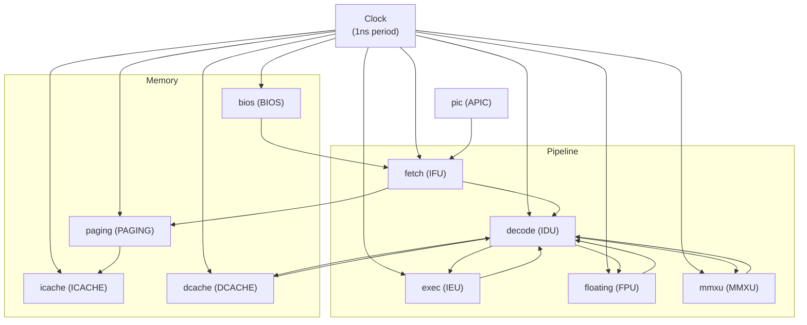

# Main -- Top-Level Wiring and Simulation Startup

## Software Analogy

`main.cpp` is the **dependency injection container** or **wiring configuration** for the entire CPU system. It contains no business logic and is only responsible for:

1. Declaring all signals (communication channels)
2. Creating all modules (components)
3. Connecting signals to module ports (wiring)
4. Starting the simulation

Think of it as a dependency injection configuration (like Python's inject library), or a Docker Compose `docker-compose.yml`.

## Source Files

- `main.cpp` -- Top-level wiring
- `directive.h` -- Debug output toggles

## Architecture Overview



## Signal Declarations

`main.cpp` declares a large number of `sc_signal`s, each serving as a communication channel between modules. Key signals are grouped by subsystem:

### BIOS / Memory Signals
- `ram_cs`, `ram_we`, `addr`, `ram_datain` -- Control and address from Fetch to memory
- `ram_dataout` (SC_MANY_WRITERS) -- Both BIOS and Paging write to this
- `bios_valid` -- BIOS output valid

### Pipeline Signals
- `instruction`, `instruction_valid`, `program_counter` -- Fetch to Decode
- `src_A`, `src_B`, `alu_op`, `alu_src` -- Decode to Execute/FPU/MMX
- `decode_valid`, `float_valid`, `mmx_valid` -- Dispatch control
- `dout`, `out_valid`, `destout` -- ALU result writeback
- `fdout`, `fout_valid`, `fdestout` (SC_MANY_WRITERS) -- Shared by FPU/MMX

### Branch Signals
- `branch_valid`, `branch_target_address` -- Branch control from Decode to Fetch
- `branch_clear`, `next_pc` -- Control after branch completion

### Interrupt Signals
- `ireq0` ~ `ireq3` -- Four interrupt request lines
- `intreq`, `vectno`, `intack_cpu` -- Between PIC and CPU

## Module Instantiation and Wiring

### Two Wiring Styles

The code demonstrates two SystemC wiring approaches:

**1. Positional Binding**: Using the `<<` operator
```cpp
IFU << ram_dataout << branch_target_address << next_pc << branch_valid
    << stall_fetch << intreq << vectno << ...;
```
Pros: Concise. Cons: Must strictly follow declaration order; error-prone.

**2. Named Binding**: Using port names
```cpp
BIOS.datain(ram_datain);
BIOS.cs(ram_cs);
BIOS.we(ram_we);
```
Pros: Self-documenting, order-independent. Cons: More verbose.

### SC_MANY_WRITERS

Three signals use the `SC_MANY_WRITERS` policy:
- `ram_dataout` -- Shared by BIOS and Paging
- `fdout`, `fout_valid`, `fdestout` -- Shared by FPU and MMX
- `stall_fetch` -- Shared by BIOS and Paging

This allows multiple modules to write to the same signal, but the designer must ensure conflicting values are not written simultaneously.

## Clock Configuration

```cpp
sc_clock clk("Clock", 1, SC_NS, 0.5, 0.0, SC_NS);
```

- Period: 1 ns
- Duty cycle: 50% (0.5)
- Start time: 0 ns

## Module Initialization Parameters

```cpp
const int delay_cycles = 2;
IFU.init_param(delay_cycles);
BIOS.init_param(delay_cycles);
ICACHE.init_param(delay_cycles);
DCACHE.init_param(delay_cycles);
```

All memory-related modules share the same latency parameter (2 cycles).

## directive.h -- Debug Toggles

```cpp
#define PRINT_IFU true     // Fetch Unit output
#define PRINT_ID true      // Decode output
#define PRINT_PU false     // Paging Unit output
#define PRINT_BPU true     // Branch Prediction output
#define PRINT_FPU true     // FPU output
#define PRINT_ICU false    // ICache output
#define PRINT_MMU false    // MMU output
#define PRINT_BIOS false   // BIOS output
#define TRACE false        // VCD waveform tracing
```

These compile-time toggles control debug output for each module, similar to log level configuration in software.

## Simulation Execution

```cpp
sc_start();                    // Start simulation (until sc_stop() is called)
```

The simulation is terminated when the QUIT instruction (opcode 0xFF) in Decode calls `sc_stop()`.

## SystemC Key Points

- `sc_main()` is the SystemC program entry point, replacing the standard C++ `main()`.
- All modules and signals are declared as local variables in `sc_main()`; their lifetime matches the simulation.
- `sc_report_handler::set_actions("/IEEE_Std_1666/deprecated", SC_DO_NOTHING)` suppresses deprecation warnings for positional binding.
