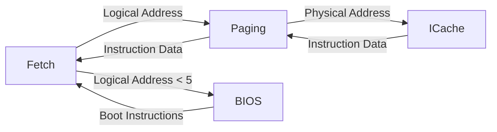

# Paging -- Address Translation Unit

## Software Analogy

The Paging unit is responsible for translating **logical addresses** to **physical addresses**, just like the virtual memory mechanism in an operating system:

```python
# Software analogy
class VirtualMemory:
    def translate(self, logical_addr):
        # In a real system, this would query the page table
        physical_addr = self.page_table[logical_addr]
        return physical_addr

# A more fitting analogy: URL routing
def route(logical_url):
    # /api/users/123 -> actual handler and storage location
    return resolve_handler(logical_url)
```

In this simplified implementation, the Paging module is effectively a **pass-through module** -- logical addresses directly equal physical addresses, with no actual translation. However, it plays an important intermediary role:

- During boot phase (address < 5), it does not forward requests, letting BIOS handle them
- During normal phase (address >= 5), it forwards requests to ICache

## Source Files

- `paging.h` -- Module declaration
- `paging.cpp` -- Behavioral implementation

## Module Interface

### Inputs (from Fetch)

| Signal Name | Type | Description |
|-------------|------|-------------|
| `paging_din` | `sc_in<unsigned>` | Write data |
| `paging_csin` | `sc_in<bool>` | Chip Select |
| `paging_wein` | `sc_in<bool>` | Write Enable |
| `logical_address` | `sc_in<unsigned>` | Logical address |

### Inputs (from ICache)

| Signal Name | Type | Description |
|-------------|------|-------------|
| `icache_din` | `sc_in<unsigned>` | Data returned from ICache |
| `icache_validin` | `sc_in<bool>` | ICache data valid |
| `icache_stall` | `sc_in<bool>` | ICache busy |

### Outputs (to ICache)

| Signal Name | Type | Description |
|-------------|------|-------------|
| `paging_dout` | `sc_out<unsigned>` | Data output |
| `paging_csout` | `sc_out<bool>` | Chip Select to ICache |
| `paging_weout` | `sc_out<bool>` | Write Enable to ICache |
| `physical_address` | `sc_out<unsigned>` | Physical address |

### Outputs (back to Fetch)

| Signal Name | Type | Description |
|-------------|------|-------------|
| `dataout` | `sc_out<unsigned>` | Instruction data |
| `data_valid` | `sc_out<bool>` | Data valid |
| `stall_ifu` | `sc_out<bool>` | Stall Fetch |

## Behavioral Logic

```
while true:
    wait for paging_csin == true
    address = logical_address

    if address >= 5:           # Do not handle boot-phase addresses
        if write operation:
            forward data and address to ICache
        else:                  # Read operation
            issue read request to ICache
            wait for icache_validin == true
            forward ICache data back to Fetch
            set data_valid = true
```

## Position in the Overall Architecture



Paging sits between Fetch and ICache as an intermediary layer. In a more complete implementation, this would include:

- **Page Table lookup**: Translating virtual page numbers to physical page frame numbers
- **TLB (Translation Lookaside Buffer)**: A cache for the page table
- **Page Fault handling**: Triggering an exception when the requested page is not in memory

## Process ID

The Paging module maintains a `pid_reg` (Process ID), used in multi-process systems to distinguish different processes' address spaces. In this simplified implementation, it is not fully utilized.

## SystemC Key Points

- Uses `SC_CTHREAD` driven on the rising clock edge.
- During read operations, `do { wait(); } while (!(icache_validin == true))` waits for the ICache response, demonstrating inter-module synchronization within the pipeline.
- This is a typical adapter / proxy module -- its main function is to coordinate and forward between two different modules.
