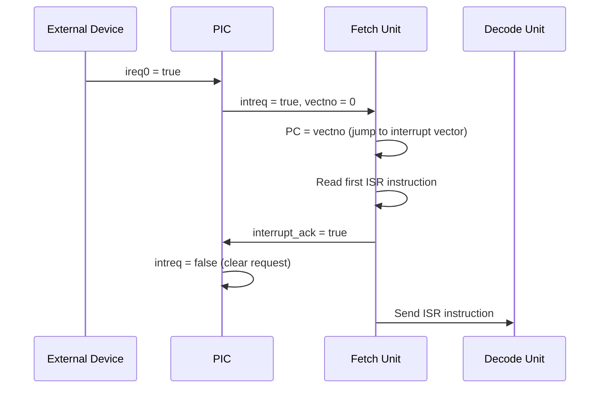

# PIC -- Programmable Interrupt Controller

## Software Analogy

The PIC (Programmable Interrupt Controller) is the hardware version of an **event loop**. It collects interrupt requests from multiple sources, prioritizes them, and notifies the CPU:

```python
# Software analogy: event dispatcher
class EventDispatcher:
    def on_event(self, irq0, irq1, irq2, irq3):
        if irq0:                      # Highest priority
            self.notify_cpu(vector=0)
        elif irq1:
            self.notify_cpu(vector=1)
        elif irq2:
            self.notify_cpu(vector=2)
        elif irq3:
            self.notify_cpu(vector=3)

        if cpu_acknowledged:
            self.clear_pending()
```

In Python asyncio, the event loop similarly listens to multiple event sources (I/O, timer, signal) and triggers corresponding callbacks at the appropriate time. The PIC does the same thing, except it triggers the CPU to jump to an Interrupt Service Routine (ISR).

## Source Files

- `pic.h` -- Module declaration
- `pic.cpp` -- Behavioral implementation

## Module Interface

| Direction | Signal Name | Type | Description |
|-----------|-------------|------|-------------|
| Input | `ireq0` | `sc_in<bool>` | Interrupt request 0 (highest priority) |
| Input | `ireq1` | `sc_in<bool>` | Interrupt request 1 |
| Input | `ireq2` | `sc_in<bool>` | Interrupt request 2 |
| Input | `ireq3` | `sc_in<bool>` | Interrupt request 3 |
| Input | `cs` | `sc_in<bool>` | Chip Select |
| Input | `rd_wr` | `sc_in<bool>` | Read/Write control |
| Input | `intack_cpu` | `sc_in<bool>` | CPU interrupt acknowledgment |
| Output | `intreq` | `sc_out<bool>` | Interrupt request to CPU |
| Output | `intack` | `sc_out<bool>` | Interrupt acknowledgment to device |
| Output | `vectno` | `sc_out<unsigned>` | Interrupt vector number |

## Behavioral Logic

The PIC's logic is very simple -- it is a **fixed-priority interrupt arbiter**:

1. Check `ireq0` (highest priority) through `ireq3` (lowest priority)
2. Forward the first active interrupt request to the CPU with the vector number
3. When the CPU acknowledges handling (`intack_cpu == true && cs == true`), clear the interrupt request

### Priority Order

```
ireq0 > ireq1 > ireq2 > ireq3
```

Software analogy: this is like UNIX signal priorities -- SIGKILL takes priority over SIGTERM, SIGTERM takes priority over SIGUSR1.

## Complete Interrupt Handling Flow



## SystemC Key Points

### SC_METHOD vs SC_CTHREAD

The PIC uses `SC_METHOD` instead of `SC_CTHREAD`:

```cpp
SC_CTOR(pic) {
    SC_METHOD(entry);
    dont_initialize();
    sensitive << ireq0 << ireq1 << ireq2 << ireq3;
}
```

This is an important design choice:

| Feature | SC_METHOD | SC_CTHREAD |
|---------|-----------|------------|
| Trigger | Whenever a sensitive signal changes | Every clock edge |
| Can call wait()? | No | Yes |
| Analogy | Event callback | Continuously running thread |
| Use case | Combinational logic / simple responses | Complex state machines |

The PIC does not need to maintain complex state; it is simply combinational logic that "forwards an interrupt when received," so `SC_METHOD` is the correct choice. Whenever any `ireq` signal changes, the `entry()` function is called once and completes immediately.

### dont_initialize()

`dont_initialize()` prevents the PIC from being automatically called once at the start of simulation. Without this, the PIC would produce a spurious interrupt output at time 0.

### Design Observations

This PIC is highly simplified. A real PIC (such as the Intel 8259A) also supports:
- Interrupt masking
- Interrupt nesting
- Adjustable priority
- End-of-Interrupt (EOI) commands
- Vector table remapping
