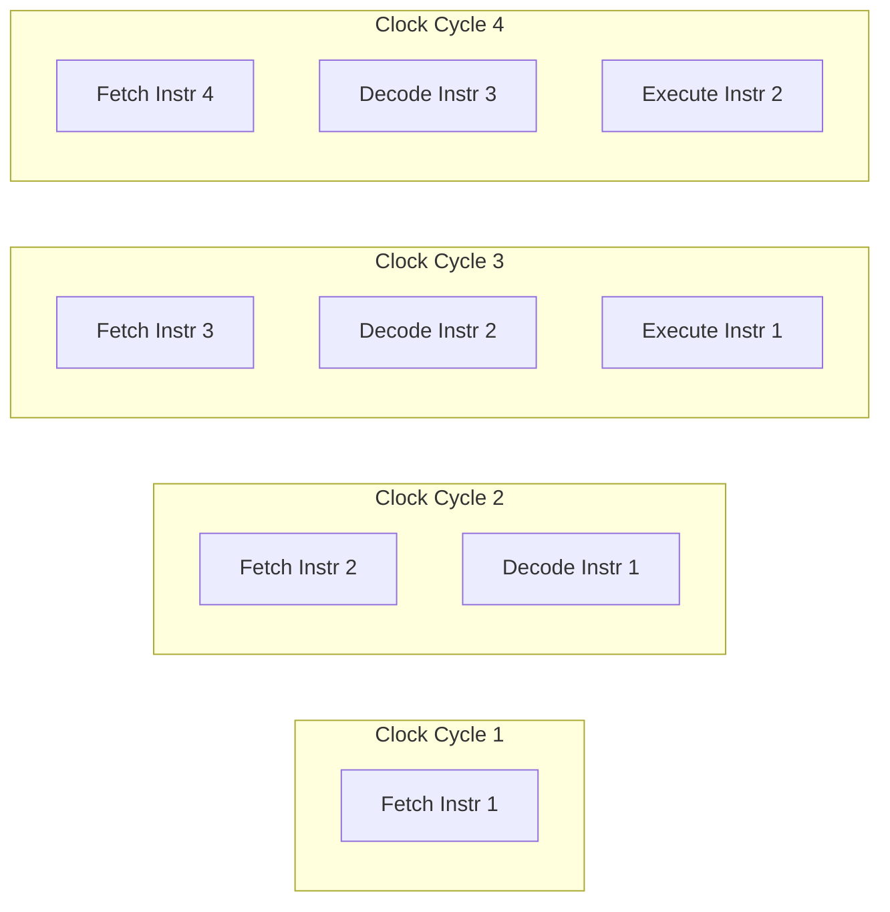
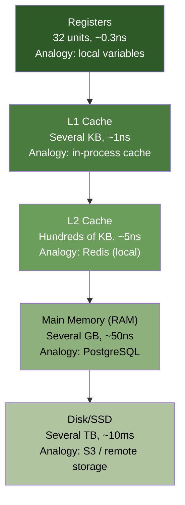
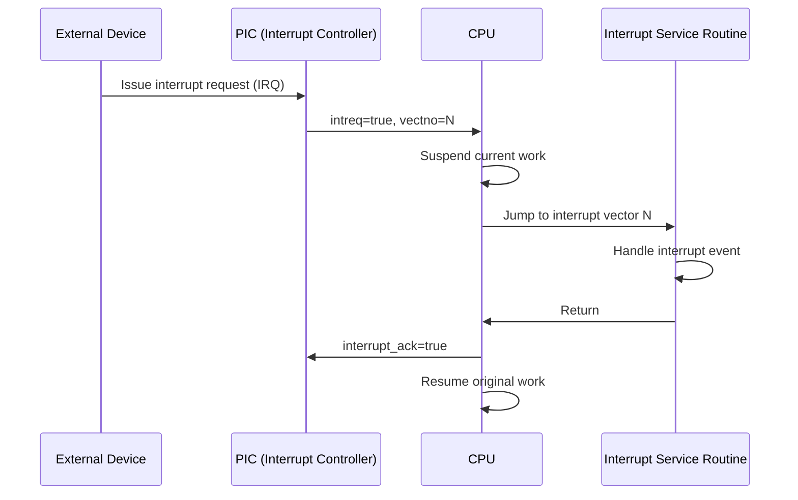
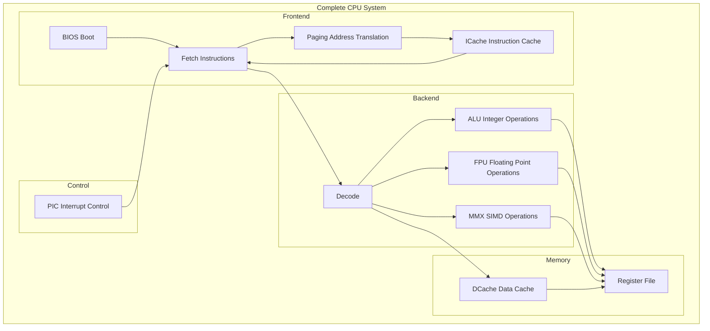

# RISC CPU Hardware Specification -- A Guide for Software Engineers

This document introduces the core concepts of a RISC CPU for software engineers without a hardware background, using software analogies to aid understanding.

---

## What is a RISC CPU?

RISC (Reduced Instruction Set Computer) is a CPU design philosophy: **use a small number of simple instructions, each doing one thing, and complete each instruction in one clock cycle whenever possible**.

### RISC vs CISC

| Feature | RISC | CISC |
|---------|------|------|
| Number of instructions | Few (~100) | Many (~1000+) |
| Complexity per instruction | Low | High |
| Instruction length | Fixed (typically 32-bit) | Variable |
| Memory access | Load/Store only | Any instruction can access memory |
| Number of registers | Many (32+) | Few (~8) |
| Software analogy | Small library functions | One function that does everything |
| Examples | ARM, RISC-V, MIPS | x86, x64 |

There is a similar philosophical debate in software engineering:
- RISC style = Unix philosophy (each program does one thing well, then compose via pipes)
- CISC style = Swiss-army-knife programs (one program that does everything)

---

## CPU Pipeline

The pipeline is the core of CPU performance. Like a factory assembly line, it splits instruction execution into multiple stages, with each stage processing a different instruction simultaneously.



### Software Analogy

Imagine a three-stage CI/CD pipeline:

| CPU Stage | CI/CD Analogy | Description |
|-----------|---------------|-------------|
| Fetch | git pull | Retrieve the code |
| Decode | Syntax analysis / lint | Parse and understand what to do |
| Execute | Compile / test | Perform the actual computation |
| Memory | Read/write database | Access external data |
| Writeback | Save results | Write results back |

While Pipeline 1 is running tests, Pipeline 2 is simultaneously performing syntax analysis, and Pipeline 3 is simultaneously pulling code. This is the parallelization effect of a pipeline.

### Pipeline Hazards

Pipelines do not always run smoothly. There are three types of problems to handle:

1. **Data Hazard**: Instruction B needs the result of instruction A, but A has not finished yet
   - Software analogy: trying to `.then()` on a Promise that has not resolved yet
   - Solution: Data Forwarding (forward the result directly) or Stall (pause and wait)

2. **Control Hazard**: A branch instruction changes the PC, invalidating already-fetched subsequent instructions
   - Software analogy: after an `if` condition is evaluated, you discover the wrong code path was preloaded
   - Solution: Branch Prediction (predict the branch direction)

3. **Structural Hazard**: Two instructions need the same hardware resource simultaneously
   - Software analogy: two threads competing for the same lock
   - Solution: Resource duplication (e.g., separate ICache/DCache)

---

## Memory Hierarchy

The memory system is a speed vs. capacity trade-off: faster memory is smaller and more expensive.



### In This Example

| Level | Implementation | Capacity | Initialization Source |
|-------|---------------|----------|----------------------|
| Registers | `cpu_reg[32]` (in Decode module) | 32 units | `register.img` |
| ICache | `icmemory[500]` | 500 entries | `icache.img` |
| DCache | `dmemory[4000]` | 4000 entries | `dcache.img` |
| BIOS ROM | `imemory[4000]` | 4000 entries | `bios.img` |

### Core Cache Concepts

- **Cache Hit**: Data found in the cache (Redis hit), returned quickly
- **Cache Miss**: Data not in the cache (Redis miss), must be fetched from slower memory
- **Write-back / Write-through**: Strategy for when to synchronize modified data back to main memory

---

## Interrupts

Interrupts are the hardware event notification mechanism. The closest software concept is a **signal handler** or **event listener**.



### Software Analogy

```python
# Python asyncio event model = interrupt model
import signal
import sys

def sigint_handler(signum, frame):  # Register interrupt handler
    print('Interrupt received')     # Execute ISR
    cleanup()                       # Handle the event
    sys.exit(0)                     # Return

signal.signal(signal.SIGINT, sigint_handler)

# Main program continues running until signal triggers
while True:
    do_work()  # CPU executes instructions normally
```

### Interrupts vs Polling

| Method | Description | Software Analogy |
|--------|-------------|------------------|
| Interrupt | Notify the CPU when an event occurs | WebSocket / Event Listener |
| Polling | CPU actively checks periodically | setInterval / HTTP Polling |

Interrupts are more efficient because the CPU does not waste time repeatedly checking.

---

## Virtual Memory and Paging

Virtual memory gives each process the illusion of owning a complete address space, while the operating system manages physical memory allocation.

### Software Analogy

```python
# Virtual memory is like an abstraction layer
class VirtualAddressSpace:
    def __init__(self, process_id):
        self.pid = process_id
        self.page_table = {}  # Logical page -> Physical page frame

    def access(self, virtual_addr):
        page = virtual_addr // PAGE_SIZE
        offset = virtual_addr % PAGE_SIZE

        if page in self.page_table:
            physical_page = self.page_table[page]
            return physical_memory[physical_page * PAGE_SIZE + offset]
        else:
            raise PageFault()  # Need to load from disk
```

### Core Concepts

- **Logical Address**: The address used by the program; each process has its own space
- **Physical Address**: The actual hardware memory address
- **Page Table**: Mapping table from logical page numbers to physical page frame numbers
- **Page Fault**: The accessed page is not in memory and needs to be loaded from disk
- **TLB (Translation Lookaside Buffer)**: A cache for the page table to speed up address translation

In this example, the Paging module implements a simplified version where logical addresses directly equal physical addresses (identity mapping).

---

## The Complete CPU: A Sophisticated Instruction Interpreter

Putting all the concepts together, a RISC CPU is a **sophisticated instruction interpreter** with:

- **Pipeline**: Multi-stage parallel processing (analogous to a multi-worker task queue)
- **Cache**: Multi-layer caching to accelerate data access (analogous to CDN + Redis + DB architecture)
- **Interrupts**: Event-driven control flow (analogous to an event loop)
- **Virtual Memory**: Address space abstraction (analogous to container namespace isolation)
- **Multiple Execution Units**: ALU, FPU, MMX computing in parallel (analogous to specialized workers in a thread pool)



## Real-World RISC Processors

| Processor | Use Case | Where You Might Encounter It |
|-----------|----------|------------------------------|
| ARM Cortex | Phones, tablets, Raspberry Pi | Your iPhone/Android, M1/M2 Mac |
| RISC-V | Open-source processor, embedded systems | Arduino-compatible development boards |
| MIPS | Network equipment, game consoles | PlayStation 1/2, older routers |
| SPARC | Servers | Oracle/Sun workstations |

The ISA (Instruction Set Architecture) in this example is custom-defined by the author, but the concepts are shared with the real processors listed above.
