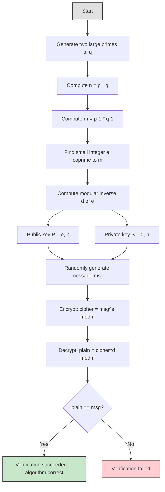

# rsa -- RSA Public-Key Encryption Example

> **Difficulty**: Intermediate | **Software Analogy**: Python native big int | **Source**: `ref/systemc/examples/sysc/rsa/rsa.cpp`

## Overview

The `rsa` example demonstrates a completely **non-hardware** application: implementing the classic **RSA public-key encryption algorithm** using SystemC's `sc_bigint<NBITS>` arbitrary-precision integer type.

The focus of this example is not hardware simulation, but rather proving that SystemC's data types can also be used for **pure algorithmic modelling**. Just as you can use Python's native big integers to implement cryptographic algorithms, SystemC's `sc_bigint` provides the same capability.

### Why Does This Matter?

In the software world, you might say: "I can just use Python directly, why bother with SystemC?" The answer is: **hardware designers need to describe both algorithms and hardware structures within the same framework**. `sc_bigint` allows them to first verify algorithm correctness at a high level, and then gradually refine it into a hardware implementation.

### Intuition for Software Engineers

If you have written Python before, an RSA implementation looks roughly like this:

```python
from Crypto.Util.number import getPrime, inverse

p, q = getPrime(128), getPrime(128)
n = p * q
e = 65537
d = inverse(e, (p-1)*(q-1))

encrypted = pow(message, e, n)    # Encrypt
decrypted = pow(encrypted, d, n)  # Decrypt
assert decrypted == message
```

The SystemC version does exactly the same thing, except it uses `sc_bigint<250>` instead of Python's native big integers.

## RSA Algorithm Flow



## Core Algorithms

This example involves multiple number theory algorithms, all implemented using `sc_bigint`:

| Algorithm | Function Name | Purpose | Software Equivalent |
| --- | --- | --- | --- |
| Euclid GCD | `gcd()` | Compute greatest common divisor | Python's `math.gcd()` |
| Extended Euclidean | `euclid()` | Compute GCD while finding x, y such that ax + by = gcd | Manual implementation or `sympy.gcdex()` |
| Modular Exponentiation | `modular_exp()` | Compute a^b mod n | Python's `pow(a, b, n)` |
| Modular Inverse | `inverse()` | Compute multiplicative inverse of a mod n | `pow(a, -1, n)` (Python 3.8+) |
| Coprime Search | `find_rel_prime()` | Find a small odd number coprime to n | Usually just use 65537 |
| Miller-Rabin Primality Test | `miller_rabin()` | Probabilistic primality test | `sympy.isprime()` |
| Prime Search | `find_prime()` | Randomly find a large prime | `Crypto.Util.number.getPrime()` |
| Encryption | `cipher()` | RSA encryption | `pow(msg, e, n)` |
| Decryption | `decipher()` | RSA decryption | `pow(msg, d, n)` |

## File List

| File | Description | Documentation Link |
| --- | --- | --- |
| `rsa.cpp` | Single file containing all function definitions and `sc_main` | [rsa.md](rsa.md) |

## Core Concepts Quick Reference

| SystemC Concept | Software Equivalent | Role in This Example |
| --- | --- | --- |
| `sc_bigint<NBITS>` | Python native big int | 250-bit arbitrary-precision integer used for all RSA operations |
| `sc_main()` | `main()` | Program entry point, calls the `rsa()` function |
| No `sc_module` | This example has no hardware modules | Purely an algorithm demonstration, does not use SystemC simulation features |

## Suggested Learning Path

1. First read [rsa.md](rsa.md) to understand each function's role and the RSA flow
2. If interested in SystemC channels and modules, go back to the [simple_fifo](../simple_fifo/_index.md) example
3. If you want to see performance modelling, proceed to the [simple_perf](../simple_perf/_index.md) example
