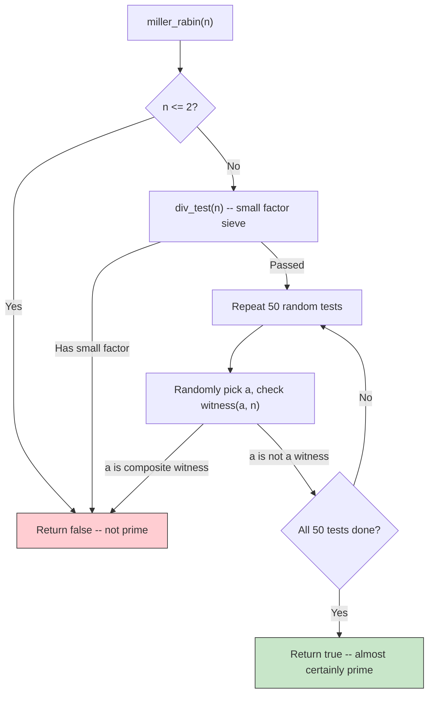
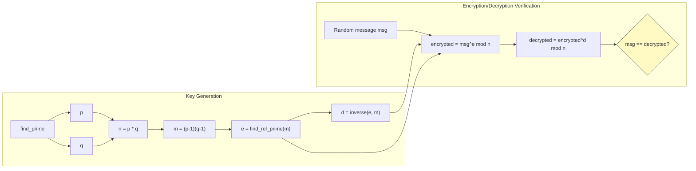

# rsa.cpp -- RSA Public-Key Encryption Implementation In-Depth

> **Source**: `ref/systemc/examples/sysc/rsa/rsa.cpp` | **Author**: Ali Dasdan, Synopsys | **Reference**: Cormen et al., *Introduction to Algorithms* (CLR)

## Everyday Analogy: Padlock

Think of RSA as a **padlock** system:

1. **Public key = an open padlock**: You send a bunch of open padlocks to all your friends (this is public)
2. **Private key = the key to the padlock**: Only you hold it
3. **Encryption = locking the padlock**: Anyone can put a message in a box and lock it with your padlock
4. **Decryption = unlocking with the key**: Only you, who holds the key, can open the box and read the message

The mathematical guarantee is: **knowing the shape of the padlock (public key) does not reveal the shape of the key (private key)**, because that would require factoring an extremely large number, which is computationally infeasible.

## Design Rationale: Why Implement Cryptography in SystemC?

The purpose of this example is **not** to provide a practical RSA implementation. Its purpose is to demonstrate:

1. **The capability of `sc_bigint<NBITS>`**: SystemC provides arbitrary-precision integers that can handle 250-bit or even larger numbers
2. **The possibility of algorithmic modelling**: Hardware designers can verify algorithm correctness within the SystemC framework
3. **Type safety**: `sc_bigint<250>` has its bit width determined at compile time, unlike Python's dynamically-sized big integers

In practice, if you are building a cryptographic chip (such as a secure element), you would first use this kind of high-level model to verify mathematical correctness, then gradually transform it into synthesizable hardware description.

## Key Type Definitions

```cpp
#define NBITS      250
#define HALF_NBITS ( NBITS / 2 )

typedef sc_bigint<NBITS> bigint;  // 250-bit signed integer
```

`sc_bigint<NBITS>` is a **fixed-width signed integer** provided by SystemC. Unlike C++'s `int` (typically 32-bit), it can precisely represent 250-bit values. This is equivalent to representing approximately 75 decimal digits.

| Concept | SystemC | Python | C++ |
| --- | --- | --- | --- |
| Type | `sc_bigint<250>` | `int` (native unlimited precision) | No built-in (requires a library) |
| Bit width | Fixed 250-bit at compile time | Grows dynamically | Depends on library |
| Operations | `+`, `-`, `*`, `/`, `%` | Same | Same (requires operator overloading) |
| Bit access | `x[i]` | `(x >> i) & 1` | `(x >> i) & 1` |

## Function-by-Function Walkthrough

### Utility Functions

#### `abs_val(x)` -- Absolute Value

```cpp
bigint abs_val(const sc_signed& x) {
    return (x < 0 ? -x : x);
}
```

Straightforward. Note that the parameter type is `sc_signed&` (the base class of `sc_bigint`), so it can accept `sc_bigint` of any bit width.

#### `randomize(seed)` -- Initialize Random Number Generator

Provides reproducible tests: passing a fixed seed yields the same results; passing -1 uses the system time. This is exactly the same practice as fixing a random seed when writing unit tests.

#### `rand_bitstr(str, nbits)` -- Generate Random Bit String

Generates a binary string in the format `"0b0..."`. The `0b` prefix is SystemC's marker for recognizing binary format, and the third character is forced to `0` to ensure a positive number.

### Core Number Theory Algorithms

#### `gcd(a, b)` -- Euclidean Algorithm

```cpp
bigint gcd(const bigint& a, const bigint& b) {
    if (b == 0) return a;
    return gcd(b, a % b);
}
```

This algorithm is over 2300 years old. It recursively replaces `a` with `a % b` until the remainder is zero.

**Software analogy**: This is just Python's `math.gcd()` or the one you learned in algorithms class.

#### `euclid(a, b, d, x, y)` -- Extended Euclidean Algorithm

Finds `d = gcd(a, b)` while also computing `x, y` such that `ax + by = d`.

This function is key to RSA: it is used by `inverse()` to compute the modular inverse (part of the private key).

**Why do we need x and y?** Because if `gcd(e, m) = 1` (i.e., e and m are coprime), then `ex + my = 1`, which means `ex = 1 (mod m)`, so `x` is the modular inverse of `e`.

#### `modular_exp(a, b, n)` -- Modular Exponentiation

```cpp
bigint modular_exp(const bigint& a, const bigint& b, const bigint& n) {
    bigint d = 1;
    for (int i = b.length() - 1; i >= 0; --i) {
        d = (d * d) % n;
        if (b[i])
            d = (d * a) % n;
    }
    return ret_pos(d, n);
}
```

Computes `a^b mod n` using **repeated squaring**. This is the core operation for both RSA encryption and decryption.

**Why not just compute `a^b` and then take the remainder?** Because `a^b` could have tens of thousands of digits and simply cannot be stored. Repeated squaring takes the remainder at each step, ensuring intermediate results never blow up.

**Software analogy**: This is Python's three-argument `pow(a, b, n)`, and Python internally uses the same algorithm.

#### `inverse(a, n)` -- Modular Inverse

Uses the Extended Euclidean Algorithm to find the multiplicative inverse of `a` modulo `n`. That is, it finds `x` such that `a * x = 1 (mod n)`.

In RSA, this is used to compute the private key exponent `d` from the public key exponent `e`.

#### `find_rel_prime(n)` -- Find Coprime Number

Starting from 3, tries each odd number until finding one coprime to `n`. In practice, 65537 (a known good choice) is usually used directly, but here a search approach is used for educational purposes.

#### `witness(a, n)` and `miller_rabin(n)` -- Miller-Rabin Primality Test



Miller-Rabin is a **probabilistic primality test**. It cannot determine with 100% certainty that a number is prime, but the error probability is at most `2^(-50)`, approximately `0.00000000000000088817`.

**Software analogy**: It is like property-based testing where you run random tests many times to increase confidence, but can never guarantee 100% correctness.

#### `find_prime(r)` -- Find a Large Prime

Randomly generates an odd number, then keeps adding 2 until `miller_rabin()` determines it is prime. According to the prime number theorem, approximately `ln(2^NBITS)` iterations are needed.

### RSA Main Flow

#### `cipher(msg, e, n)` and `decipher(msg, d, n)` -- Encryption and Decryption

```cpp
bigint cipher(const bigint& msg, const bigint& e, const bigint& n) {
    return modular_exp(msg, e, n);   // msg^e mod n
}

bigint decipher(const bigint& msg, const bigint& d, const bigint& n) {
    return modular_exp(msg, d, n);   // msg^d mod n
}
```

Encryption and decryption have exactly the same mathematical form, just using different exponents (public key `e` vs private key `d`).

#### `rsa(seed)` -- Complete RSA Flow



Complete steps:
1. Generate two large primes `p` and `q`
2. Compute `n = p * q` (shared by both public and private keys)
3. Compute `m = (p-1) * (q-1)` (Euler's totient function)
4. Find a small integer `e` coprime to `m` (public key exponent)
5. Compute the modular inverse `d` of `e` (private key exponent)
6. Public key = `(e, n)`, Private key = `(d, n)`
7. Randomly generate a message, encrypt then decrypt, verify the result matches

### `sc_main()` -- Program Entry Point

```cpp
int sc_main(int argc, char *argv[]) {
    if (argc <= 1)
        rsa(-1);      // Use system time as seed
    else
        rsa(atoi(argv[1]));  // Use specified seed
    return 0;
}
```

Note: Although `sc_main` (SystemC's entry point) is used, this example **does not use the SystemC simulation engine at all**. There is no `sc_module`, no `sc_start()`, no `SC_THREAD`. It purely leverages SystemC's data types.

## Comparison with Standard Cryptography Libraries

| Aspect | This Example | OpenSSL / libsodium |
| --- | --- | --- |
| Purpose | Educational, demonstrating `sc_bigint` | Production use |
| Security | Not secure (NBITS=250 is too small) | Secure (2048+ bit) |
| Performance | Slow | Highly optimized |
| Prime search | Linear search + Miller-Rabin | Multiple optimization strategies |
| Public key exponent | Dynamic search for small coprime | Usually fixed at 65537 |

## Core Concepts Quick Reference

| SystemC Concept | Software Equivalent | Role in This Example |
| --- | --- | --- |
| `sc_bigint<NBITS>` | Python native big int | Core type for all RSA operations |
| `sc_signed` | Base concept of Python `int` | Parameter type of `abs_val()`, provides polymorphism |
| `x[i]` bit access | `(x >> i) & 1` | Bit-by-bit reading of exponents in `modular_exp()` and `witness()` |
| `x.length()` | `x.bit_length()` | Get the bit length of a value |
| `x.to_int()` | `int(x)` | Convert small values to C++ int in `div_test()` |
