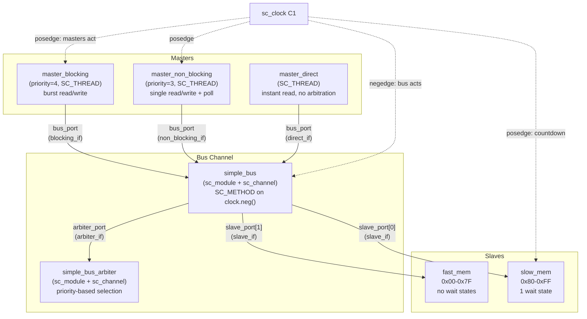
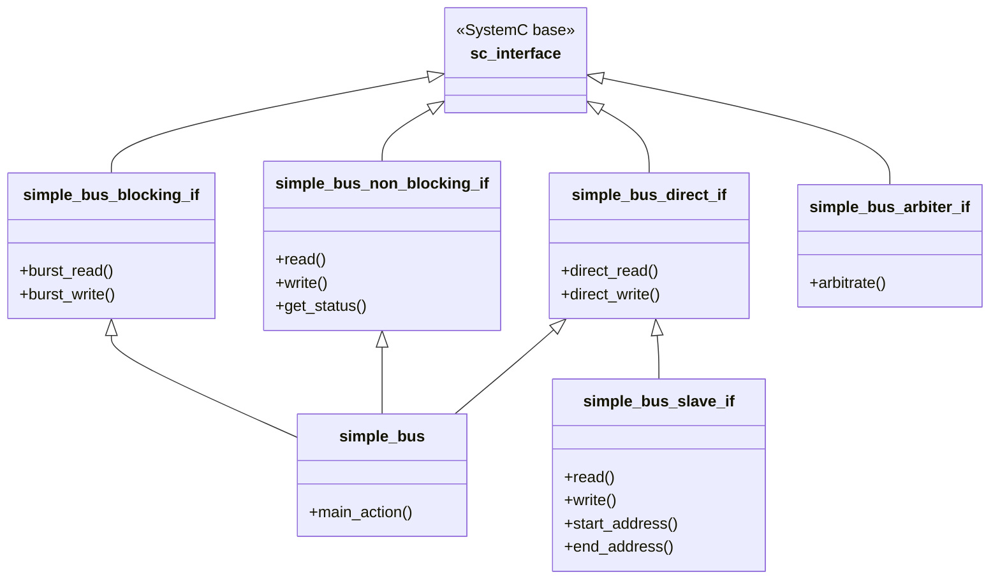
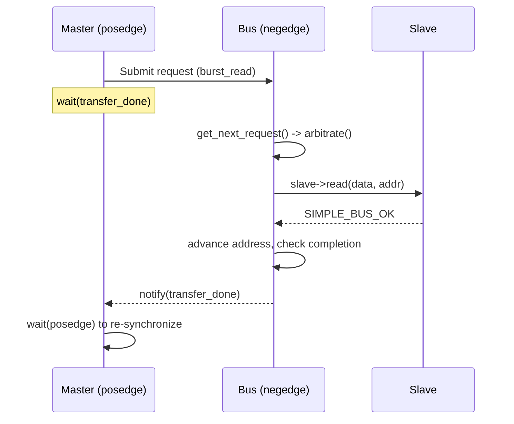

# Simple Bus -- SystemC Bus System Overview

## Software Analogy: Shared Database and Connection Pool

Imagine a **shared database server** serving multiple application instances:

- **Masters** = Application instances that need to read/write data
- **Bus** = Connection pool manager that mediates all database access
- **Arbiter** = Lock manager that decides which application gets the next connection
- **Slaves** = Different storage backends (fast Redis cache vs. slow disk database)
- **Blocking access** = Synchronous SQL query -- thread blocks until result returns
- **Non-blocking access** = Asynchronous query -- submit query then poll for result
- **Direct access** = In-memory cache read -- completes instantly, bypassing the connection pool

This is exactly the core of the `simple_bus` example: multiple masters compete for a shared bus, the arbiter decides priority, and slaves respond at different speeds.

---

## Architecture Diagram

---

## Interface Inheritance Hierarchy

---

## File List

| File | Type | Description |
|------|------|-------------|
| `simple_bus_types.h` | Header | Status enum, forward declarations, `sb_fprintf` |
| `simple_bus_types.cpp` | Source | Status string array for debug output |
| `simple_bus_request.h` | Header | Request structure (priority, address, data, lock, event) |
| `simple_bus_tools.cpp` | Source | Signal-safe `sb_fprintf` utility function |
| `simple_bus_blocking_if.h` | Interface | Blocking bus interface: `burst_read`, `burst_write` |
| `simple_bus_non_blocking_if.h` | Interface | Non-blocking bus interface: `read`, `write`, `get_status` |
| `simple_bus_direct_if.h` | Interface | Direct bus interface: `direct_read`, `direct_write` |
| `simple_bus_slave_if.h` | Interface | Slave interface: inherits `direct_if` with address range |
| `simple_bus_arbiter_if.h` | Interface | Arbiter interface: `arbitrate` |
| `simple_bus.h` | Header | Bus channel: implements 3 master interfaces |
| `simple_bus.cpp` | Source | Bus logic: request handling, slave dispatch, lock management |
| `simple_bus_arbiter.h` | Header | Arbiter module declaration |
| `simple_bus_arbiter.cpp` | Source | Priority arbitration with 3 rules |
| `simple_bus_master_blocking.h` | Header | Blocking master module declaration |
| `simple_bus_master_blocking.cpp` | Source | Burst read -> compute -> burst write loop |
| `simple_bus_master_non_blocking.h` | Header | Non-blocking master module declaration |
| `simple_bus_master_non_blocking.cpp` | Source | Single read -> modify -> write with polling loop |
| `simple_bus_master_direct.h` | Header | Direct master (monitor) module declaration |
| `simple_bus_master_direct.cpp` | Source | Periodic direct-read monitor |
| `simple_bus_fast_mem.h` | Header+Source | Fast memory slave (inline, no wait states) |
| `simple_bus_slow_mem.h` | Header+Source | Slow memory slave (inline, configurable wait states) |
| `simple_bus_test.h` | Header | Testbench: instantiation and wiring of all modules |
| `simple_bus_main.cpp` | Source | `sc_main` entry point, runs for 10000 ns |

---

## Core Concepts

### 1. sc_interface Inheritance Hierarchy -- Interface Segregation Principle

The bus exposes **three separate interfaces** to masters. Each master only sees the methods it needs. This is the **Interface Segregation Principle (ISP)** from SOLID design principles: a blocking master doesn't need to know about `get_status()`, and a direct master doesn't need to know about priority.

From a software perspective, it's like having three separate interfaces -- `ReadOnlyRepository`, `AsyncRepository`, and `SyncRepository` -- all backed by the same database connection pool.

### 2. sc_channel -- A Class That Is Both Module and Interface

`simple_bus` is both an `sc_module` (has processes and ports) and an `sc_interface` implementation (provides `burst_read`, `read`, `direct_read`). In SystemC, this combination is called a **hierarchical channel**. This is similar to inheriting from multiple abstract classes in C++ (C++ abstract class / Python ABC), while also being a component managed by dependency injection.

### 3. Arbitration

When multiple masters submit requests in the same clock cycle, the arbiter selects the winner based on these rules:
1. An in-progress locked burst cannot be interrupted
2. A locked request that was granted in the previous cycle takes priority
3. Otherwise, the lowest priority number wins

This is analogous to a **priority thread scheduler** with mutex support.

### 4. Blocking vs. Non-blocking vs. Direct

| Access Mode | Software Analogy | Process Type | Waits for Completion? |
|---|---|---|---|
| Blocking | `await fetch()` | SC_THREAD | Yes, via `wait(event)` |
| Non-blocking | `fetch().then(poll)` | SC_THREAD | No, polls with `get_status()` |
| Direct | `cache.get()` | SC_THREAD | Instant, bypasses bus protocol |

### 5. Timing Convention

- **Masters** act on **clock positive edge (posedge)**
- **Bus** acts on **clock negative edge (negedge)**
- The half-cycle gap avoids race conditions -- masters submit requests first, then the bus processes them

---

## Suggested Reading Order

1. **[spec.md](spec.md)** -- Hardware bus concepts for software engineers
2. **[types.md](types.md)** -- Status codes, request structure, utility functions
3. **[interfaces.md](interfaces.md)** -- 5 interface classes
4. **[simple-bus.md](simple-bus.md)** -- Bus channel implementation
5. **[arbiter.md](arbiter.md)** -- Arbitration logic
6. **[slaves.md](slaves.md)** -- Fast and slow memory
7. **[masters.md](masters.md)** -- Three master types
8. **[main.md](main.md)** -- Testbench and simulation entry point
