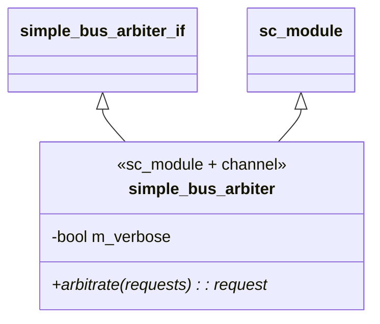
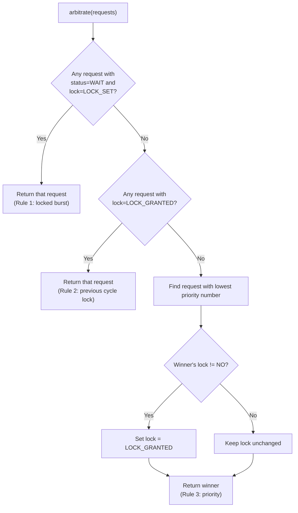
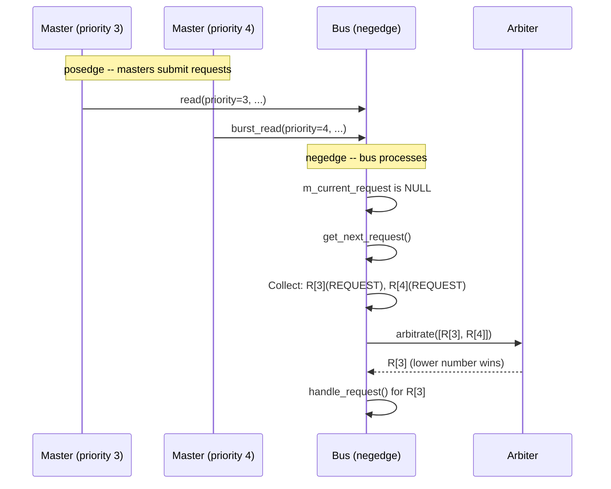

# Simple Bus -- Arbiter

## Overview

`simple_bus_arbiter` is a **hierarchical channel** (both an `sc_module` and an interface implementation) that decides which pending request gets bus access in each cycle. It implements a **priority arbitration strategy** with lock support.

**Software analogy:** Think of a **thread scheduler** with a priority queue and mutex support:
- Multiple threads (masters) compete for CPU time (bus access)
- The scheduler picks the highest-priority runnable thread
- A thread holding a mutex (lock) cannot be preempted within its critical section

**Source files:** `simple_bus_arbiter.h`, `simple_bus_arbiter.cpp`

---

## Class Structure



The arbiter is very simple -- one method, one member variable. It has **no process** and **no clock port**. It is called synchronously by the bus's `get_next_request()` method.

---

## Arbitration Rules

The `arbitrate()` method applies three rules in priority order:

### Rule 1: In-Progress Locked Burst

```cpp
if ((request->status == SIMPLE_BUS_WAIT) &&
    (request->lock == SIMPLE_BUS_LOCK_SET))
    return request;  // cannot interrupt locked burst
```

If a request is being serviced (`WAIT`) and has its lock set, it wins unconditionally. This prevents a higher-priority master from interrupting a locked burst transfer.

**Software analogy:** A thread inside a `synchronized` block / critical section cannot be preempted by other threads waiting on the same lock.

### Rule 2: Previously Granted Lock

```cpp
if (requests[i]->lock == SIMPLE_BUS_LOCK_GRANTED)
    return requests[i];
```

If a request had its lock granted in the previous cycle (meaning that master reserved the bus and is now issuing a follow-up request), it takes priority regardless of priority number.

**Software analogy:** A database connection with an advisory lock -- the same client's next query gets the connection without re-competing.

### Rule 3: Highest Priority (Lowest Number)

```cpp
for (i = 1; i < requests.size(); ++i)
    if (requests[i]->priority < best_request->priority)
        best_request = requests[i];
```

The default fallback: the request with the **lowest priority number** wins. The arbiter also asserts that all priorities are unique.

**Software analogy:** A priority queue where lower numbers mean higher priority (similar to Unix nice values).

---

## Decision Flowchart



---

## Arbitration Examples

### Scenario 1: Simple Priority

```
Pending: R[3](-), R[4](-)
Winner: R[3] (Rule 3 -- lower number = higher priority)
```

### Scenario 2: Locked Burst Cannot Be Interrupted

```
Pending: R[3](-), R[4](+, status=WAIT)
Winner: R[4] (Rule 1 -- locked burst in progress)
```

Even though R[3] has higher priority, R[4] is in the middle of a locked burst transfer and cannot be preempted.

### Scenario 3: Lock Reservation

```
Cycle 1: R[4](+) selected (only request)
Cycle 2: R[3](-), R[4](+, lock=GRANTED)
Winner: R[4] (Rule 2 -- lock was granted in previous cycle)
```

R[4] used a lock to reserve the bus. Even though R[3] has higher priority, R[4] gets the bus because its lock was granted.

### Scenario 4: Lock Not Followed Up

```
Cycle 1: R[4](+) selected, lock granted
Cycle 2: Only R[3](-) (R[4] did not issue a new request)
Winner: R[3] (Rule 3 -- R[4]'s lock expired via clear_locks())
```

If the lock-holding master does not submit a follow-up request, the lock is cleared and normal priority rules resume.

### Scenario 5: Duplicate Priority (Error)

```
Pending: R[3](-), R[3](-)
Result: sc_assert failure -- priorities must be unique
```

---

## Timing: When Is the Arbiter Called?



The arbiter is called every negedge when `m_current_request` is `NULL` and there are pending requests. The bus collects all requests with status `REQUEST` or `WAIT`, passes them to the arbiter, and processes the winner.

---

## Design Considerations

### Why Is the Arbiter a Separate Module?

The arbitration strategy is **pluggable**. By defining `simple_bus_arbiter_if` as an interface and connecting via `sc_port`, you can swap in a different arbiter without modifying the bus:

- **Round-robin arbiter:** Each master gets one turn regardless of priority
- **Fair-share arbiter:** Tracks how much bus time each master has used
- **TDMA arbiter:** Assigns fixed time slots to each master

This is the **Strategy pattern** -- the arbitration algorithm is encapsulated behind an interface.

### Why Not Just Sort by Priority?

The three-rule system exists because of the **lock mechanism**. Without locks, a simple `min_element` by priority would suffice. But locks add a form of "reservation" that must override normal priority, resulting in this rule hierarchy:
1. Active locked burst (cannot interrupt hardware-level atomic operation)
2. Granted lock (honoring reservation)
3. Priority (default scheduling)
