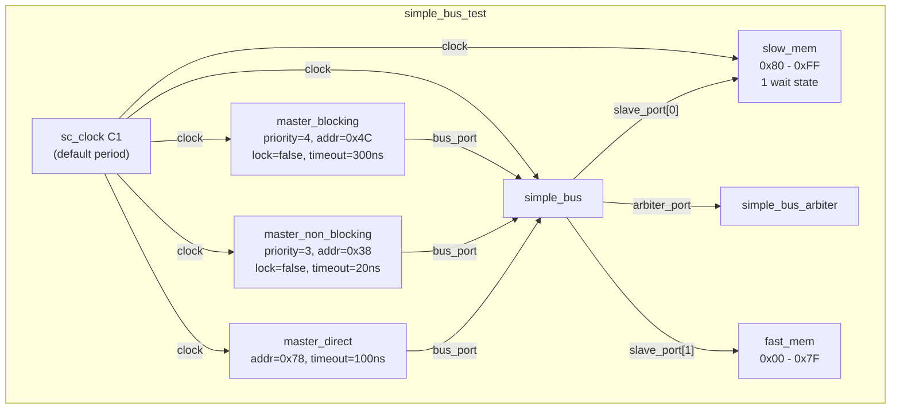

# Simple Bus -- Testbench and Main Entry Point

## Overview

These files assemble all components into a runnable system and execute the simulation.

**Source files:** `simple_bus_test.h`, `simple_bus_main.cpp`

---

## File: `simple_bus_main.cpp`

The simulation entry point is very concise:

```cpp
int sc_main(int, char **) {
    simple_bus_test top("top");
    sc_start(10000, SC_NS);
    return 0;
}
```

This creates the entire testbench hierarchy inside `simple_bus_test` and runs the simulation for 10,000 nanoseconds (10 microseconds).

---

## File: `simple_bus_test.h`

`simple_bus_test` is a hierarchical module responsible for instantiating and wiring all components. Its role is equivalent to a **dependency injection container** or **main configuration** in software.

### System Topology



### Construction Details

| Component | Constructor Parameters | Notes |
|---|---|---|
| `master_b` | `"master_b", priority=4, addr=0x4C, lock=false, timeout=300` | Burst read/write of 16 words starting at 0x4C. Lower priority. |
| `master_nb` | `"master_nb", priority=3, addr=0x38, lock=false, timeout=20` | Single-word read-modify-write, scanning 0x38-0xB8. Higher priority. |
| `master_d` | `"master_d", addr=0x78, timeout=100` | Monitors 4 words at 0x78-0x84. No priority needed. |
| `mem_fast` | `"mem_fast", start=0x00, end=0x7F` | 128 bytes = 32 words of instant-access memory. |
| `mem_slow` | `"mem_slow", start=0x80, end=0xFF` | 128 bytes = 32 words, 1 wait state. |
| `bus` | `"bus"` | Verbose mode is commented out. |
| `arbiter` | `"arbiter"` | Verbose mode is commented out. |

### Memory Map

```
Address:  0x00                    0x38    0x4C         0x78 0x80          0xB8    0xFF
          |---- fast_mem (0x00-0x7F) ----||---- slow_mem (0x80-0xFF) ----|

          |                        ^      ^             ^  ^              ^       |
          |                        |      |             |  |              |       |
          |                   nb_start  b_start     d_start|          nb_end     |
          |                                                |                     |
          |                                            b_end (0x8C)              |
```

**Key observation:** The blocking master's burst (`0x4C` to `0x4C + 16*4 = 0x8C`) **crosses** the boundary between fast memory and slow memory. The first 13 words (`0x4C-0x7C`) hit fast memory; the last 3 words (`0x80-0x88`) hit slow memory with wait states. This causes the burst transfer for those last few words to take longer.

### Wiring Code

```cpp
// Master port -> Bus
master_d->bus_port(*bus);    // direct_if perspective
master_b->bus_port(*bus);    // blocking_if perspective
master_nb->bus_port(*bus);   // non_blocking_if perspective

// Bus -> Arbiter
bus->arbiter_port(*arbiter);

// Bus -> Slaves (multi-port)
bus->slave_port(*mem_slow);  // slave_port[0]
bus->slave_port(*mem_fast);  // slave_port[1]
```

Each `bus_port(*bus)` binding works because `simple_bus` implements all three master-side interfaces. C++ implicit conversion resolves the correct interface. `slave_port` is a multi-port (`sc_port<..., 0>`), so multiple `slave_port(...)` bindings add to the port's connection list.

---

## Simulation Timeline

```mermaid
gantt
    title Approximate Activity During Simulation (10000 ns)
    dateFormat X
    axisFormat %s

    section Direct Master
    Read 4 words and print     :d1, 0, 1
    Wait 100ns                 :d2, 1, 100
    Read 4 words and print     :d3, 100, 101
    Wait 100ns                 :d4, 101, 200

    section Non-blocking Master
    Read word at 0x38          :nb1, 0, 2
    Write word at 0x38         :nb2, 2, 4
    Wait 20ns                  :nb3, 4, 24
    Read word at 0x3C          :nb4, 24, 26

    section Blocking Master
    Burst read 16 words        :b1, 0, 20
    Compute 16 cycles          :b2, 20, 36
    Burst write 16 words       :b3, 36, 56
    Wait 300ns                 :b4, 56, 356
```



### Runtime Interactions

1. **Early phase (0-50 ns):** All three masters are active. When both have pending requests, the non-blocking master (priority 3) preempts the blocking master (priority 4).

2. **Steady state:** The blocking master has long idle periods (300 ns timeout), while the non-blocking master cycles roughly every 20 ns. The direct master operates independently every 100 ns, generating no bus contention.

3. **Address conflicts:** When the non-blocking master's address scan reaches the same region as the blocking master's burst, they compete for bus access. The non-blocking master wins due to higher priority.

4. **Slow memory overhead:** When the blocking or non-blocking master accesses addresses >= 0x80, each word transfer takes one extra cycle due to the slow memory's wait states.

---

## Enabling Verbose Output

The testbench has commented-out verbose options:

```cpp
// bus = new simple_bus("bus", true);       // verbose bus output
// arbiter = new simple_bus_arbiter("arbiter", true);  // verbose arbiter output
```

When enabled, these show detailed per-cycle information:
- **Bus verbose:** Which requests are pending, which slave is being accessed
- **Arbiter verbose:** Full request queue and which rule selected the winner

This is invaluable for understanding the system's cycle-by-cycle behavior.
