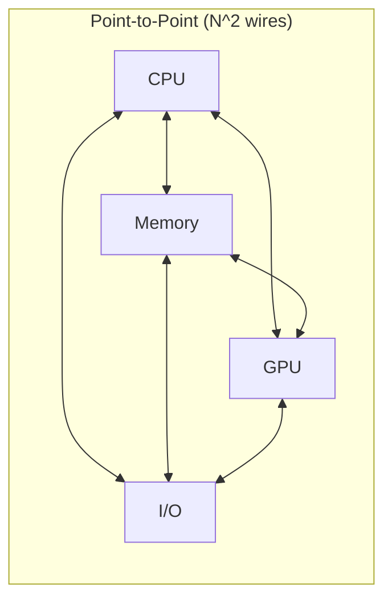
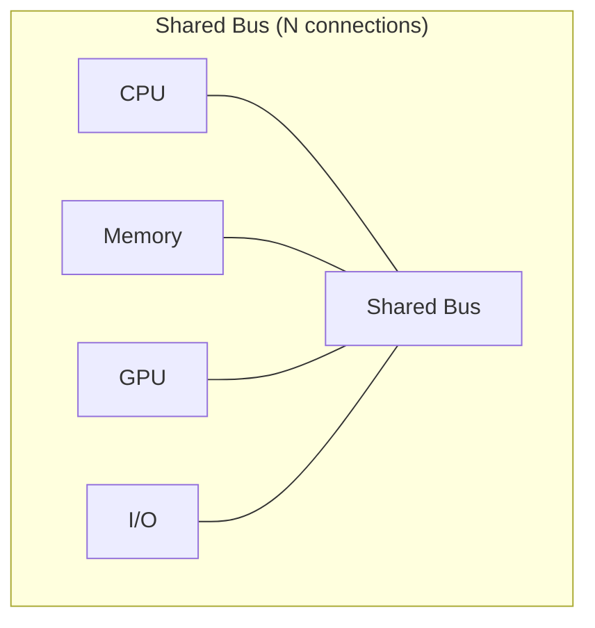
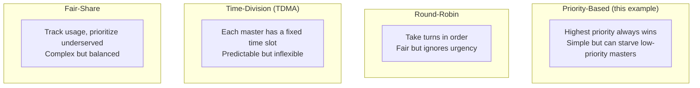
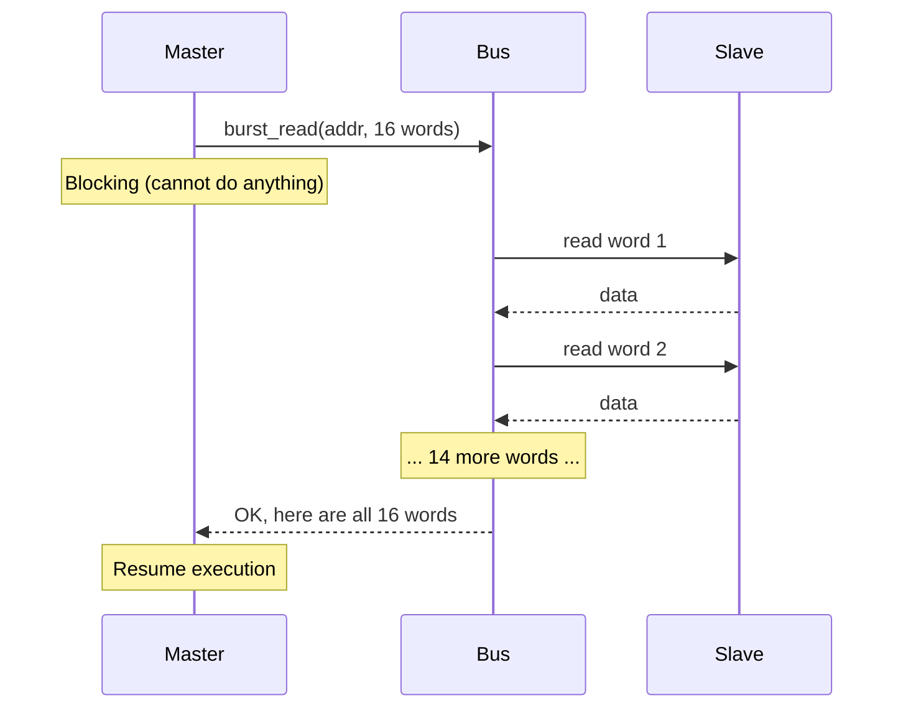
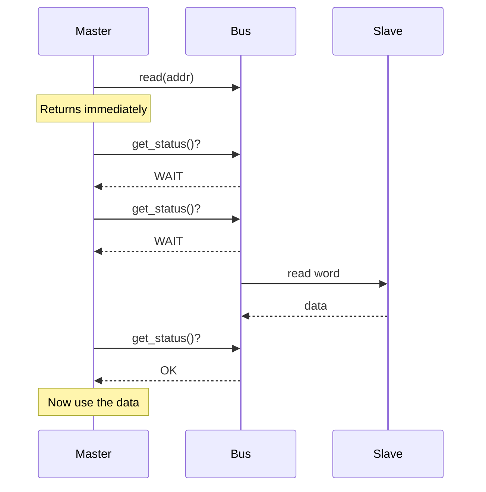
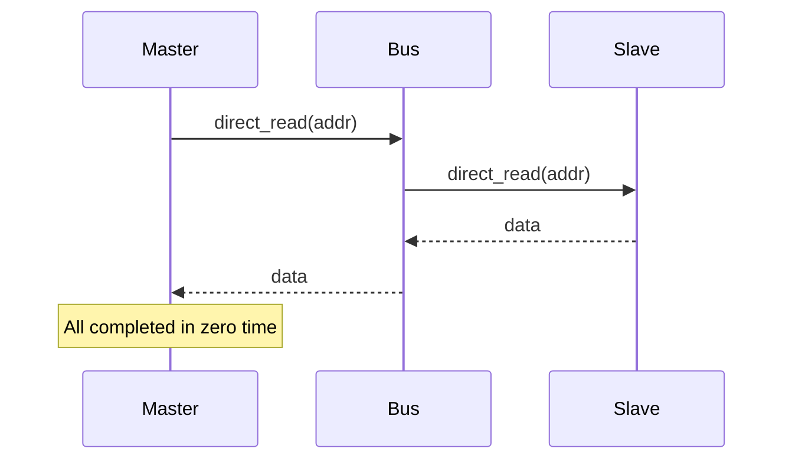
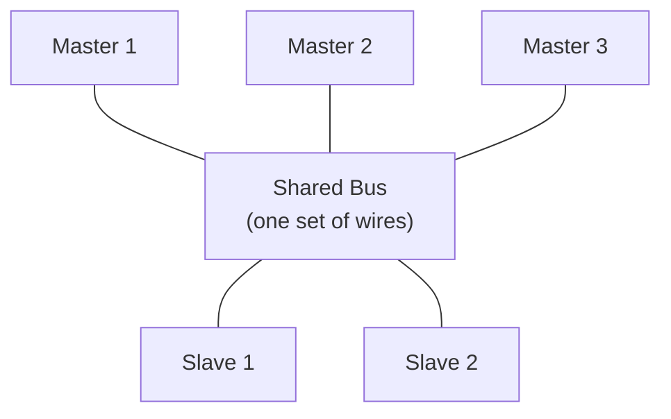
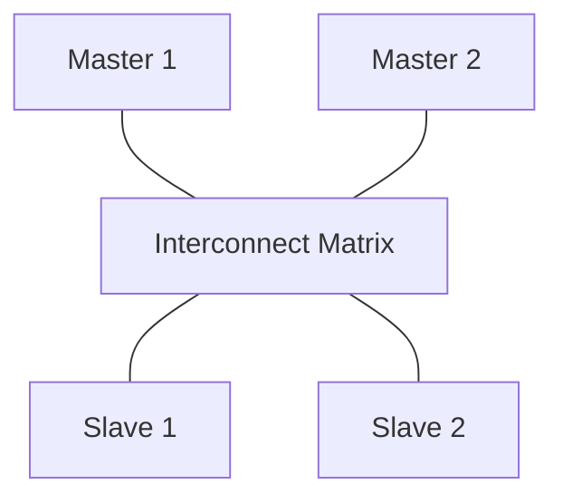

# Simple Bus -- Hardware Specification for Software Engineers

## What Is a System Bus?

A **system bus** is a shared communication backbone connecting chips (CPU, memory, peripherals) on a circuit board. Instead of running dedicated wires between every pair of chips, all chips connect to the same set of shared wires.

### Software Analogy

Think of it as a **message broker** (like RabbitMQ or Kafka):

| Hardware Concept | Software Equivalent |
|---|---|
| System bus | Message broker / shared event bus |
| Bus wires | Network connections / shared memory segments |
| Master (CPU) | Producer / API client |
| Slave (memory) | Consumer / database |
| Bus arbiter | Load balancer / connection pool manager |
| Bus protocol | Message format / API contract |

Or think of it as a **shared database** -- all application servers connect to the same database server. The database handles concurrent access, queuing, and locking. This is essentially what a bus does for hardware.

---

## Why Do We Need a Bus? Why Not Point-to-Point Connections?

### The Wiring Problem

If 4 chips need to communicate with each other, point-to-point connections require 6 links (N*(N-1)/2). With 10 chips, that's 45 links. Each "link" is actually 32+ parallel wires (32-bit data), plus address lines and control signals. The circuit board quickly becomes impossibly complex.

A bus solves this: **one set of shared wires, everyone connects to it.**

### Trade-off Comparison

| Aspect | Point-to-Point | Shared Bus |
|---|---|---|
| Wiring complexity | O(N^2) | O(N) |
| Concurrent transfers | All pairs simultaneously | One at a time |
| Bandwidth | Dedicated per pair | Shared by all |
| Cost | Expensive with many devices | Cheap |
| Software analogy | Dedicated database per service | Shared database |

---

## Bus Arbitration: Who Transmits When?

Since only one master can use the bus at a time (the wires are shared), there must be a mechanism to decide who gets to transmit. This is **arbitration**.

### Software Analogy: Meeting Moderator

Imagine a conference call with 5 people, with the rule: only one person can speak at a time. The moderator decides who speaks next.

| Meeting Concept | Bus Equivalent |
|---|---|
| Participant raises hand | Master submits bus request |
| Moderator picks next speaker | Arbiter selects winning request |
| Speaker talks | Master performs data transfer |
| "I'm done" | Transfer complete, bus released |
| "Wait, I'm not finished" | Locked burst -- cannot be interrupted |

### Common Arbitration Strategies

This example uses **priority arbitration** with lock support (see [arbiter.md](arbiter.md)).

---

## Blocking vs. Non-blocking vs. Direct Access

These three access modes represent different degrees of coupling between master and bus:

### Blocking (Synchronous)

**Software equivalent:** `result = requests.get(url)` -- thread blocks until response is received.

**When to use:** When you need all the data before you can continue. For example, loading a configuration file at startup.

### Non-blocking (Asynchronous Polling)

**Software equivalent:** `future = executor.submit(task); while (!future.isDone()) { ... }` -- submit work then check periodically.

**When to use:** When you want to do other work while waiting, or need fine-grained control over waiting behavior.

### Direct (Instant, No Protocol)

**Software equivalent:** `value = hashMap.get(key)` -- instant, in-process, no network overhead.

**When to use:** Debugging, monitoring, or when you need to inspect memory without affecting the bus protocol (no arbitration, no wait states).

---

## Real-World Bus Standards

### ARM AMBA Family (Most Prevalent Today)

ARM's **Advanced Microcontroller Bus Architecture (AMBA)** is the dominant bus standard in mobile and embedded devices.

| Bus | Speed | Complexity | Use Case | Analogy |
|---|---|---|---|---|
| **AHB** (Advanced High-perf) | High | Medium | CPU-memory, DMA | Highway |
| **APB** (Advanced Peripheral) | Low | Simple | UART, SPI, GPIO | City road |
| **AXI** (Advanced eXtensible) | Very high | Complex | High-bandwidth IP, GPU | Multi-lane expressway |

**AXI** supports multiple outstanding transfers, out-of-order completion, and independent read/write channels. Much more complex than this simple_bus example, but shares the same fundamental concepts.

### Other Standards

| Standard | Origin | Characteristics |
|---|---|---|
| **Wishbone** | OpenCores | Open-source, simple |
| **Avalon** | Intel/Altera | FPGA optimized |
| **OCP** (Open Core Protocol) | OCP-IP | Standardized socket interface |
| **PCIe** | PCI-SIG | Point-to-point serial, common in PCs |

### Mapping This Example to Real Buses

| simple_bus Feature | AHB Equivalent | AXI Equivalent |
|---|---|---|
| `burst_read/write` | HBURST (burst type) | ARLEN/AWLEN (burst length) |
| `priority` | Bus master priority | QoS signals |
| `lock` | HMASTLOCK | ARLOCK/AWLOCK |
| `SIMPLE_BUS_WAIT` | HREADY = 0 (wait states) | RVALID/WREADY handshake |
| `slave_if::start/end_address` | Address decoder | Address decoder |
| `arbiter` | Built-in arbiter | Interconnect fabric |

---

## Bus Topologies: How Chips Connect

### Single Shared Bus (This Example)

**Limitation:** Only one transfer can occur at a time. If Master 1 is communicating with Slave 1, Master 2 must wait even if Slave 2 is idle.

### Multi-Layer Bus (AHB/AXI)

The interconnect matrix allows **simultaneous transfers** to different slaves: Master 1 can communicate with Slave 1 while Master 2 communicates with Slave 2. Contention only occurs when two masters want to access the same slave.

**Software analogy:** A shared bus is like a single-threaded event loop (Python asyncio event loop). A multi-layer bus is like a thread pool, where parallel requests can hit different backends simultaneously.

---

## Key Takeaways for Software Engineers

1. **A bus is just a shared communication channel with protocol rules**, fundamentally no different from a message broker or shared database.

2. **Arbitration = scheduling.** The same algorithms used for CPU scheduling (priority, round-robin, fair-share) apply equally to bus arbitration.

3. **Blocking vs. non-blocking in hardware** has exactly the same semantics as in software: does the caller wait for the result, or check back later?

4. **Wait states** are the hardware version of network latency -- different "backends" (memory types) respond at different speeds.

5. **The real complexity of modern buses (AXI)** lies in supporting concurrent outstanding transfers, out-of-order completion, and bandwidth optimization -- the same challenges as building a high-performance web server.
