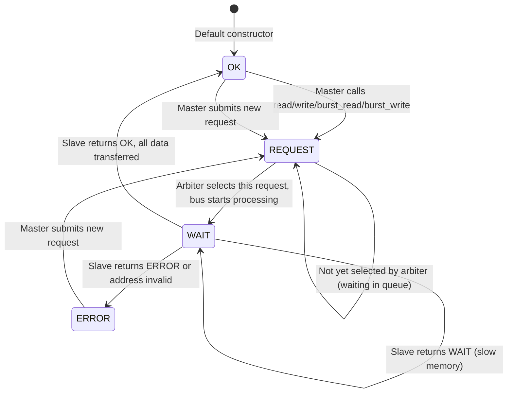
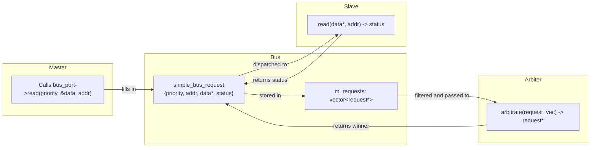

# Simple Bus -- Types, Request Structure, and Utility Functions

## Overview

These files define the data types shared across the entire simple bus system: status codes, lock states, the request structure that flows through the bus, and utility functions.

**Source files:** `simple_bus_types.h`, `simple_bus_types.cpp`, `simple_bus_request.h`, `simple_bus_tools.cpp`

---

## File: `simple_bus_types.h` / `.cpp`

### Status Enum

```cpp
enum simple_bus_status {
    SIMPLE_BUS_OK = 0,
    SIMPLE_BUS_REQUEST,
    SIMPLE_BUS_WAIT,
    SIMPLE_BUS_ERROR
};
```

**Software analogy:** HTTP status codes:

| Bus Status | Value | HTTP Equivalent | Meaning |
|---|---|---|---|
| `SIMPLE_BUS_OK` | 0 | 200 OK | Transfer completed successfully |
| `SIMPLE_BUS_REQUEST` | 1 | 202 Accepted | Request submitted, awaiting processing |
| `SIMPLE_BUS_WAIT` | 2 | 102 Processing | In progress, not yet complete |
| `SIMPLE_BUS_ERROR` | 3 | 500 Error | Transfer failed |

### Status String Array

```cpp
char simple_bus_status_str[4][20] = {
    "SIMPLE_BUS_OK",
    "SIMPLE_BUS_REQUEST",
    "SIMPLE_BUS_WAIT",
    "SIMPLE_BUS_ERROR"
};
```

Used for debug output -- converts enum integers to human-readable strings.

### Forward Declarations

```cpp
struct simple_bus_request;
typedef std::vector<simple_bus_request *> simple_bus_request_vec;
```

`simple_bus_request_vec` is the container type used by the arbiter -- it receives a vector of pending request pointers.

### `sb_fprintf` Declaration

```cpp
extern int sb_fprintf(FILE *, const char *, ...);
```

Signal-safe version of `fprintf` (see `simple_bus_tools.cpp` below for details).

---

## File: `simple_bus_request.h`

### Lock Status Enum

```cpp
enum simple_bus_lock_status {
    SIMPLE_BUS_LOCK_NO = 0,      // no lock
    SIMPLE_BUS_LOCK_SET,          // lock requested
    SIMPLE_BUS_LOCK_GRANTED       // lock confirmed by arbiter
};
```

These three states form a small state machine managing bus reservation (see [arbiter.md](arbiter.md) for details).

### Request Structure

```cpp
struct simple_bus_request {
    // Identification
    unsigned int priority;

    // Request parameters
    bool do_write;
    unsigned int address;
    unsigned int end_address;
    int *data;
    simple_bus_lock_status lock;

    // Completion notification
    sc_event transfer_done;
    simple_bus_status status;
};
```

**Software analogy:** This is a **task ticket** in a work queue system:

| Field | Analogy | Description |
|---|---|---|
| `priority` | Job priority / client ID | Lower number = more important. Also serves as the master's unique identifier. |
| `do_write` | HTTP method (GET vs PUT) | `false` = read, `true` = write |
| `address` | Current URL/offset | Current byte address being processed |
| `end_address` | Range end | Last byte address of the burst transfer. Equals `address` for single transfers. |
| `data` | Payload pointer | Points to the master's data buffer, incremented after each word transfer. |
| `lock` | Advisory lock state | Controls bus reservation between consecutive requests. |
| `transfer_done` | Completion callback / Promise | The `sc_event` that the blocking interface `wait()` waits on, notified by the bus when transfer completes. |
| `status` | Job status | Current state: `OK`, `REQUEST`, `WAIT`, or `ERROR`. |

### Default Constructor

```cpp
simple_bus_request::simple_bus_request()
    : priority(0), do_write(false), address(0), end_address(0),
      data((int *)0), lock(SIMPLE_BUS_LOCK_NO), status(SIMPLE_BUS_OK)
{}
```

New requests start with `OK` status and no lock. The bus fills in the actual fields when a master calls a bus interface function.

### Request Lifecycle



---

## File: `simple_bus_tools.cpp`

### `sb_fprintf` -- Signal-Safe Printf

```cpp
int sb_fprintf(FILE *fp, const char *fmt, ...) {
    va_list ap;
    va_start(ap, fmt);
    int ret = 0;
    do {
        errno = 0;
        ret = vfprintf(fp, fmt, ap);
    } while (errno == EINTR);
    return ret;
}
```

This is a wrapper around `vfprintf` that retries on `EINTR` (interrupted by signal). In standard C, `fprintf` can silently fail if a Unix signal arrives during a write. This wrapper ensures the output is actually written.

**Software analogy:** An HTTP client with automatic retry on transient network errors.

All debug output in the system uses `sb_fprintf` rather than `printf` or `fprintf` directly.

---

## How Types Flow Through the System



The `simple_bus_request` structure is the core data structure that threads the entire system together. Each master (identified by priority) creates only one request object and reuses it across multiple transactions. The bus fills it in when the master calls an interface function, the arbiter selects from the collection, and the bus dispatches it to the slave.
