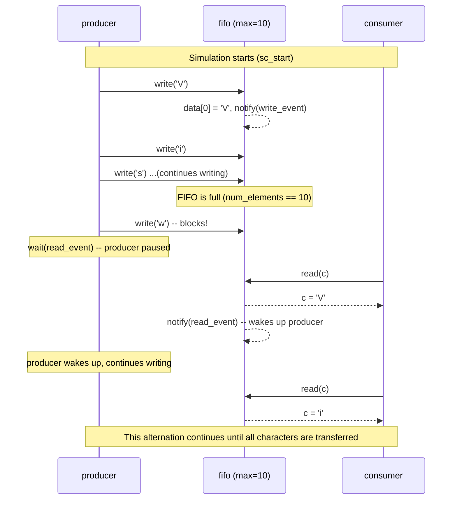

# simple_fifo -- Producer-Consumer Example

> **Difficulty**: Beginner | **Software Analogy**: Python queue.Queue | **Source**: `ref/systemc/examples/sysc/simple_fifo/simple_fifo.cpp`

## Overview

`simple_fifo` is the most classic introductory example from the official SystemC distribution. It demonstrates the complete flow of a **producer** sending data to a **consumer** through a custom **FIFO channel**.

If you have written Python, this is essentially a **bounded queue**:

```python
import queue
q = queue.Queue(maxsize=10)  # queue with capacity 10
# coroutine writes
# coroutine reads
```

This is Python's `queue.Queue(maxsize=10)`:
- Queue full -> `put()` blocks until someone takes data out
- Queue empty -> `get()` blocks until someone puts data in

A SystemC FIFO channel does exactly the same thing, except it uses **events** to implement blocking and waking, instead of OS mutex/condition variables.

## Architecture Diagram

### Class Relationship Diagram

```mermaid
classDiagram
    class sc_interface {
        <<SystemC built-in>>
    }

    class write_if {
        <<interface>>
        +write(char) void*
        +reset() void*
    }

    class read_if {
        <<interface>>
        +read(char&) void*
        +num_available() int*
    }

    class sc_channel {
        <<SystemC built-in>>
    }

    class fifo {
        -char data[10]
        -int num_elements
        -int first
        -sc_event write_event
        -sc_event read_event
        +write(char) void
        +read(char&) void
        +reset() void
        +num_available() int
    }

    class producer {
        +sc_port~write_if~ out
        -main() void
    }

    class consumer {
        +sc_port~read_if~ in
        -main() void
    }

    class top {
        +fifo* fifo_inst
        +producer* prod_inst
        +consumer* cons_inst
    }

    sc_interface <|-- write_if
    sc_interface <|-- read_if
    sc_channel <|-- fifo
    write_if <|.. fifo
    read_if <|.. fifo
    sc_module <|-- producer
    sc_module <|-- consumer
    sc_module <|-- top

    producer --> write_if : sc_port
    consumer --> read_if : sc_port
    top *-- fifo
    top *-- producer
    top *-- consumer
```



### Execution Sequence Diagram



## File List

| File | Description | Doc Link |
| --- | --- | --- |
| `simple_fifo.cpp` | Single file containing all class definitions and `sc_main` | [simple_fifo.md](simple_fifo.md) |

## Hardware Specification Reference

Want to understand the role FIFO plays in real hardware? See [spec.md](spec.md).

## Core Concepts Quick Reference

| SystemC Concept | Software Equivalent | Role in This Example |
| --- | --- | --- |
| `sc_interface` | C++ abstract class / Python ABC | `write_if` and `read_if` define the read/write contract for the FIFO |
| `sc_channel` | Concrete class implementing an interface (like the underlying implementation of Python queue.Queue) | `fifo` implements both `write_if` and `read_if` |
| `sc_port<T>` | Type-safe interface pointer via dependency injection (similar to Python inject library's `@inject`) | producer accesses the FIFO through `sc_port<write_if>` |
| `SC_THREAD` | `asyncio.create_task()` / `threading.Thread()` | producer and consumer each run in their own independent thread |
| `sc_event` | `threading.Condition` / `asyncio.Event` | `write_event` and `read_event` coordinate blocking and waking |
| `wait(event)` | `condition.wait()` / `queue.get() blocking` | producer waits when FIFO is full; consumer waits when FIFO is empty |

## Suggested Learning Path

1. Read [spec.md](spec.md) first to understand what FIFO means in the hardware world
2. Then read [simple_fifo.md](simple_fifo.md) to understand the code line by line
3. Next, try the [pipe](../pipe/_index.md) example (multi-stage pipeline)
