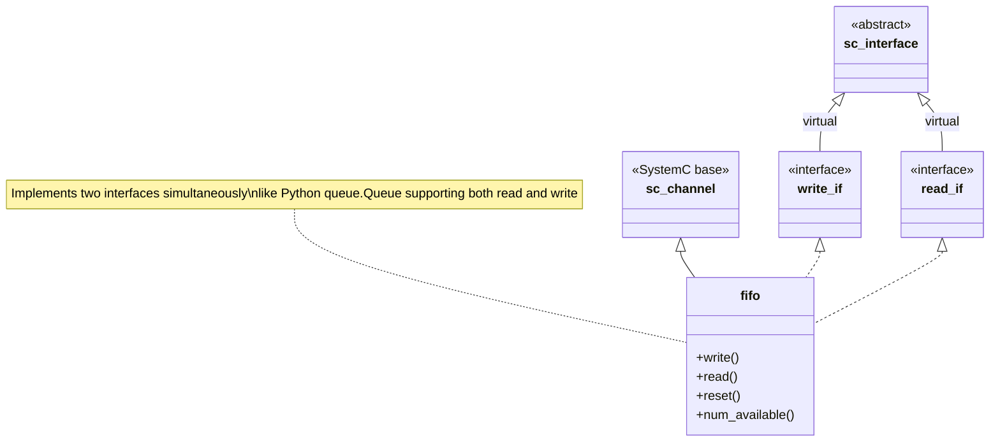
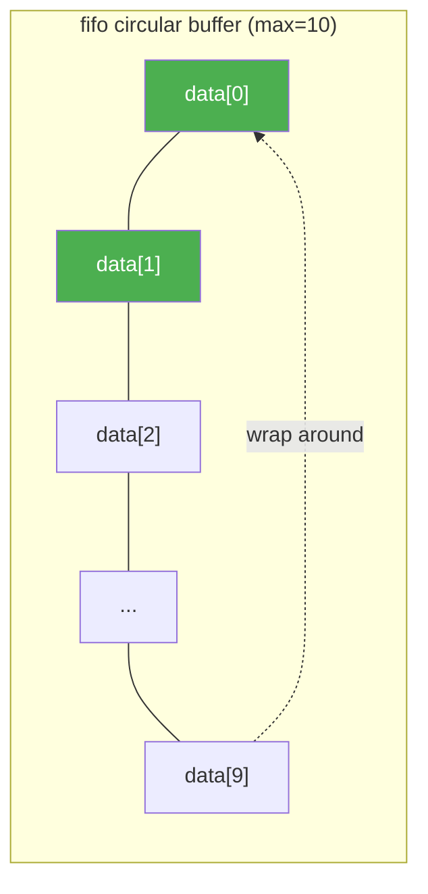
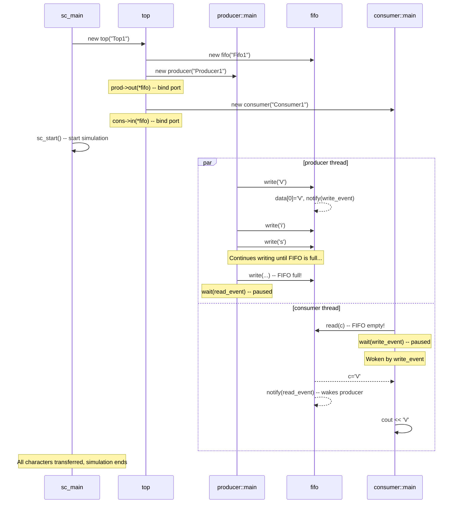

# simple_fifo.cpp -- Line-by-Line Analysis

> **Source**: `ref/systemc/examples/sysc/simple_fifo/simple_fifo.cpp`
> **Lines**: 165 | **Classes**: 6 (including 2 interfaces)

## Overview

This is a **single-file** example that demonstrates the most essential SystemC design patterns in 165 lines of code:
- Define **interfaces** -- specify the communication contract
- Implement **channels** -- provide concrete communication mechanisms
- Connect modules to channels through **ports**

## Everyday Analogy

Imagine a **conveyor belt** between the **kitchen** and the **dining area** in a restaurant:

| Restaurant Element | Code Equivalent | Description |
| --- | --- | --- |
| Chef | `producer` | Continuously prepares dishes (produces data) |
| Conveyor belt | `fifo` | Fixed length (max 10 plates); chef waits when full |
| Waiter | `consumer` | Takes dishes from the belt and serves customers |
| "Ready to place" light | `read_event` | Lights up after waiter takes a plate, notifying the chef to continue |
| "New dish available" light | `write_event` | Lights up after chef places a plate, notifying the waiter to pick up |
| Placing rules | `write_if` | Specification for "place dish" and "clear belt" actions |
| Picking rules | `read_if` | Specification for "pick dish" and "check how many left" actions |

## Class-by-Class Analysis

### 1. `write_if` -- Write Interface (Lines 45-50)

```cpp
class write_if : virtual public sc_interface
{
   public:
     virtual void write(char) = 0;
     virtual void reset() = 0;
};
```

**Purpose**: Defines what the "write end" can do. This is a pure virtual interface, equivalent to:

- **Python**: `class WriteIF(ABC): @abstractmethod write(c); @abstractmethod reset()`
- **C++**: `class WriteIF { virtual void write(char c) = 0; virtual void reset() = 0; };`

**Why use `virtual` inheritance from `sc_interface`?**

A SystemC channel can inherit from multiple interfaces simultaneously. Using `virtual` inheritance avoids the **diamond inheritance** problem -- `fifo` inherits from both `write_if` and `read_if`, which both inherit from `sc_interface`. Adding `virtual` ensures there is only one instance of `sc_interface`.

### 2. `read_if` -- Read Interface (Lines 52-57)

```cpp
class read_if : virtual public sc_interface
{
   public:
     virtual void read(char &) = 0;
     virtual int num_available() = 0;
};
```

**Purpose**: Defines what the "read end" can do. Note that `read` takes a **reference** parameter, which is a common C++ idiom for returning values.

`num_available()` lets the consumer query how much data is currently available in the FIFO, equivalent to Python's `queue.Queue.qsize()`.

### 3. `fifo` -- FIFO Channel (Lines 59-92)

This is the core of the example. `fifo` implements both `write_if` and `read_if`, just like a Python queue.Queue supports both `get()` (read) and `put()` (write).

```cpp
class fifo : public sc_channel, public write_if, public read_if
```

#### Inheritance Diagram



#### Internal Data Structure

```cpp
enum e { max = 10 };       // FIFO capacity = 10
char data[max];            // circular buffer
int num_elements, first;   // element count, read position
sc_event write_event;      // "new data written" event
sc_event read_event;       // "data was read" event
```

This is a classic **circular buffer (ring buffer)**:



#### `write()` -- Write with Blocking

```cpp
void write(char c) {
    if (num_elements == max)    // FIFO full?
        wait(read_event);       // wait until someone reads data

    data[(first + num_elements) % max] = c;  // write to circular buffer
    ++ num_elements;
    write_event.notify();       // notify: new data available
}
```

**Comparison with Python queue.Queue**:

| Operation | Python queue.Queue | SystemC fifo |
| --- | --- | --- |
| Write | `q.put(data)` | `fifo.write(data)` |
| Behavior when full | Caller blocks | `wait(read_event)` suspends SC_THREAD |
| Wake-up mechanism | Handled internally by Python Condition | `write_event.notify()` manual notification |

**Important detail**: `wait()` in SystemC **yields execution** to the simulator kernel, giving other threads a chance to run. This is consistent with the concept of Python asyncio's event loop scheduler -- you are not busy-waiting, but truly pausing.

#### `read()` -- Read with Blocking

```cpp
void read(char &c) {
    if (num_elements == 0)      // FIFO empty?
        wait(write_event);      // wait until someone writes data

    c = data[first];            // read the front data
    -- num_elements;
    first = (first + 1) % max;  // advance read pointer (circular)
    read_event.notify();        // notify: space available
}
```

Read is the mirror operation of write. Wait when empty, read when data is available, notify the write end after reading.

### 4. `producer` -- Producer Module (Lines 94-113)

```cpp
class producer : public sc_module
{
   public:
     sc_port<write_if> out;    // connects to FIFO via write_if interface

     producer(sc_module_name name) : sc_module(name)
     {
       SC_THREAD(main);        // register main() as an independent thread
     }

     void main()
     {
       const char *str =
         "Visit www.accellera.org and see what SystemC can do for you today!\n";
       while (*str)
         out->write(*str++);   // write to FIFO character by character
     }
};
```

**Key Design Points**:

- **`sc_port<write_if>`**: This is a "type-safe socket". The producer only knows it is connected to something that implements `write_if`, and has no knowledge of the concrete implementation being `fifo`. This is **Dependency Inversion**.
  - Software analogy: dependency injection (like Python's inject library) with `@inject`
  - Python analogy: depend only on the ABC interface, not the concrete type

- **`SC_THREAD(main)`**: Registers the `main()` function as a SystemC thread. This is similar to `asyncio.create_task(main())` -- an independent execution unit that can be suspended and resumed.

- **`out->write(*str++)`**: Calls the interface method through the port. `->` is an overloaded operator on `sc_port`, which actually calls the FIFO's `write()`.

### 5. `consumer` -- Consumer Module (Lines 115-140)

```cpp
class consumer : public sc_module
{
   public:
     sc_port<read_if> in;

     consumer(sc_module_name name) : sc_module(name)
     {
       SC_THREAD(main);
     }

     void main()
     {
       char c;
       while (true) {
         in->read(c);           // read one character from FIFO (may block)
         cout << c << flush;

         if (in->num_available() == 1)
           cout << "<1>" << flush;  // mark when only 1 element left in FIFO
         if (in->num_available() == 9)
           cout << "<9>" << flush;  // mark when 9 elements in FIFO
       }
     }
};
```

**Note**: The consumer's `while(true)` never terminates on its own. The simulation stops automatically when the producer finishes sending all characters and all threads are stuck in `wait()` (because no events can be triggered anymore).

The `<1>` and `<9>` markers are for observing the FIFO fill level -- when you see `<1>` it means the FIFO is nearly empty (consumption is keeping up), and `<9>` means the FIFO is nearly full (production is too fast).

### 6. `top` -- Top-Level Module (Lines 142-159)

```cpp
class top : public sc_module
{
   public:
     fifo *fifo_inst;
     producer *prod_inst;
     consumer *cons_inst;

     top(sc_module_name name) : sc_module(name)
     {
       fifo_inst = new fifo("Fifo1");

       prod_inst = new producer("Producer1");
       prod_inst->out(*fifo_inst);     // bind producer's out port to fifo

       cons_inst = new consumer("Consumer1");
       cons_inst->in(*fifo_inst);      // bind consumer's in port to fifo
     }
};
```

`top` is the **assembler**, responsible for creating all submodules and connecting them together. This is like doing dependency injection in Python's `main()`:

```python
# Python analogy
fifo = Fifo(maxsize=10)
producer = Producer(fifo)  # inject WriteIF
consumer = Consumer(fifo)  # inject ReadIF
```

**Why does `prod_inst->out(*fifo_inst)` work?**

`sc_port<write_if>` overloads `operator()`, accepting any object that implements `write_if`. Since `fifo` implements `write_if`, it can be bound directly. This is the power of **interface polymorphism**.

### 7. `sc_main` -- Program Entry Point (Lines 161-165)

```cpp
int sc_main(int, char *[]) {
    top top1("Top1");
    sc_start();
    return 0;
}
```

`sc_main` is the entry point for SystemC programs (replacing the usual `main()`). The SystemC library provides the actual `main()`, which calls your `sc_main()`.

`sc_start()` starts the simulator kernel and begins scheduling all registered `SC_THREAD`s. The simulation continues until all threads finish or are permanently waiting.

## Complete Execution Flow



## Design Philosophy

### Why Use Interfaces?

Wouldn't it be simpler to have the producer hold a `fifo*` directly? The answer is **Separation of Concerns**:

1. **producer only needs write capability** -- it should not know about `read()` and `num_available()`
2. **consumer only needs read capability** -- it should not know about `write()` and `reset()`
3. **Substitutability** -- you can replace `fifo` with anything that implements `write_if` (e.g., an advanced FIFO with flow control), and the producer needs no changes at all

This is the **Interface Segregation Principle** from the SOLID principles.

### Why Use `sc_channel` Instead of a Plain Class?

`sc_channel` inherits from `sc_module`, giving it support from the SystemC simulator kernel:
- Can use `wait()` to suspend and resume
- Participates in the simulator's scheduling
- Has a name (`sc_module_name`), useful for debugging and tracing

If you implemented FIFO with a plain C++ class, you would not be able to use `wait()` to suspend threads -- you would have to resort to busy waiting or implement your own condition variables, which defeats the purpose of the SystemC simulation engine.

### `SC_THREAD` vs `SC_METHOD`

This example uses `SC_THREAD` because the producer and consumer need **blocking waits** (`wait()`). SystemC also has another execution model, `SC_METHOD`, which cannot call `wait()` and is more like a callback function.

| Feature | SC_THREAD | SC_METHOD |
| --- | --- | --- |
| Software analogy | Python coroutine (asyncio) / Thread | callback / event handler |
| Can `wait()` | Yes | No |
| Execution style | Can be suspended/resumed | Runs from start to finish each time |
| Use case | Complex logic requiring event waits | Simple combinational logic |
