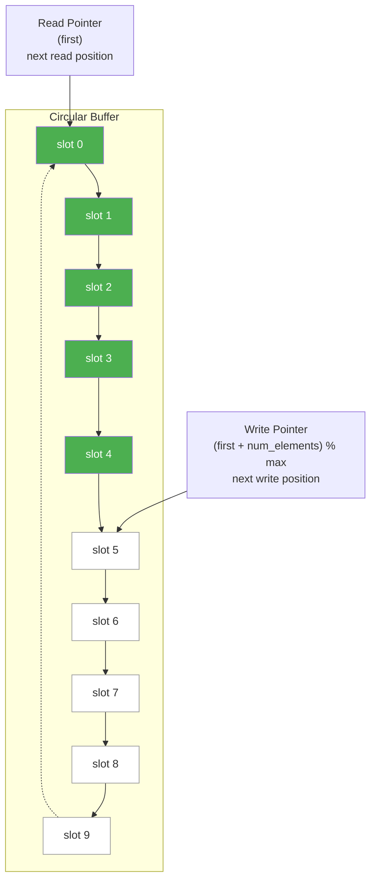

# FIFO Hardware Specification -- Explained for Software Engineers

> This document explains the role and design considerations of FIFO in real hardware. No hardware background required.

## What is a FIFO?

FIFO stands for **First In, First Out**. In the hardware world, it is a **fixed-size queue** fabricated on a chip, used to transfer data between two independently operating circuits.

**Everyday analogy**: Imagine a sushi conveyor belt:
- The chef places sushi on it (write end)
- Customers pick up sushi from the other end (read end)
- The conveyor belt has a fixed length (cannot hold unlimited items)
- The chef and customers each operate at their own pace

In the software world, you are already familiar with this concept:

| Software Technology | Equivalent Concept | Characteristics |
| --- | --- | --- |
| Python `queue.Queue(maxsize)` (bounded) | Capacity-limited queue | put blocks when full, get blocks when empty |
| C++ `std::queue` + condition_variable | Fixed-size blocking queue | Based on std::mutex + std::condition_variable |
| Unix pipe | `cmd1 \| cmd2` | 64KB buffer in the kernel |
| Python `queue.Queue(maxsize)` | Thread-safe bounded queue | Uses Lock + Condition internally |
| Kafka partition | Persistent FIFO | Producer/consumer decoupling |

The difference is: a hardware FIFO is a **physical circuit** -- no operating system, no garbage collector, no context switch. It must complete a read or write operation within every clock cycle.

## Why Does Hardware Need FIFO?

### 1. Clock Domain Crossing

In hardware systems, different modules may operate at **different clock frequencies**. For example:
- CPU runs at 3 GHz
- Memory controller runs at 1.6 GHz
- PCIe interface runs at 2.5 GHz

They cannot transfer data directly (just like two people in different timezones cannot synchronize calls directly) -- they need a FIFO as a "buffering translator".

**Software analogy**: Imagine two microservices running at different event loop frequencies, with a message queue in between for decoupling.

### 2. Rate Matching

Producers and consumers process at different speeds. For example:
- A network interface receives 10Gbps of packets per second
- The CPU's processing speed may not keep up

FIFO absorbs these speed differences, preventing data loss.

**Software analogy**: Placing Nginx as a buffer in front of a web server to handle burst traffic.

### 3. Temporal Decoupling

The producer does not need to wait for the consumer to be ready before sending data (and vice versa). FIFO lets both operate independently.

**Software analogy**: Asynchronous message queue -- the producer puts data into the queue and returns immediately, without waiting for the consumer to finish processing.

## Typical FIFO Parameters

In hardware design, FIFO has several key parameters:

| Parameter | English Name | Description | Software Equivalent |
| --- | --- | --- | --- |
| Depth | Depth | How many entries it can store (this example = 10) | The `10` in `make(chan T, 10)` |
| Width | Width | Bits per entry (this example = 8 bits = 1 char) | Size of the data type |
| Almost Full | Almost Full | Warning when nearly full (e.g., 8/10) | Watermark alert, backpressure |
| Almost Empty | Almost Empty | Warning when nearly empty (e.g., 2/10) | Consumer starvation warning |
| Full | Full | Completely full, cannot write | Channel blocks |
| Empty | Empty | Completely empty, cannot read | Channel blocks |
| Overflow | Overflow | Writing when full, data is lost | Buffer overflow -- critical bug |
| Underflow | Underflow | Reading when empty, garbage data | Reading from empty queue -- critical bug |

### Mapping to This Example

```
simple_fifo's fifo class:
  Depth      = 10  (enum e { max = 10 })
  Width      = 8 bits (char)
  Full behavior  = wait(read_event)  -- blocks until data is read
  Empty behavior = wait(write_event) -- blocks until data is written
  Almost Full/Empty = not supported (simplified version)
```

The `num_available() == 1` and `num_available() == 9` checks in the consumer are essentially observing the "almost empty" and "almost full" states.

## FIFO Internal Structure -- Circular Buffer

Most FIFOs (including this example) are implemented using a **circular buffer**:



- Green = contains data (5 elements, `num_elements = 5`)
- White = empty
- Read Pointer (`first`) points to the earliest written data
- Write Pointer (`first + num_elements`) points to the next writable position
- When a pointer reaches the end of the array, it wraps around (`% max`) -- that is what makes it "circular"

### Circular Buffer in Hardware

In hardware, circular buffers are typically implemented using **dual-port SRAM**:
- One port handles writes (connected to the write-side circuit)
- One port handles reads (connected to the read-side circuit)
- Reads and writes can happen **simultaneously in the same clock cycle**

This is much faster than software -- no locks needed, because hardware is inherently parallel.

## Real-World FIFO Applications

### 1. UART Transmit/Receive Buffer

When your computer communicates with an embedded device via serial port (or USB-to-serial), the UART chip has an internal 16-byte FIFO:
- Received bytes enter the RX FIFO first, waiting for the CPU to read
- Bytes the CPU wants to send enter the TX FIFO first, and the UART sends them out gradually

**Software analogy**: `BufferedReader` / `BufferedWriter` wrapping an underlying stream.

### 2. Network Packet Buffer

Each port on a network switch has a FIFO:
- Arriving packets are placed into the ingress FIFO
- The switching fabric reads from it and forwards
- Before forwarding, packets are placed into the egress FIFO

FIFO depth determines how much burst traffic can be absorbed. Insufficient depth leads to packet drops.

**Software analogy**: Nginx proxy buffer / TCP receive buffer.

### 3. DMA Transfer Queue

DMA (Direct Memory Access) controllers let peripherals read/write memory directly, bypassing the CPU:
- The CPU puts "transfer commands" into a command FIFO
- The DMA engine takes them out and executes them one by one
- Results are placed into a completion FIFO

**Software analogy**: Job queue -- the producer pushes tasks in, worker threads process them gradually.

### 4. Display Pipeline Buffer

The GPU places rendered pixel data into a frame buffer FIFO, and the display controller reads from it at a fixed rate (60Hz / 144Hz) to send to the screen. A shallow FIFO causes screen tearing.

**Software analogy**: A video player's preload buffer -- loading a few seconds of video data ahead of time to avoid stuttering.

## FIFO Design Trade-offs

| Consideration | Shallow FIFO (small depth) | Deep FIFO (large depth) |
| --- | --- | --- |
| Area (chip cost) | Small | Large |
| Latency | Low | High (data waits longer in the queue) |
| Burst traffic tolerance | Poor (fills up easily) | Good (absorbs large bursts) |
| Power consumption | Low | High |

**Software analogy**: This is like choosing the buffer size for a message queue -- too small causes frequent blocking and reduces throughput, too large consumes memory and increases latency.

## What You Learn from This Example

The `simple_fifo` example is simple, but it fully demonstrates the most fundamental communication pattern in hardware design:

1. **Interface separation** -- Read and write ends each define their own contract (`write_if` / `read_if`), just as a hardware FIFO's write port and read port are physically separate
2. **Blocking semantics** -- Wait when full, wait when empty -- this is the behavioral model of the `full` and `empty` signals in hardware
3. **Event-driven** -- Uses `sc_event` to model hardware signal notifications instead of polling
4. **Circular buffer** -- The most common FIFO implementation in hardware

Once you understand these concepts, you have grasped the fundamental principles of **inter-module communication** in hardware systems. This is essentially the same as the producer-consumer pattern in software, just implemented at a different level.
