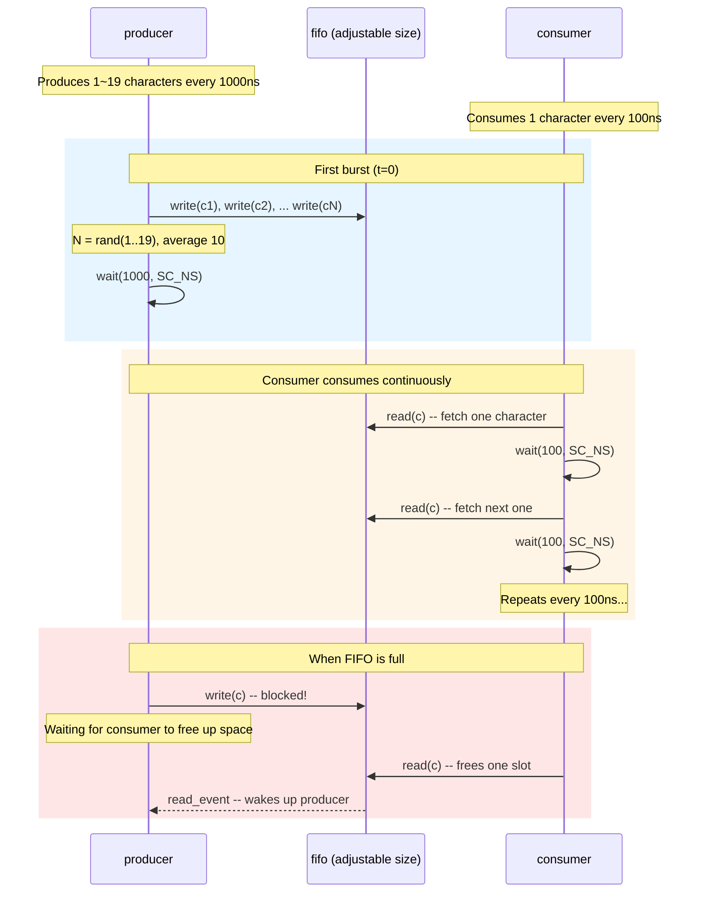
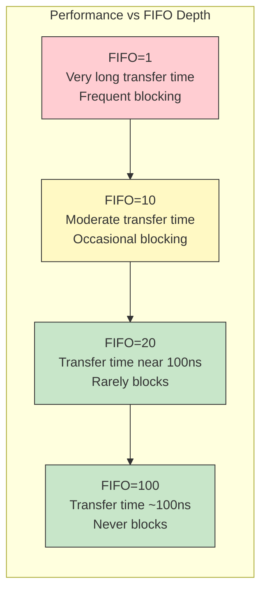

# simple_perf -- Performance Modeling Example

> **Difficulty**: Intermediate | **Software analogy**: Stress-testing Kafka/RabbitMQ throughput under different buffer sizes | **Source**: `ref/systemc/examples/sysc/simple_perf/simple_perf.cpp`

## Overview

`simple_perf` is the "performance analysis edition" of [simple_fifo](../simple_fifo/_index.md). It keeps the same producer-consumer architecture but adds a **timing model** and **statistics collection**, letting you explore a key question:

> **How does FIFO depth (buffer size) affect overall throughput?**

This question is very common in the software world too. Imagine tuning Kafka's consumer buffer size, or RabbitMQ's prefetch count:
- Buffer too small: the producer is frequently blocked, overall throughput drops
- Buffer too large: wastes memory (in the hardware world, wastes chip area)
- Just right: both producer and consumer can operate smoothly

### Relationship with simple_fifo

| Aspect | simple_fifo | simple_perf |
| --- | --- | --- |
| Purpose | Teaching -- demonstrate channel mechanism | Analysis -- explore design space |
| Timing model | None | producer: 1000ns/burst, consumer: 100ns/char |
| FIFO size | Fixed at 10 | Adjustable via command line |
| Statistics | None | Average/max fill depth, average transfer time |
| Transfer volume | One string | 100,000 characters |

## Timing Sequence Diagram



## Key Insight

On average, the producer's output rate matches the consumer's consumption rate (both approximately 100ns/character). But the producer is **bursty** -- it writes 1~19 characters at once then rests.

This is like an API server receiving burst traffic:

```
producer:  |====burst====|--------idle--------|====burst====|
consumer:  |-c-|-c-|-c-|-c-|-c-|-c-|-c-|-c-|-c-|-c-|-c-|-c-|
```

The FIFO's role is to **absorb burst traffic**. If the FIFO is large enough, the producer's burst can be fully written without blocking; if it's too small, the producer must wait, increasing overall transfer time.

## Performance Curve Concept



Hints from the source code:
- FIFO = 10~20 can achieve an average transfer time of around 110ns/character
- Beyond a certain threshold, increasing FIFO size yields diminishing returns

## File List

| File | Description | Documentation Link |
| --- | --- | --- |
| `simple_perf.cpp` | Single file containing all class definitions and `sc_main` | [simple_perf.md](simple_perf.md) |

## Hardware Specification Reference

Want to understand why performance modeling matters in hardware design? See [spec.md](spec.md).

## Quick Concept Reference

| SystemC Concept | Software Equivalent | Role in This Example |
| --- | --- | --- |
| `sc_time` | `Duration` / `time.Duration` | Represents simulation time (e.g., 100 ns) |
| `wait(time)` | `time.sleep()` / `Thread.sleep()` | Simulates passage of specified time |
| `sc_time_stamp()` | `System.currentTimeMillis()` | Gets current simulation time |
| `sc_channel` | Underlying implementation of `queue.Queue` | FIFO implements both read and write interfaces |
| `sc_event` | `Condition.notify()` | Coordinates blocking/waking between producer and consumer |

## Suggested Learning Path

1. Read [spec.md](spec.md) first to understand the motivation for performance modeling
2. If you haven't read [simple_fifo](../simple_fifo/_index.md) yet, read it first (this example builds on it)
3. Then read [simple_perf.md](simple_perf.md) to understand the code line by line
4. Try running the program with different FIFO sizes and observe how the statistics change
