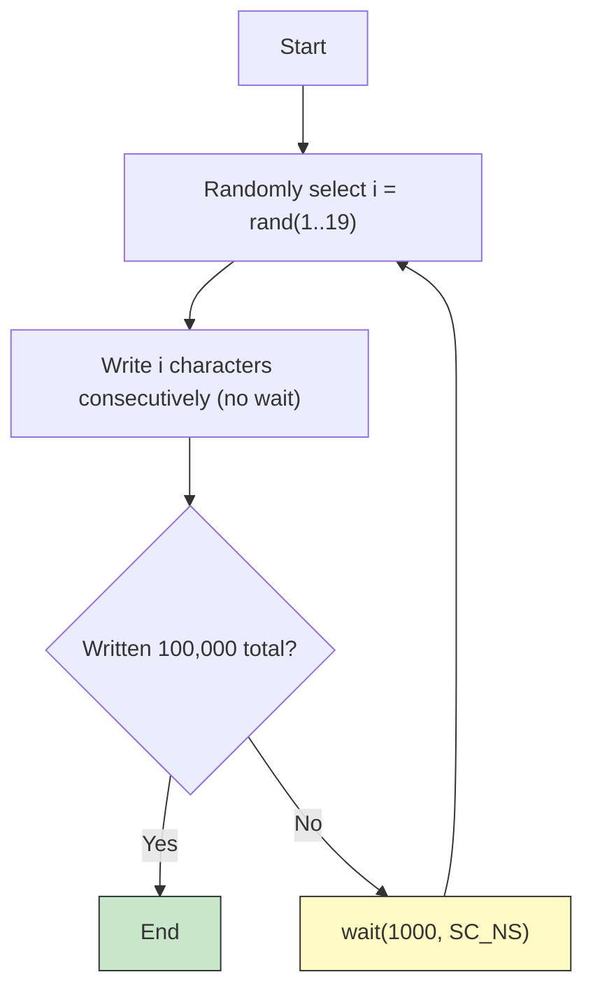
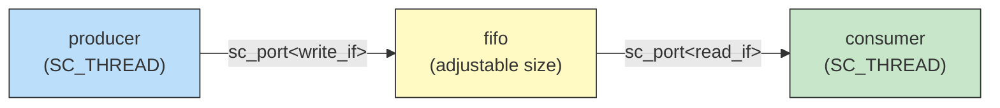

# simple_perf.cpp -- Performance Modeling Implementation Details

> **Source**: `ref/systemc/examples/sysc/simple_perf/simple_perf.cpp` | **Author**: Stuart Swan, Cadence Design Systems

## Overview of Differences from simple_fifo

If you have already read simple_fifo, the structure of this example is nearly identical. The key differences are:

1. **Timing model added**: producer bursts every 1000ns, consumer reads one every 100ns
2. **Statistics collection added**: FIFO prints a performance report upon destruction
3. **Adjustable FIFO size**: via command-line argument
4. **Large-scale transfer**: 100,000 characters (enough to produce meaningful statistics)

## Interface Definitions

```cpp
class write_if : virtual public sc_interface {
    virtual void write(char) = 0;
    virtual void reset() = 0;
};

class read_if : virtual public sc_interface {
    virtual void read(char &) = 0;
    virtual int num_available() = 0;
};
```

Identical to simple_fifo. `write_if` and `read_if` define the read/write contract for the FIFO, like a C++ abstract class or Python ABC.

## FIFO Implementation -- Performance Edition

### Constructor

```cpp
fifo(sc_module_name name, int size_) : sc_channel(name), size(size_) {
    data = new char[size];
    num_elements = first = 0;
    num_read = max_used = average = 0;
    last_time = SC_ZERO_TIME;
}
```

Compared to simple_fifo, additional statistics variables are introduced:
- `num_read`: total number of characters read
- `max_used`: historical maximum fill depth
- `average`: accumulated fill depth (used to compute the average)
- `last_time`: simulation time of the last read

### Destructor -- Statistics Report

```cpp
~fifo() {
    delete[] data;
    cout << "Fifo size is: " << size << endl;
    cout << "Average fifo fill depth: " << double(average) / num_read << endl;
    cout << "Maximum fifo fill depth: " << max_used << endl;
    cout << "Average transfer time per character: " << last_time / num_read << endl;
    cout << "Total characters transferred: " << num_read << endl;
    cout << "Total time: " << last_time << endl;
}
```

This is the most valuable part of the entire example. When the simulation ends (the object is destroyed), the FIFO automatically prints a performance report.

**Software analogy**: Like viewing a Grafana dashboard after a load test -- average latency, max latency, throughput.

### Statistics Metrics Explained

| Metric | Meaning | Software Equivalent |
| --- | --- | --- |
| Average fifo fill depth | Average number of elements in the FIFO | Average backlog in a message queue |
| Maximum fifo fill depth | Maximum simultaneous elements in the FIFO | Peak backlog in a queue |
| Average transfer time | Average time per character from write to system completion | End-to-end latency |
| Total characters transferred | Total volume transferred | Total requests served |
| Total time | Total simulation duration | Test duration |

### write() -- Write Operation

```cpp
void write(char c) {
    if (num_elements == size)
        wait(read_event);        // FIFO full, wait for consumer to free space

    data[(first + num_elements) % size] = c;
    ++ num_elements;
    write_event.notify();        // Notify consumer that new data is available
}
```

Circular buffer implementation. `(first + num_elements) % size` is the classic circular index calculation.

### read() -- Read Operation (with Statistics)

```cpp
void read(char &c) {
    last_time = sc_time_stamp();   // Record current simulation time
    if (num_elements == 0)
        wait(write_event);         // FIFO empty, wait for producer to write

    compute_stats();               // Update statistics

    c = data[first];
    -- num_elements;
    first = (first + 1) % size;
    read_event.notify();           // Notify producer that space is available
}
```

Difference from simple_fifo: adds `sc_time_stamp()` to record time and `compute_stats()` to collect statistics.

### compute_stats() -- Statistics Collection

```cpp
void compute_stats() {
    average += num_elements;         // Accumulate current fill depth
    if (num_elements > max_used)
        max_used = num_elements;     // Update maximum
    ++num_read;                      // Increment counter
}
```

Called on every read. `average` accumulates the fill depth at each read; dividing by `num_read` at the end yields the average fill depth.

## Producer -- Bursty Producer

```cpp
void main() {
    const char *str = "Visit www.accellera.org and see what SystemC can do for you today!\n";
    const char *p = str;
    int total = 100000;

    while (true) {
        int i = 1 + int(19.0 * rand() / RAND_MAX);  // 1 <= i <= 19
        while (--i >= 0) {
            out->write(*p++);
            if (!*p) p = str;
            -- total;
        }
        if (total <= 0) break;
        wait(1000, SC_NS);   // Wait 1000ns after each burst
    }
}
```

### Timing Model Analysis



**Average output rate calculation**:
- Each burst produces `(1+19)/2 = 10` characters on average
- Interval between bursts is 1000ns
- Average rate = 10 characters / 1000ns = **1 character / 100ns**

This exactly matches the consumer's consumption rate (100ns/character). So theoretically, if the FIFO were infinitely large, the average transfer time would be 100ns. But because the producer is bursty, a finite FIFO causes blocking.

## Consumer -- Steady Consumer

```cpp
void main() {
    char c;
    while (true) {
        in->read(c);
        wait(100, SC_NS);   // Read one character every 100ns
    }
}
```

The consumer is very simple: it steadily reads one character every 100ns. It serves as the "clock" of the entire system.

## Top-level Module

```cpp
class top : public sc_module {
    fifo fifo_inst;
    producer prod_inst;
    consumer cons_inst;

    top(sc_module_name name, int size) :
        sc_module(name),
        fifo_inst("Fifo1", size),
        prod_inst("Producer1"),
        cons_inst("Consumer1")
    {
        prod_inst.out(fifo_inst);
        cons_inst.in(fifo_inst);
    }
};
```



## sc_main -- Program Entry Point

```cpp
int sc_main(int argc, char *argv[]) {
    int size = 10;                    // Default FIFO size
    if (argc > 1)
        size = atoi(argv[1]);         // Read from command line
    if (size < 1) size = 1;
    if (size > 100000) size = 100000;

    top top1("Top1", size);
    sc_start();                       // Start simulation
    return 0;
}
```

You can run it like this:
```bash
./simple_perf 15    # FIFO size = 15
./simple_perf 50    # FIFO size = 50
```

## Design Space Exploration

The real value of this example lies in **Design Space Exploration**. By varying the FIFO size, you can observe:

| FIFO Size | Expected Behavior |
| --- | --- |
| 1 | Almost every burst causes blocking, transfer time far greater than 100ns |
| 5 | Frequently blocks, but much better than size=1 |
| 10 (default) | Occasionally blocks, transfer time slightly above 100ns |
| 15-20 | Rarely blocks, close to the ideal 100ns |
| 50+ | Almost never blocks, but wastes space |

**Software analogy**: This is like doing capacity planning -- how large does your Kafka partition's buffer need to be? How big should you set your Redis queue's maxlen? The answer depends on how bursty your producer is and how much latency you can tolerate.

## Why Do Performance Modeling?

In hardware design, every FIFO entry occupies real chip area and power. Unlike software where you can add memory at any time, hardware cannot be changed once fabricated. So hardware designers need to precisely determine buffer sizes during the design phase.

This example demonstrates the core capability of SystemC performance modeling: **finding optimal design parameters with high-level models before writing a single line of RTL**.

## Quick Concept Reference

| SystemC Concept | Software Equivalent | Role in This Example |
| --- | --- | --- |
| `wait(1000, SC_NS)` | `time.sleep(1ms)` | Producer's burst interval |
| `wait(100, SC_NS)` | `time.sleep(0.1ms)` | Consumer's consumption interval |
| `sc_time_stamp()` | `clock.now()` | Records simulation time at each read |
| `SC_ZERO_TIME` | `Duration::ZERO` | Zero-value time constant |
| `last_time / num_read` | Average latency calculation | Computes average transfer time at FIFO destruction |
| `sc_start()` | Start the event loop | Begins simulation until all threads finish |
