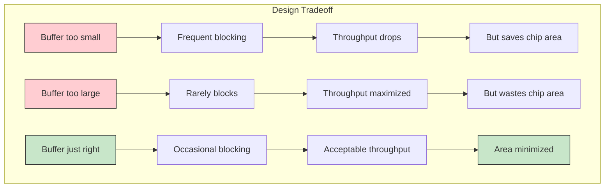
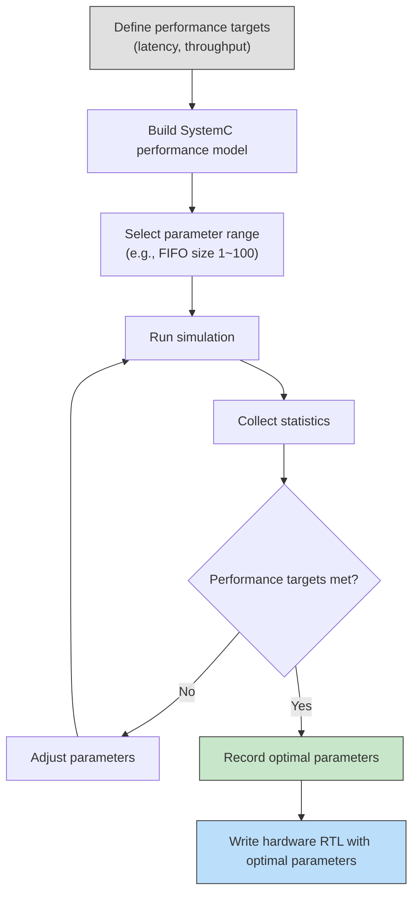

# Performance Modeling -- Capacity Planning in Hardware Design

> **Prerequisites**: No hardware background needed | **Software analogy**: Stress testing and capacity planning

## What Is Performance Modeling?

Performance Modeling is using software simulation to predict a system's performance **before actually building it**.

**Software analogy**: Suppose you need to design a high-concurrency API server. You wouldn't just buy 100 servers and hope for the best. You'd first use load testing tools (like k6 or Python locust) to simulate expected traffic and find the optimal number of servers, thread pool size, connection pool limits, and other parameters.

Hardware designers do exactly the same thing, except their "servers" are on-chip buffers, FIFOs, and caches -- and once fabricated, these cannot be changed (unlike software which can be scaled up at any time).

## Why Do Hardware Engineers Care So Much About Buffer Size?

In the software world, the cost of a buffer being too small is performance degradation or OOM -- you can add memory or adjust settings. In the hardware world:

| Aspect | Software | Hardware |
| --- | --- | --- |
| Buffer too small | Performance drops, can be adjusted dynamically | Performance drops, **cannot be modified** |
| Buffer too large | Wastes memory, can be adjusted dynamically | Wastes chip area and power, **cannot be modified** |
| Cost of adjustment | Change one config file | Redesign and re-manufacture (millions of dollars) |
| Decision timing | Can still be adjusted after deployment | Must be decided during the design phase |

This is why performance modeling is **essential** for hardware designers, not just "nice to have."

## Core Performance Metrics

### Throughput

The amount of data that can be processed per unit of time.

- **Software example**: How many requests per second an API server can handle (RPS)
- **Hardware example**: How many packets per second a network chip can forward (PPS)
- **This example**: consumer processes one character every 100ns = 10M characters/second

### Latency

The time for a piece of data from entering the system to being fully processed.

- **Software example**: API response time (p50, p99)
- **Hardware example**: Time for a packet to enter and exit
- **This example**: Average transfer time per character

### Utilization

The proportion of a resource being effectively used.

- **Software example**: CPU usage, memory usage
- **Hardware example**: Average fill rate of a buffer
- **This example**: average fifo fill depth / fifo size

### Buffer Occupancy

The fill level of a buffer at any given moment.

- **Software example**: Pending message count in a message queue
- **Hardware example**: How many elements are currently in the FIFO
- **This example**: Average and maximum fifo fill depth

## Area vs Throughput Tradeoff

This is one of the most classic tradeoffs in hardware design:

**Software analogy**: Like deciding Kubernetes pod resource request/limit:
- Set too low: pod gets throttled or OOM killed
- Set too high: wastes cluster resources, other services can't get resources
- Just right: you need load testing to find out

## Software Equivalent: Message Queue Capacity Planning

Suppose you are designing a system using RabbitMQ:

| Hardware Concept | RabbitMQ Equivalent |
| --- | --- |
| FIFO depth | Queue's `x-max-length` |
| Producer burst rate | Publisher's burst send rate |
| Consumer rate | Consumer's `prefetch_count` and processing speed |
| Buffer full blocking | Backpressure under publisher confirm mechanism |
| Buffer empty waiting | Consumer idle (no messages to process) |
| Average transfer time | End-to-end message latency |

How would you decide the maximum length of a RabbitMQ queue?

1. **Estimate production rate**: How many events per second does the API server produce? Are there burst peaks?
2. **Estimate consumption rate**: How many events per second can the consumer process?
3. **Set latency targets**: How many seconds of end-to-end latency is acceptable?
4. **Run stress tests**: Run load tests with different queue lengths to find the optimal value

This is exactly what `simple_perf` does -- except the target is a hardware FIFO rather than a message queue.

## Real-World Example: Network Packet Buffer Sizing

Consider a design problem for a network switch chip:

**Scenario**: A 10Gbps network port needs its receive buffer size determined.

**Known conditions**:
- Average packet size: 500 bytes
- Peak traffic: 10Gbps (approximately 2.5M packets/sec)
- Processing latency: each packet needs 200ns for the forwarding decision
- Burst tolerance: needs to absorb 10us of micro-burst

**Buffer size calculation**:
- 10us micro-burst at 10Gbps = 10us x 10Gbps = 100,000 bits = 12,500 bytes
- Add safety margin (2x) = 25,000 bytes
- Corresponds to approximately 50 packets of buffer

If the buffer is too small (say only 5 packets), packets will be dropped during micro-bursts. If too large (say 5000 packets), it wastes expensive on-chip SRAM.

**Value of performance modeling**: Use a SystemC model to simulate real traffic patterns (including micro-bursts), find the minimum required buffer size, then add a safety margin. This is more accurate than pure mathematical calculation because it can account for more complex traffic distributions.

## Design Space Exploration Workflow

This workflow is nearly identical to software "performance tuning," with the only difference being the last step: software engineers deploy after tuning parameters, while hardware engineers start writing RTL (Hardware Description Language) after tuning parameters.

## Summary

Performance modeling lets you know whether a design is feasible **before spending significant resources**. Whether it's software capacity planning or hardware buffer sizing, the core thinking is the same:

1. Build a model (it doesn't need to be perfect, just capture the key behaviors)
2. Test with representative workloads
3. Collect and analyze performance metrics
4. Adjust design parameters based on results
5. Repeat until targets are met
