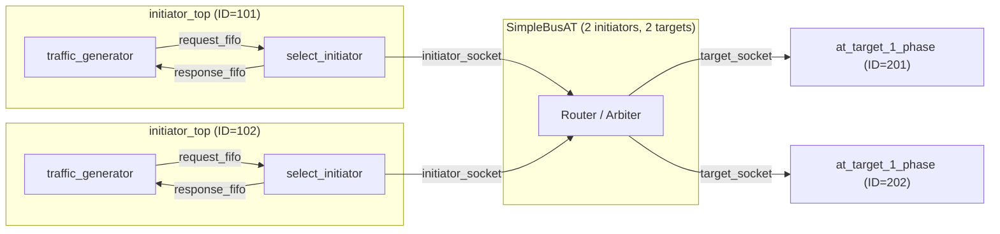
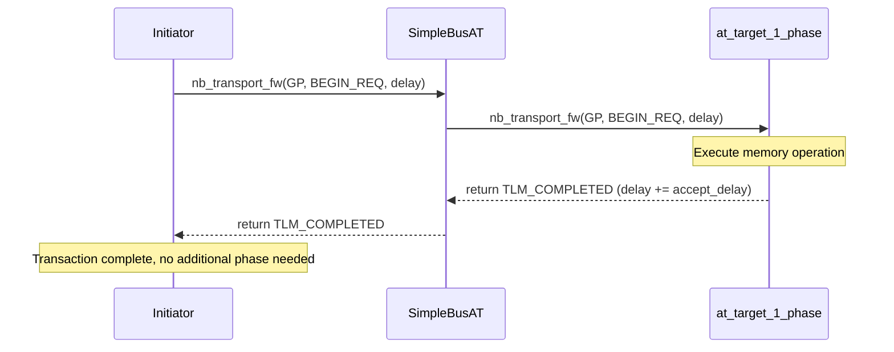

# at_1_phase -- AT Single-Phase Protocol Example

> **Difficulty**: Intermediate | **Software Analogy**: Fire-and-forget RPC (similar to UDP) | **Source Code**: `ref/systemc/examples/tlm/at_1_phase/`

## Overview

`at_1_phase` demonstrates the simplest protocol in TLM-2.0 Approximately-Timed (AT) mode: **single-phase transaction (1-phase transaction)**. After the initiator sends a request, the target immediately returns `TLM_COMPLETED`, and the transaction is done.

### Software Analogy: UDP Packet Sending

If you have written network programs before, this is like **UDP fire-and-forget**:

```python
# UDP: send and forget
sock.sendto(data, ("server", 8080))
# No need to wait for ACK, can send the next one immediately
```

Compared to HTTP (which requires waiting for a response) or TCP (which requires a handshake), 1-phase is the lightest communication mode. In simulation, it trades timing accuracy for faster simulation speed.

### Why Use 1-Phase?

| Scenario | Suitable Protocol | Reason |
| --- | --- | --- |
| Early architecture exploration, only care about functional correctness | 1-phase | Fastest simulation speed |
| Need to know bus occupancy time | 2-phase or 4-phase | Requires more synchronization points |
| Accurately simulate pipeline behavior | 4-phase | Requires full handshake |

## Architecture Diagram



## Transaction Timing Diagram



## File List

| File | Description | Documentation Link |
| --- | --- | --- |
| `src/at_1_phase.cpp` | `sc_main` entry point | [at-1-phase.md](at-1-phase.md) |
| `src/at_1_phase_top.cpp` | System top-level module, responsible for component instantiation and connection | [at-1-phase.md](at-1-phase.md) |
| `src/initiator_top.cpp` | Initiator top-level module | [at-1-phase.md](at-1-phase.md) |
| `include/at_1_phase_top.h` | Top-level module header file | [at-1-phase.md](at-1-phase.md) |
| `include/initiator_top.h` | Initiator top-level header file | [at-1-phase.md](at-1-phase.md) |

## Core Concepts Quick Reference

| TLM Concept | Software Equivalent | Role in This Example |
| --- | --- | --- |
| `nb_transport_fw` | Asynchronous RPC call (`sendAsync()`) | Initiator sends request to target |
| `TLM_COMPLETED` | HTTP 200 OK (done in one round trip) | Target immediately returns completion status |
| `BEGIN_REQ` | Request sent (`socket.send()`) | The only phase used |
| `tlm_generic_payload` | Generic request/response object (like `HttpRequest`) | Carries address, data, command |
| `peq_with_get` | Scheduled task queue (`ScheduledExecutorService`) | Used by target to schedule delayed responses |

## Suggested Learning Path

1. First read [at-1-phase.md](at-1-phase.md) to understand the complete 1-phase implementation
2. Then look at [at_2_phase](../at_2_phase/_index.md) to understand how a response phase is added
3. Finally look at [at_4_phase](../at_4_phase/_index.md) to understand the complete 4-phase handshake
