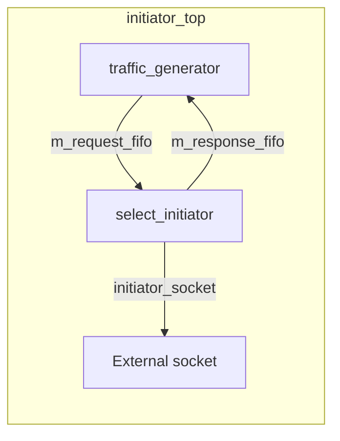

# at_1_phase -- Source Code Walkthrough

> **Source Code Path**: `ref/systemc/examples/tlm/at_1_phase/`

## Software Analogy Overview

The entire `at_1_phase` example maps to a simple **asynchronous messaging system**:

| Component | Software Analogy | Responsibility |
| --- | --- | --- |
| `traffic_generator` | Test HTTP client (automatically generates a series of requests) | Generates read/write transactions |
| `select_initiator` | Core engine of an asynchronous HTTP client | Manages `nb_transport_fw` calls and response handling |
| `initiator_top` | Wrapper combining client and request generator | Connects traffic_generator and select_initiator via FIFO |
| `SimpleBusAT` | API Gateway / Load Balancer | Routes requests to the correct target based on address |
| `at_target_1_phase` | Backend microservice (supports fire-and-forget) | Receives requests, performs memory operations, responds immediately |

## System Top Level: example_system_top

### Header File `include/at_1_phase_top.h`

```
example_system_top
  |-- SimpleBusAT<2, 2>       m_bus            (2 initiator ports, 2 target ports)
  |-- at_target_1_phase       m_at_target_1_phase_1   (ID=201)
  |-- at_target_1_phase       m_at_target_1_phase_2   (ID=202)
  |-- initiator_top           m_initiator_1            (ID=101)
  |-- initiator_top           m_initiator_2            (ID=102)
```

This is like a system with 2 clients and 2 servers, connected through a bus (router) in the middle.

### Constructor `src/at_1_phase_top.cpp`

The constructor does two things:

1. **Instantiate all components** and set their parameters:
   - Target memory size is 4KB, width is 4 bytes
   - `accept_delay` = 10ns (simulates server request acceptance latency)
   - `read_response_delay` = 50ns, `write_response_delay` = 30ns
   - Each initiator can handle up to 2 active transactions simultaneously

2. **Bind socket connections** (equivalent to setting up a network routing table):
   ```
   initiator_1 --> bus.target_socket[0]
   initiator_2 --> bus.target_socket[1]
   bus.initiator_socket[0] --> target_1.m_memory_socket
   bus.initiator_socket[1] --> target_2.m_memory_socket
   ```

### Target Parameters (Software Equivalents)

| Parameter | Value | Software Analogy |
| --- | --- | --- |
| `memory_size` | 4096 bytes | Database capacity |
| `memory_width` | 4 bytes | Maximum unit for a single read/write |
| `accept_delay` | 10 ns | Latency from server receiving request to starting processing |
| `read_response_delay` | 50 ns | Processing time for read operations |
| `write_response_delay` | 30 ns | Processing time for write operations |

## Initiator Top-Level Module: initiator_top

### Header File `include/initiator_top.h`

`initiator_top` is a **wrapper module** that connects `traffic_generator` (the component that generates requests) and `select_initiator` (the component that actually sends TLM transactions) via `sc_fifo`.



Software analogy: This is like a **producer-consumer architecture**:
- `traffic_generator` is the producer, continuously generating requests and placing them into `request_fifo`
- `select_initiator` is the consumer, taking requests from `request_fifo` and sending them
- Upon completion, responses are placed into `response_fifo` and returned to traffic_generator

### Key Interface

`initiator_top` inherits `tlm_bw_transport_if<>` (backward transport interface), but in this example `nb_transport_bw` and `invalidate_direct_mem_ptr` are not implemented. This is because the hierarchical socket connection requires these interfaces, but the actual backward path handling is done inside `select_initiator`.

## Target Implementation: at_target_1_phase (Shared Component)

The target implementation is located in `common/src/at_target_1_phase.cpp` and is a shared component across multiple examples.

### nb_transport_fw -- Core Logic

After the target receives `BEGIN_REQ`, there are two processing paths:

#### Path 1: Immediate Completion (Most Cases)

```
if (request_count % 20 != 0):
    1. Execute memory operation immediately
    2. delay_time += accept_delay
    3. return TLM_COMPLETED
```

Software analogy: Synchronous API call. The server processes and returns the result directly, like `return Response.ok(result)`.

#### Path 2: Delayed Response (Forced Every 20 Requests)

```
if (request_count % 20 == 0):
    1. Calculate memory operation delay
    2. Place transaction into response PEQ (payload event queue)
    3. phase = END_REQ
    4. return TLM_UPDATED
```

Software analogy: Asynchronous processing. The server first returns `202 Accepted`, then sends the result later via callback.

This "delayed response every 20 requests" design is intended to **demonstrate forced synchronization**: even in 1-phase mode, occasional forced synchronization is needed to ensure simulation accuracy.

### begin_response_method -- Delayed Response Handling

After a transaction is placed into `m_response_PEQ` and the delay expires, `begin_response_method` is triggered:

1. Retrieve the transaction from the PEQ
2. Execute the memory operation
3. Call `nb_transport_bw(GP, BEGIN_RESP, SC_ZERO_TIME)` to send the response back to the initiator

Depending on the initiator's response:
- `TLM_COMPLETED`: Transaction ends, wait for annotated delay
- `TLM_ACCEPTED`: Need to wait for `END_RESP` event before continuing

## sc_main Entry Point

`src/at_1_phase.cpp` is very simple:

1. Enable reporting (logging system)
2. Instantiate `example_system_top`
3. Call `sc_start()` to begin simulation (automatically ends when traffic generator completes)

## Key Takeaways

| Concept | Description |
| --- | --- |
| **1-phase core** | Most transactions only need `BEGIN_REQ` + `TLM_COMPLETED`, completing in one round trip |
| **forced sync** | Every 20 requests forces a multi-step response (`TLM_UPDATED`) to demonstrate the synchronization mechanism |
| **PEQ (Payload Event Queue)** | Similar to `DelayQueue`, used to schedule delayed events |
| **FIFO connection** | traffic_generator and initiator are decoupled via `sc_fifo` |
| **SimpleBusAT** | Routes transactions to the corresponding target based on address range |
