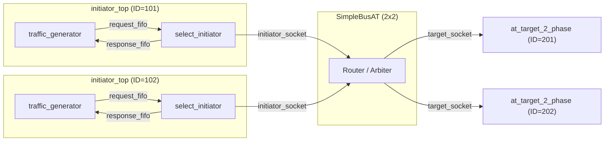
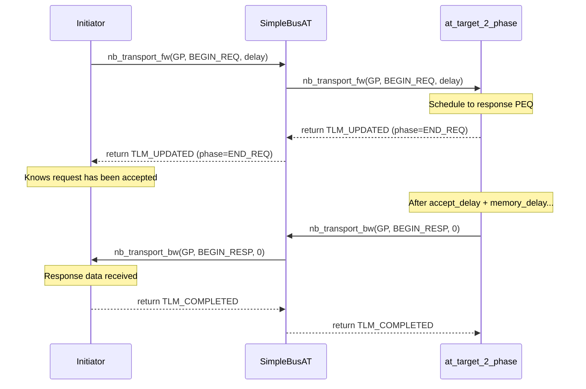

# at_2_phase -- AT Two-Phase Protocol Example

> **Difficulty**: Intermediate | **Software Analogy**: HTTP Request-Response | **Source Code**: `ref/systemc/examples/tlm/at_2_phase/`

## Overview

`at_2_phase` demonstrates the **two-phase transaction protocol** in TLM-2.0 AT mode. Unlike 1-phase, the 2-phase protocol explicitly separates "request" and "response" into two distinct phases:

- **Phase 1: BEGIN_REQ** -- Initiator sends the request
- **Phase 2: BEGIN_RESP** -- Target returns the response

### Software Analogy: HTTP Request-Response

```python
# HTTP: standard request-response pattern
response = await client.get("http://server/api/data")
#         ^                 ^
#         |                 Phase 1: BEGIN_REQ (send request)
#         Phase 2: BEGIN_RESP (receive response)
```

Differences from 1-phase (UDP fire-and-forget):
- 1-phase: Send and done (`sendto()` returning means completion)
- 2-phase: After sending, you need to **wait for the server response**; the server can perform asynchronous processing in between

### Why Use 2-Phase?

2-phase allows the target to perform **asynchronous processing** between `BEGIN_REQ` and `BEGIN_RESP`. During this time:
- The initiator knows the target has started processing (received `END_REQ`)
- The target can take time to execute memory operations
- When finished, the target proactively calls `nb_transport_bw` to notify the initiator

## Architecture Diagram



## Transaction Timing Diagram



## File List

| File | Description | Documentation Link |
| --- | --- | --- |
| `src/at_2_phase.cpp` | `sc_main` entry point | [at-2-phase.md](at-2-phase.md) |
| `src/at_2_phase_top.cpp` | System top-level module | [at-2-phase.md](at-2-phase.md) |
| `src/initiator_top.cpp` | Initiator top-level module | [at-2-phase.md](at-2-phase.md) |
| `include/at_2_phase_top.h` | Top-level header file | [at-2-phase.md](at-2-phase.md) |
| `include/initiator_top.h` | Initiator top-level header file | [at-2-phase.md](at-2-phase.md) |

## Core Concepts Quick Reference

| TLM Concept | Software Equivalent | Role in This Example |
| --- | --- | --- |
| `TLM_UPDATED` | `202 Accepted` (server accepted, will respond later) | Target tells initiator the request has been accepted |
| `END_REQ` | Server received complete request body | Target indicates request phase is over via return value |
| `BEGIN_RESP` | Server starts sending response body | Target proactively calls `nb_transport_bw` to send data back |
| `nb_transport_bw` | Callback / WebSocket push | Target proactively notifies initiator after processing completes |
| `m_response_PEQ` | `ScheduledExecutorService` | Schedules delayed response processing |

## Suggested Learning Path

1. If you haven't already, read [at_1_phase](../at_1_phase/_index.md) first
2. Read [at-2-phase.md](at-2-phase.md) to understand the complete two-phase implementation
3. Then look at [at_4_phase](../at_4_phase/_index.md) to understand the complete 4-phase handshake
